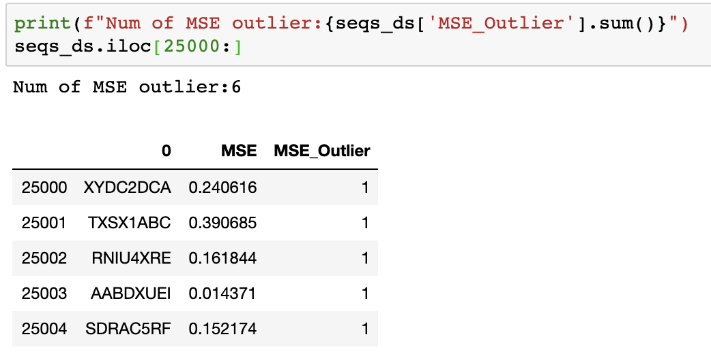

# Autoencoder

## Use Keras to develop a robust NN architecture that can be used to efficiently recognize anomalies in sequences

Suppose that you have a very long list of string sequences, such as a list of amino acid structures \(‘PHE-SER-CYS’, ‘GLN-ARG-SER’,…\), product serial numbers \(‘AB121E’, ‘AB323’, ‘DN176’…\), or users UIDs, and you are required to create a validation process of some kind that will detect anomalies in this sequence. An anomaly might be a string that follows a slightly different or unusual format than the others \(whether it was created by mistake or on purpose\) or just one that is extremely rare. To make things even more interesting, suppose that you don't know what is the correct format or structure that sequences suppose to follow.

This is a relatively common problem \(though with an uncommon twist\) that many data scientists usually approach using one of the popular unsupervised ML algorithms, such as DBScan, Isolation Forest, etc. Many of these algorithms typically do a good job in finding anomalies or outliers by singling out data points that are relatively far from the others or from areas in which most data points lie. Although autoencoders are also well-known for their anomaly detection capabilities, they work quite differently and are less common when it comes to problems of this sort.

I will leave the explanations of what is exactly an autoencoder to the many insightful and well-written posts, and articles that are freely available online. Very very briefly \(and please just read on if this doesn't make sense to you\), just like other kinds of ML algorithms, autoencoders learn by creating different representations of data and by measuring how well these representations do in generating an expected outcome; and just like other kinds of neural network, autoencoders learn by creating different _layers_ of such representations that allow them to learn more complex and sophisticated representations of data \(which on my view is exactly what makes them superior for a task like ours\). Autoencoders are a special form of a neural network, however, because the output that they attempt to generate is a _reconstruction of the input they receive_. An autoencoder starts with input data \(i.e., a set of numbers\) and then transforms it in different ways using a set of mathematical operations until it learns the parameters that it ought to use in order to reconstruct the same data \(or get very close to it\). In this learning process, an autoencoder essentially learns the format rules of the input data. And, that's exactly what makes it perform well as an anomaly detection mechanism in settings like ours.

Using autoencoders to detect anomalies usually involves two main steps:

First, we feed our data to an autoencoder and tune it until it is well trained to reconstruct the expected output with minimum error. An autoencoder that receives an input like 10,5,100 and returns 11,5,99, for example, is well-trained if we consider the reconstructed output as sufficiently close to the input and if the autoencoder is able to successfully reconstruct most of the data in this way.

Second, we feed all our data again to our trained autoencoder and measure the _error term_ of each reconstructed data point. In other words, we measure how “far” is the _reconstructed_ data point from the _actual_ datapoint. A well-trained autoencoder essentially learns how to reconstruct an input that follows a certain format, so if we give a badly formatted data point to a well-trained autoencoder then we are likely to get something that is quite different from our input, and a large error term.

## Time for Some Code

Let's get into the details. I should emphasize, though, that this is just one way that one can go about such a task using an autoencoder. There are other ways and technics to build autoencoders and you should experiment until you find the architecture that suits your project.

These are the steps that I'm going to follow:

1. Generate a set of random string sequences that follow a specified format, and add a few anomalies.
2. Encode the sequences into numbers and scale them.
3. Design, fit, and tune an autoencoder.
4. Feed the sequences to the trained autoencoder and calculate the error term of each data point.
5. Find the anomalies by finding the data points with the highest error term.
6. **Generate a long sequence of strings.**

We're gonna start by writing a function that creates strings of the following format: CEBF0ZPQ \(\[4 letters A-F\]\[1 digit 0–2\]\[3 letters QWOPZXML\]\), and generate 25K sequences of this format.

```python
first_letters =  'ABCDEF'
second_numbers = '120'
last_letters = 'QWOPZXML'

# returns a string of the following format: [4 letters A-F][1 digit 0-2][3 letters QWOPZXML]
def get_random_string():
    str1 = ''.join(random.choice(first_letters) for i in range(4))
    str2 = random.choice(second_numbers)
    str3 = ''.join(random.choice(last_letters) for i in range(3))
    return str1+str2+str3

# get 25,000 sequences of this format
random_sequences = [get_random_string() for i in range(25000)]
#this will return string according to the following format
# ['CBCA2QOM', 'FBEF0WZW', 'DBFB2ZML', 'BFCB2WXO']
# add some anomalies to our list
random_sequences.extend(['XYDC2DCA', 'TXSX1ABC','RNIU4XRE','AABDXUEI','SDRAC5RF'])
#save this to a dataframe
seqs_ds = pd.DataFrame(random_sequences)
```

1. **Encode the string sequences into numbers and scale them**

```python
#Build the char index that we will use to encode seqs to numbers
#(this char index was written by Jason Brownlee from Machine Learning Mastery)
char_index = '0abcdefghijklmnopqrstuvwxyz'
char_index +='ABCDEFGHIJKLMNOPQRSTUVWXYZ'
char_index += '123456789'
char_index += '().,-/+=&$?@#!*:;_[]|%⸏{}\"\'' + ' ' +'\\'

char_to_int = dict((c, i) for i, c in enumerate(char_index))
int_to_char = dict((i, c) for i, c in enumerate(char_index))

from keras.preprocessing.sequence import pad_sequences
#function that convert a char seqs to numbers seqs
#(it does a little more but lets leave it for now)
def encode_sequence_list(seqs, feat_n=0):
    encoded_seqs = []
    for seq in seqs:
        encoded_seq = [char_to_int[c] for c in seq]
        encoded_seqs.append(encoded_seq)
    if(feat_n > 0):
        encoded_seqs.append(np.zeros(feat_n))
    return pad_sequences(encoded_seqs, padding='post')

def decode_sequence_list(seqs):
    decoded_seqs = []
    for seq in seqs:
        decoded_seq = [int_to_char[i] for i in seq]
        decoded_seqs.append(decoded_seq)
    return decoded_seqs

# Using the char_index, the encode_sequence_list function
# will turn a string like this EBCA0OXO
#to an array like this [29 32 27 27  0 42 42 38]

# encode each string seq to an integer array [[1],[5],[67]], [[45],[76],[7]
encoded_seqs = encode_sequence_list(random_sequences)
# mix everything up
np.random.shuffle(encoded_seqs)
```

Now we have an array of the following shape as every string sequence has 8 characters, each of which is encoded as a number which we will treat as a column.

```text
encoded_seqs.shape#(25005,8)
```

Finally, before feeding the data to the autoencoder I'm going to scale the data using a MinMaxScaler, and split it into a training and test set. Proper scaling can often significantly improve the performance of NNs so it is important to experiment with more than one method.

```python
#Scale our data using a MinMaxScaler that will scale
#each number so that it will be between 0 and 1
from sklearn.preprocessing import StandardScaler, MinMaxScaler
scaler = MinMaxScaler()
scaled_seqs = scaler.fit_transform(encoded_seqs)
#Create a test and train sets of our data
X_train = scaled_seqs[:20000]
X_test = scaled_seqs[20000:]
```

**3. Design, fit and tune the autoencoder.**

As mentioned earlier, there is more than one way to design an autoencoder. It is usually based on small hidden layers wrapped with larger layers \(this is what creates the encoding-decoding effect\). I have made a few tuning sessions in order to determine the best params to use here as different kinds of data usually lend themselves to very different best-performance parameters.

```python
from keras.models import Model, load_model
from keras.layers import Input, Dense, Dropout
from keras.callbacks import ModelCheckpoint, TensorBoard
from keras import regularizers

input_dim = X_train.shape[1] # the # features
encoding_dim = 8 # first layer
hidden_dim = int(encoding_dim / 2) #hideen layer

nb_epoch = 30
batch_size = 128
learning_rate = 0.1

input_layer = Input(shape=(input_dim, ))
encoder = Dense(encoding_dim, activation="tanh", activity_regularizer=regularizers.l1(10e-5))(input_layer)
encoder = Dense(hidden_dim, activation="relu")(encoder)
decoder = Dense(encoding_dim, activation='relu')(encoder)
decoder = Dense(input_dim, activation='tanh')(decoder)
autoencoder = Model(inputs=input_layer, outputs=decoder)

# ----- some data omitted --------- #

history = autoencoder.fit(X_train, X_train,
                    epochs=nb_epoch,
                    batch_size=batch_size,
                    shuffle=True,
                    validation_data=(X_test, X_test),
                    verbose=1,
                    callbacks=[checkpointer, tensorboard]).history
```

And, indeed, our autoencoder seems to perform very well as it is able to minimize the error term \(or loss function\) quite impressively.


**4. Calculate the Error and Find the Anomalies!**

Now, we feed the data again as a whole to the autoencoder and check the error term on each sample. Recall that _seqs\_ds_ is a pandas DataFrame that holds the actual string sequences. Line \#2 encodes each string, and line \#4 scales it. Then, I use the predict\(\) method to get the reconstructed inputs of the strings stored in seqs\_ds. Finally, I get the error term for each data point by calculating the “distance” between the input data point \(or the actual data point\) and the output that was reconstructed by the autoencoder:

```text
mse = np.mean(np.power(actual_data - reconstructed_data, 2), axis=1)
```

```python
#encode all the data
encoded_seqs = encode_sequence_list(seqs_ds.iloc[:,0])
#scale it
scaled_data = MinMaxScaler().fit_transform(encoded_seqs)
#predict it
predicted = autoencoder.predict(scaled_data)
#get the error term
mse = np.mean(np.power(scaled_data - predicted, 2), axis=1)
#now add them to our data frame
seqs_ds['MSE'] = mse
```

After we store the error term in the data frame, we can see how well each input data was constructed by our autoencoder.


**How do we find the anomalies?**

Well, the first thing we need to do is decide what is our threshold, and that usually depends on our data and domain knowledge. Some will say that an anomaly is a data point that has an error term that is higher than 95% of our data, for example. That would be an appropriate threshold if we expect that 5% of our data will be anomalous. However, recall that we injected 5 anomalies to a list of 25,000 perfectly formatted sequences, which means that only 0.02% of our data is anomalous, so we want to set our threshold as higher than 99.98% of our data \(or the 0.9998 percentile\). So first let's find this threshold:


Next, I will add an MSE\_Outlier column to the data set and set it to 1 when the error term crosses this threshold.


And now all we have to do is check how many outliers do we have and whether these outliers are the ones we injected and mixed in the data

```text
['XYDC2DCA', 'TXSX1ABC','RNIU4XRE','AABDXUEI','SDRAC5RF']
```

So let's see how many outliers we have and whether they are the ones we injected.



And…. Voila! We found 6 outliers while 5 of which are the “real” outliers.

Looks like magic ha?

Source code on git available [here](https://github.com/a-agmon/experiments/blob/master/Sequence_Anomaly_Detection-NN.ipynb)

## Reference

\[1\] [https://towardsdatascience.com/a-keras-based-autoencoder-for-anomaly-detection-in-sequences-75337eaed0e5](https://towardsdatascience.com/a-keras-based-autoencoder-for-anomaly-detection-in-sequences-75337eaed0e5)

