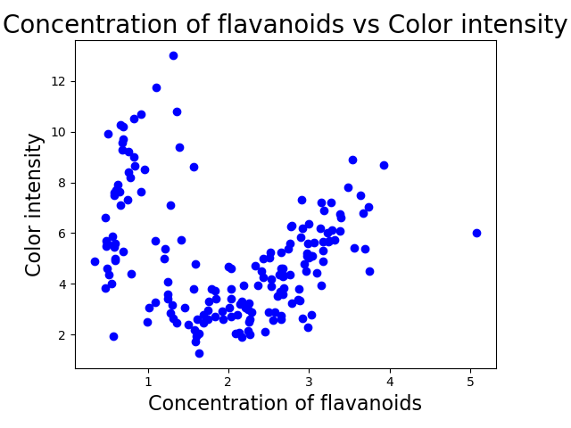

## Outlier Detection for a 2D Feature Space in Python \(DBSCAN\)

### How to detect outliers using plotting and clustering techniques to analyze the dependency of two features

After collecting all your courage to start a machine learning project, you firstly have to think about **how** and **where** **to** actually **start**. Following picture shows a typical [machine learning workflow](https://cloud.google.com/ml-engine/docs/ml-solutions-overview). The very beginning of every machine learning project is to collect and prepare essential data to be able to be processed by those fancy algorithms, such as [neural networks](https://github.com/ztlevi/Machine_Learning_Questions/tree/26cb30cb7a3ec95f737534585c8ae80567d03d7b/how-to-build-your-own-neural-network-from-scratch-in-python-68998a08e4f6/README.md) or [support vector machines](https://github.com/ztlevi/Machine_Learning_Questions/tree/26cb30cb7a3ec95f737534585c8ae80567d03d7b/support-vector-machine-introduction-to-machine-learning-algorithms-934a444fca47/README.md).


Besides creating some funky first visualizations of your sourced dataset or engineering used features, you also want to detect if you have any sneaky outliers in your dataset.

This article provides a **step-by-step guide** **on how to detect outliers** in the dependency between two features \(aka attributes or variables\), also called a **two-dimensional feature space.**

## OUTLIER DETECTION — LET’S GET STARTED!

This project was was developed in the IDE PyCharm with the Project Interpreter **Python 3.7**. However, you are free to apply the code in any other environment or notebook! The full project can be found [here](https://github.com/JOPloume/outlier-detection-2D-feature-space).

## \#1 — Visualizing the feature space.

First step is bringing in some visuals of the feature space we are dealing with. This project makes use of the _wine dataset_ that comes together with the framework [scikit learn](https://scikit-learn.org/stable/index.html).

We might not be enjoying wine as much as Amy Schumer does, but we still think wine is an amazingly tasty research object to investigate. The 2D feature space we will be examining is the dependency between the **concentration of flavanoids** \(a class of metabolites\) and the **color intensity** of wine.

**Following code provides an initial visualization of the 2D feature space.**

```python
import pandas as pd
import sys
from sklearn.cluster import DBSCAN
from collections import Counter

# Reading in 2D Feature Space
feature_space = pd.read_csv("../datasets/wine-data.csv", header=None, sep=",")
data = feature_space.iloc[:, 0:2].values

# DBSCAN model with parameters
model = DBSCAN(eps=0.8, min_samples=10).fit(data)

# Creating Panda DataFrame with Labels for Outlier Detection
outlier_df = pd.DataFrame(data)

# Printing total number of values for each label
print(Counter(model.labels_))

# Printing DataFrame being considered as Outliers -1
print(outlier_df[model.labels_ == -1])

# Printing and Indicating which type of object outlier_df is
print(type(outlier_df))

# Exporting this DataFrame to CSV
outlier_df[model.labels_ == -1].to_csv("../datasets/dbscan-outliers.csv")

sys.exit()
```

```python
import matplotlib.pyplot as plt
import sys
from numpy import genfromtxt

# NumPy function to create array from tabular dataset
my_csv = genfromtxt('../datasets/wine-data.csv', delimiter=',')

# Slicing array
array_flavanoids = my_csv[:, 0]

# Slicing array
array_colorintensity = my_csv[:, 1]

# Scatter plot function
plt.scatter(array_flavanoids, array_colorintensity, c='b', marker='o')
plt.xlabel('Concentration of flavanoids', fontsize=16)
plt.ylabel('Color intensity', fontsize=16)
plt.title('Concentration of flavanoids vs Color intensity', fontsize=20)
plt.show()

sys.exit()
```



Awesome! Now we have a first “feel” of the dependency we are dealing with.

## \#2 — Clustering data points.

We might already see some clusters and outliers in our first visualization, but to give our intuition a bit more statistical grounding, we take help of a clustering algorithm. **DBSCAN** _\(Density-Based Spatial Clustering of Applications with Noise\)_ is a clustering algorithm commonly used for outlier detection. Here, a data instance is considered as outlier, if it does not belong to any cluster.

> “DBSCAN algorithm requires 2 parameters — epsilon, which specifies how close points should be to each other to be considered a part of a cluster; and minPts, which specifies how many neighbors a point should have to be included into a cluster.” — alitouka

“DBSCAN algorithm requires 2 parameters — **epsilon**, which specifies how close points should be to each other to be considered a part of a cluster; and **minPts**, which specifies how many neighbors a point should have to be included into a cluster.” — [alitouka](https://github.com/alitouka)

With adjusting and tweaking the model’s parameters epsilon and minPts \(in Python: min_samples\), we reveal some nice clusters in the feature space.

**Following code clusters the 2D feature space.**

```python
import pandas as pd
import matplotlib.pyplot as plt
import sys
from numpy import genfromtxt
from sklearn.cluster import DBSCAN

# Reading in 2D Feature Space
feature_space = pd.read_csv("../datasets/wine-data.csv", header=None, sep=",")
data = feature_space.iloc[:, 0:2].values

# DBSCAN model with parameters
model = DBSCAN(eps=0.8, min_samples=10).fit(data)

# PLOTTING
# NumPy function to create array from tabular dataset
my_csv = genfromtxt('../datasets/wine-data.csv', delimiter=',')

# Slicing array
array_flavanoids = my_csv[:, 0]

# Slicing array
array_colorintensity = my_csv[:, 1]

# Scatter plot function
colors = model.labels_
plt.scatter(array_flavanoids, array_colorintensity, c=colors, marker='o')
plt.xlabel('Concentration of flavanoids', fontsize=16)
plt.ylabel('Color intensity', fontsize=16)
plt.title('Concentration of flavanoids vs Color intensity', fontsize=20)
plt.show()

sys.exit()
```

## Comparing the first visualization of the feature space with the cluster visualization


Oh yes, and we have finally spotted them!

## These tiny purple dots are the **outliers** we were searching for!


## \#3 — Calculating outliers.

Wow!! Now we know that there **do** exist outliers in the dependency between the **concentration of flavanoids** and the **color intensity** of wine, yaaay \(I still don’t actually get what flavanoids are, btw\). Just one last step…

**Following code calculates the outliers of the 2D feature space.**

This code calculates and finally prints the 11 outliers of the dataset in a separate [CSV-file](https://github.com/JOPloume/outlier-detection-2D-feature-space/blob/master/datasets/dbscan-outliers.csv).

This **step-by-step guide for outlier detection** was created during my thesis project on human-in-the-loop computing, an approach of combining human with machine intelligence. Stay tuned!

\[1\] Google Cloud, [Machine learning workflow](https://cloud.google.com/ml-engine/docs/ml-solutions-overview) \(2019\)

\[2\] M. Ester, H.-P. Kriegel, J. Sander and X. Xu, [A density-based algorithm for discovering clusters a density-based algorithm for discovering clusters in large spatial databases with noise](https://dl-acm-org.proxy.lnu.se/citation.cfm?id=3001507) \(1996\), KDD’96 Proceedings of the Second International Conference on Knowledge Discovery and Data Mining

\[3\] [https://towardsdatascience.com/outlier-detection-python-cd22e6a12098](https://towardsdatascience.com/outlier-detection-python-cd22e6a12098)
