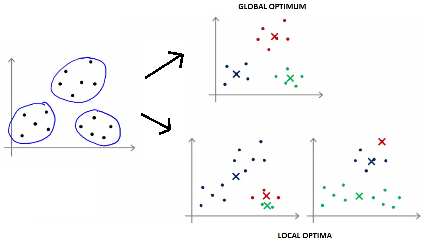
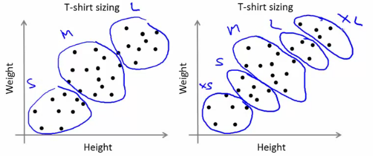

# Clustering

## Kmeans


* Clustering is a unsupervised learning algorithm that groups data in such a way that data points in the same group are more similar to each other than to those from other groups
* Similarity is usually defined using a distance measure \(e.g, Euclidean, Cosine, Jaccard, etc.\)
* The goal is usually to discover the underlying structure within the data \(usually high dimensional\)
* The most common clustering algorithm is K-means, where we define K \(the number of clusters\) and the algorithm iteratively finds the cluster each data point belongs to

[scikit-learn](http://scikit-learn.org/stable/modules/clustering.html) implements many clustering algorithms. Below is a comparison adopted from its page.

### Algorithm

* Input:
  * $$K$$ \(number of clusters\)
  * Training set $${x^1,x^2,...,x^m}$$ \($$x^i \in \mathbb{R}^n$$\)
* Algorithm:
  1. Randomly initialized $$K$$ cluster centroids $$\mu_1,\mu_2,...,\mu_K \in \mathbb{R}^n$$
  2. Repeat {

     * for i = 1 to $$m$$
       * $$c^i$$ := index \(from 1 to K\) of cluster centroid closest to $$x^i$$
     * for k = 1 to $$K$$
       * $$\mu_k$$ := average \(mean\) of points assigned to Cluster k

     }

[**Python implementation**](https://github.com/ztlevi/Machine_Learning_Questions/blob/master/codes/kmeans/kmeans.py)

### Random initialization

* How we initialize K-means
  * And how avoid local optimum
* Consider clustering algorithm
  * Never spoke about how we initialize the centroids
    * A few ways - one method is most recommended
* Have number of centroids set to less than number of examples \(K &lt; m\) \(if K &gt; m we have a problem\)0
  * Randomly pick K training examples
  * Set μ1 up to μK to these example's values
* K means can converge to different solutions depending on the initialization setup
  * Risk of local optimum 
  * The local optimum are valid convergence, but local optimum not global ones
* If this is a concern
  * We can do multiple random initializations
    * See if we get the same result - many same results are likely to indicate a global optimum
* Algorithmically we can do this as follows;

  

  * A typical number of times to initialize K-means is 50-1000
  * Randomly initialize K-means
    * For each 100 random initialization run K-means
    * Then compute the distortion on the set of cluster assignments and centroids at convergent
    * End with 100 ways of cluster the data
    * Pick the clustering which gave the lowest distortion

* If you're running K means with 2-10 clusters can help find better global optimum
  * If K is larger than 10, then multiple random initializations are less likely to be necessary
  * First solution is probably good enough \(better granularity of clustering\)

### Determine optimal k

#### Elbow mothod

The technique to determine K, the number of clusters, is called the elbow method. With a bit of fantasy, you can see an elbow in the chart below.

We’ll plot:

* values for K on the horizontal axis
* the distortion on the Y axis \(the values calculated with the cost function\). This results in:


When K increases, the centroids are closer to the clusters centroids. The improvements will decline, at some point rapidly, creating the elbow shape. That point is the optimal value for K. In the image above, K=3.

```python
# clustering dataset
# determine k using elbow method

from sklearn.cluster import KMeans
from sklearn import metrics
from scipy.spatial.distance import cdist
import numpy as np
import matplotlib.pyplot as plt

x1 = np.array([3, 1, 1, 2, 1, 6, 6, 6, 5, 6, 7, 8, 9, 8, 9, 9, 8])
x2 = np.array([5, 4, 5, 6, 5, 8, 6, 7, 6, 7, 1, 2, 1, 2, 3, 2, 3])

plt.plot()
plt.xlim([0, 10])
plt.ylim([0, 10])
plt.title('Dataset')
plt.scatter(x1, x2)
plt.show()

# create new plot and data
plt.plot()
X = np.array(list(zip(x1, x2))).reshape(len(x1), 2)
colors = ['b', 'g', 'r']
markers = ['o', 'v', 's']

# k means determine k
distortions = []
K = range(1,10)
for k in K:
    kmeanModel = KMeans(n_clusters=k).fit(X)
    kmeanModel.fit(X)
    distortions.append(sum(np.min(cdist(X, kmeanModel.cluster_centers_, 'euclidean'), axis=1)) / X.shape[0])

# Plot the elbow
plt.plot(K, distortions, 'bx-')
plt.xlabel('k')
plt.ylabel('Distortion')
plt.title('The Elbow Method showing the optimal k')
plt.show()
```

#### Another method for choosing K

* Using K-means for market segmentation
* Running K-means for a later/downstream purpose
  * See how well different number of clusters serve you later needs
* e.g.
  * T-shirt size example
    * If you have three sizes \(S,M,L\)
    * Or five sizes \(XS, S, M, L, XL\)
    * Run K means where K = 3 and K = 5
  * How does this look

    

  * This gives a way to chose the number of clusters
    * Could consider the cost of making extra sizes vs. how well distributed the products are
    * How important are those sizes though? \(e.g. more sizes might make the customers happier\)
    * So applied problem may help guide the number of clusters

## DBSCAN: Density-Based Spatial Clustering of Applications with Noise

DBSCAN is a density-based clustered algorithm similar to mean-shift, but with a couple of notable advantages. Check out another fancy graphic below and let’s get started!


1. DBSCAN begins with an arbitrary starting data point that has not been visited. The neighborhood of this point is extracted using a distance epsilon ε \(All points which are within the ε distance are neighborhood points\).
2. If there are a sufficient number of points \(according to minPoints\) within this neighborhood then the clustering process starts and the current data point becomes the first point in the new cluster. Otherwise, the point will be labeled as noise \(later this noisy point might become the part of the cluster\). In both cases that point is marked as “visited”.
3. For this first point in the new cluster, the points within its ε distance neighborhood also become part of the same cluster. This procedure of making all points in the ε neighborhood belong to the same cluster is then repeated for all of the new points that have been just added to the cluster group.
4. This process of steps 2 and 3 is repeated until all points in the cluster are determined i.e all points within the ε neighborhood of the cluster have been visited and labeled.
5. Once we’re done with the current cluster, a new unvisited point is retrieved and processed, leading to the discovery of a further cluster or noise. This process repeats until all points are marked as visited. Since at the end of this all points have been visited, each point will have been marked as either belonging to a cluster or being noise.

DBSCAN poses some great advantages over other clustering algorithms. Firstly, it does not require a pe-set number of clusters at all. It also identifies outliers as noises, unlike mean-shift which simply throws them into a cluster even if the data point is very different. Additionally, it can find arbitrarily sized and arbitrarily shaped clusters quite well.

The main drawback of DBSCAN is that it doesn’t perform as well as others when the clusters are of varying density. This is because the setting of the distance threshold ε and minPoints for identifying the neighborhood points will vary from cluster to cluster when the density varies. This drawback also occurs with very high-dimensional data since again the distance threshold ε becomes challenging to estimate.

