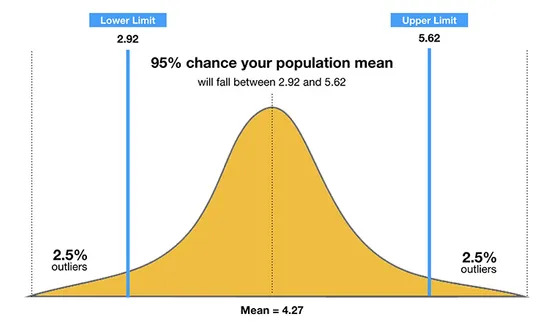
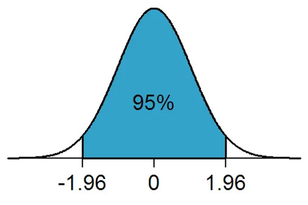
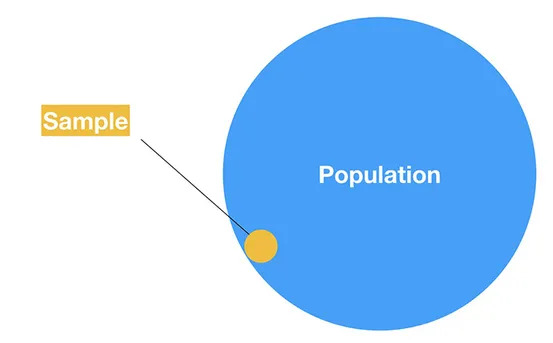
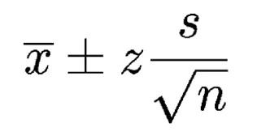
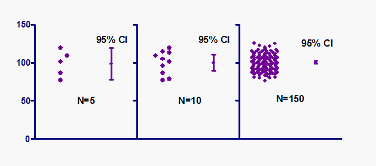
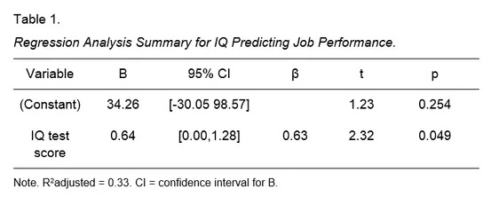

# Confidence Interval

\[Reference\]\([https://www.simplypsychology.org/confidence-interval.html\#:~:text=The%20confidence%20interval%20\(CI\)%20is,an%20upper%20and%20lower%20interval](https://www.simplypsychology.org/confidence-interval.html#:~:text=The%20confidence%20interval%20%28CI%29%20is,an%20upper%20and%20lower%20interval)\)

> The confidence interval \(CI\) is a range of values that’s likely to include a population value with a certain degree of confidence. It is often expressed a % whereby a population means lies between an upper and lower interval.

## What does a 95% confidence interval mean?

The 95% confidence interval is a range of values that you can be 95% certain contains the true mean of the population.  
As the sample size increases, the range of interval values will narrow, meaning that you know that mean with much more accuracy compared with a smaller sample.

We can visualize this using a [normal distribution](https://www.simplypsychology.org/normal-distribution.html) \(see the below graph\).

For example, the probability of the population mean value being between -1.96 and +1.96 standard deviations \(z-scores\) from the sample mean is 95%.

Accordingly, there is a 5% chance that the population mean lies outside of the upper and lower confidence interval \(as illustrated by the 2.5% of outliers on either side of the 1.96 z-scores\).

## Why do researchers use confidence intervals?

It is more or less impossible to study every single person in a population so [researchers select a sample](https://www.simplypsychology.org/sampling.html) or sub-group of the population.

This means that the researcher can only estimate the parameters \(i.e. characteristics\) of a population, the estimated range being calculated from a given set of sample data.

Therefore, a confidence interval is simply a way to measure how well your sample represents the population you are studying.

The probability that the confidence interval includes the true mean value within a population is called the confidence level of the CI.

You can calculate a CI for any confidence level you like, but the most commonly used value is 95%. A 95% confidence interval is a range of values \(upper and lower\) that you can be 95% certain contains the true mean of the population.

## How do I calculate a confidence interval?

To calculate the confidence interval, start by computing the mean and standard error of the sample.

Remember, you must calculate an upper and low score for the confidence interval using the [z-score](https://www.simplypsychology.org/z-score.html) for the chosen confidence level \(see table below\).

| Confidence Level | Z-Score |
| :--------------- | :------ |
| 0.90             | 1.645   |
| 0.95             | 1.96    |
| 0.99             | 2.58    |

> ## Confidence Interval Formula

Where:

- **X** is the mean
- **Z** is the chosen Z-value \(1.96 for 95%\)
- **s** is the standard error
- **n** is the sample size

For the lower interval score divide the standard error by the square root on n, and then multiply the sum of this calculation by the z-score \(1.96 for 95%\). Finally, subtract the value of this calculation from the sample mean.

> ## An Example

- **X** \(mean\) = 86
- **Z** = 1.960 \(from the table above for 95%\)
- **s** \(standard error\) = 6.2
- **n** \(sample size\) = 46

Lower Value: 86 - 1.960 × 6.2 √46 = **86 - 1.79** = 84.21

Upper Value: 86 + 1.960 × 6.2 √46 = **86 + 1.79** = 87.79

So the population mean is likely to be between 84.21 and 87.79

## How can we be confident the population mean is similar to the sample mean?

The narrower the interval \(upper and lower values\), the more precise is our estimate.

As a general rule, as a sample size increases the confident interval should become more narrow.

Therefore, with large samples, you can estimate the population mean with more precision than you can with smaller samples, so the confidence interval is quite narrow when computed from a large sample.

## How to report a confident interval APA style

The APA 6 style manual states \(p.117\):

> “ When reporting confidence intervals, use the format 95% CI \[LL, UL\] where LL is the lower limit of the confidence interval and UL is the upper limit. ”

For example, one might report: 95% CI \[5.62, 8.31\].

Confidence intervals can also be reported in a table

