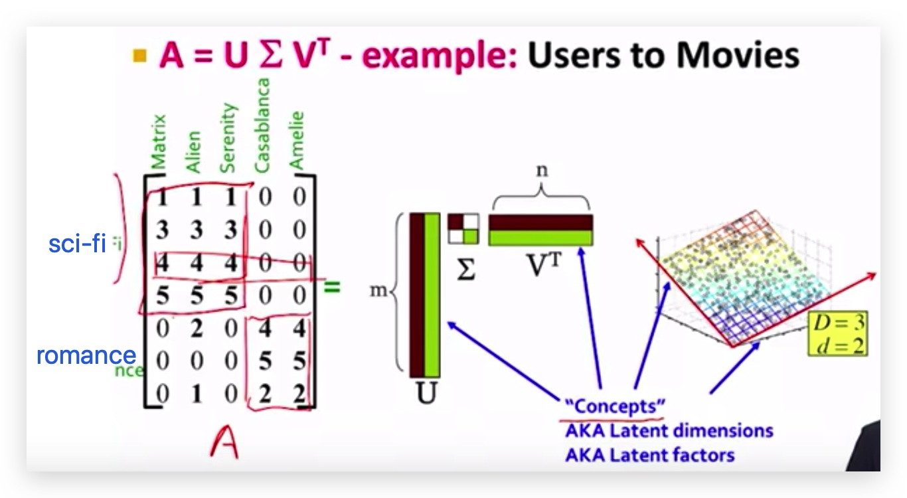
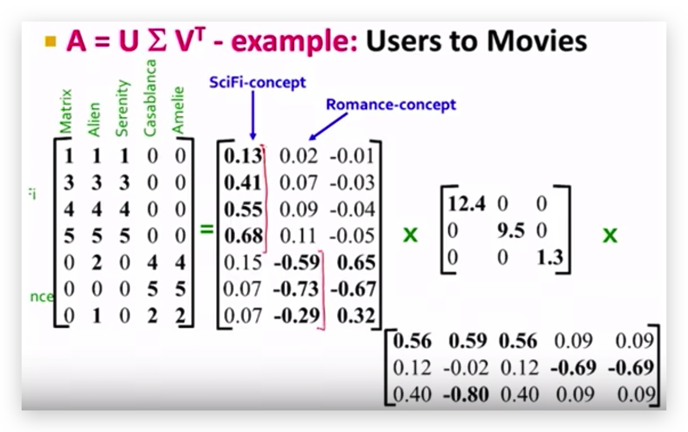

# Linear Algebra

## The Rank of a Matrix

You can think of an $$r \times c$$ matrix as a set of $$r$$ row [vectors](https://stattrek.com/help/glossary.aspx?Target=Vectors), each having $$c$$ elements; or you can think of it as a set of $$c$$ column vectors, each having $$r$$ elements.

The **rank** of a matrix is defined as \(a\) the maximum number of [ linearly independent](https://stattrek.com/help/glossary.aspx?Target=Linear_dependence_of_vectors) _column_ vectors in the matrix or \(b\) the maximum number of linearly independent $$row$$ vectors in the matrix. Both definitions are equivalent.

For an $$r \times c$$ matrix,

* If $$r$$ is less than $$c$$, then the maximum rank of the matrix is $$r$$.
* If $$r$$ is greater than $$c$$, then the maximum rank of the matrix is $$c$$.

The rank of a matrix would be zero only if the matrix had no elements. If a matrix had even one element, its minimum rank would be one.

For example, the following matrix has rank of 2.

$$
X =
\begin{pmatrix}
1 & 2 & 4 & 4 \\
3 & 4 & 8 & 0
\end{pmatrix}
$$

## [Singular Value Decomposition](https://www.youtube.com/watch?v=P5mlg91as1c)

### Formula

$$A_{[m \times n]}=U_{[m \times r]} \Sigma_{[r \times r]} (V_{[n \times r]})^T$$

* A: Input data matrix
  * $$m \times n$$ matrix \(e.g. m documents, n terms\)
* U: left singular vectors
  * $$m \times r$$ matrix \(m documents, r concepts\)
* $$\Sigma$$: Singular values
  * $$r \times r$$ diagonal matrix \(strength of each `concept`\) \(r: rank of matrix A\)
* V: Right singular vectors
  * $$n \times r$$ matrix \(n terms, r concepts\)

### Properties

It is always possible to decompose a real matrix A into $$A=U \Sigma V^T$$, where

* $$U, \Sigma, V$$: unique
* $$U, V$$: column orthonormal
  * $$U^T U = I$$; $$V^T V = I$$ \(I: identity matrix\)
  * \(Columns are orthogonal unit vectors\)
* $$\Sigma$$: diagonal
  * Entries \(singular values\) are positive, and sorted in decreasing order \($$\sigma_1 \geq \sigma_2 \geq \cdots \geq 0$$\)

### Interpretation

* U: user-to-concept similarity matrix
* V: movie-to-concept similarity matrix
* $$\Sigma$$: its diagonal elements `strength` of each concept

