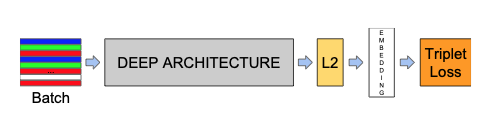

# FaceNet

## Model structure

The network consists of a batch input layer and a deep CNN followed by **L2 normalization**, which results in the **face embedding**. This is followed by the **triplet loss** during training.

Namely, the authors strive for an embedding $$f(x)$$, from an image $$x$$ into a feature space $$\mathbf{R}^d$$, such that:

* squared distance between all faces, independent of imaging conditions, of the same identity is small.
* the squared distance between a pair of face images from different identities is large.

## Triplet Loss

The embedding is represented by $$f (x) \in \mathbf{R}^d$$ . It embeds an image x into a d-dimensional Euclidean space. Additionally, we constrain this embedding to live on the d-dimensional hypersphere, i.e. $$||f(x)||^2 = 1$$.

Here the objective is that we want to make sure that an image $$x^a_i$$\(**anchor**\) of a specific person is closer to all other images $$x^p_i$$ \(**positive**\) of the same person than it is to any image $$x^n_i$$ \(**negative**\) of any other person.

* $$\|f(x^a_i)-f(x^p_i)\|^2 +\alpha<\|f(x^a_i)-f(x^n_i)\|^2$$ for $$\forall (f(x^a_i),f(x^p_i),f(x^n_i))\in \tau$$
* $$\alpha$$ is a margin that is enforced between positive and negative pairs.
* $$\tau$$ is the set of all possible triplets in the training set and has cardinality $$N$$
* The the objective is to minimize the Loss: $$L = \sum [\|f(x^a_i)-f(x^p_i) \|^2-\|f(x^a_i)-f(x^n_i)\|^2+\alpha]_+$$

## Triplet Selection

Given $$x^a_i$$ , we want to select an $$x^p_i$$ \(**hard positive**\) such that $$argmax_{x^p_i} \|f (x^a_i )-f (x^p_i )\|^2$$ and similarly $$x^n_i$$ \(**hard negative**\) such that $$argmin_{x^n_i}\|f(x^a_i )-f (x^n_i )\|^2$$ .

Two obvious choices:

* Generate triplets offline every n steps, using the most recent network checkpoint and computing the argmin and argmax on a subset of the data.
* **Generate triplets online**. This can be done by select- ing the hard positive/negative exemplars from within a mini-batch.

### Online Triplets Generation

* To have a meaningful representation of the anchor- positive distances, it needs to be ensured that **a minimal number of exemplars of any one identity is present in each minibatch**.
  * around 40 faces are selected per identity per minibatch.
  * randomly sampled negative faces are added to each mini-batch.
* Instead of picking the hardest positive, we use all anchor-positive pairs in a mini-batch while still selecting the hard negatives. For all anchor-positive method was **more stable and converged slightly faster at the beginning of training**.
* Selecting the hardest negatives can in practice lead to bad local minima early on in training, specifically it can result in a collapsed model \(i.e. $$f(x) = 0$$\). In order to mitigate this, it helps to select $$x^n_i$$ such that

  $$\|f(x^a_i)-f(x^p_i)\|^2_2<\|f(x^a_i)-f(x^n_i)\|^2_2$$

  * these negative exemplars **semi-hard​**, as they are further away from the anchor than the positive exemplar, but still hard because the squared distance is close to the anchor-positive distance.
  * Those negatives lie inside the margin $$\alpha$$

* In most experiments the author used a batch size of around 1,800 exemplars.

## Deep Convolutional Networks

* Use rectified linear units as the non-linear activation function
* Now use Inception+ResNet

## Model Evaluation

The author evaluate our method on the face verification task. I.e. given a pair of two face images a squared L2 distance threshold $$D(x_i,x_j)$$ is used to determine the classification of **same** and **different**. All faces pairs $$(i, j)$$ of the same identity are denoted with $$\mathcal{P}_{same}$$, whereas all pairs of different identities are denoted with $$\mathcal{P}_{diff}$$

* the set of all **true accepts** as:

  $$TA(d) = \{ (i,j) \in \mathcal{P}_{same}$$, with $$\space D(xi,xj) <= d \}$$.

  These are the face pairs $$(i, j)$$ that were correctly classified as same at threshold $$d$$.

* the set of all pairs that was incorrectly classified as same\(**false accept**\) is:

  $$TP(d) = \{ (i,j) \in \mathcal{P}_{diff}$$, with $$\space D(xi,xj) <= d \}$$.

* The validation rate $$VAL(d)$$ and the false accept rate $$FAR(d)$$ for a given face distance $$d$$ are then defined as:

  $$VAL(d)=\frac{|TA(d)|}{|P_{same}|}$$ ,

  $$FAR(d)=\frac{|TP(d)|}{|P_{diff}|}$$

