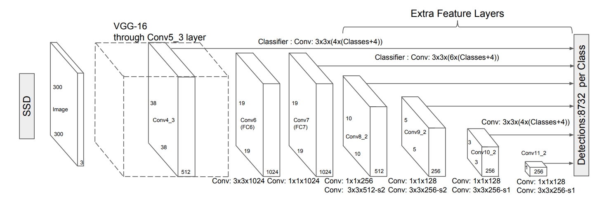
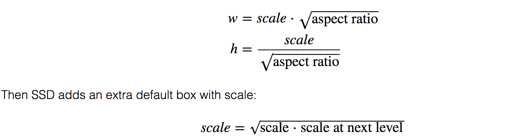

# Single Shot MultiBox Detector\(SSD\)

- **Single Shot**: this means that the tasks of object localization and classification are done in a single forward pass of the network
- **MultiBox**: this is the name of a technique for bounding box regression developed by Szegedy et al. \(we will briefly cover it shortly\)
- **Detector**: The network is an object detector that also classifies those detected objects

## Architecture



## Choosing default boundary boxes

SSD defines a scale value for each feature map layer. Starting from the left, Conv4_3 detects objects at the smallest scale 0.2 \(or 0.1 sometimes\) and then increases linearly to the rightmost layer at a scale of 0.9.


the scale value with the target aspect ratios, we compute the width and the height of the default boxes. For layers making 6 predictions, SSD starts with 5 target aspect ratios: 1, 2, 3, 1/2 and 1/3. Then the width and the height of the default boxes are calculated as:



The center of each default box to $$(\frac{i+0.5}{|f_{k}|}, \frac{j+0.5}{|f_{k}|})$$, where $$|f_{k}|$$ is the size of the k-th square feature map, $$i, j \in [0, |f_{k}|]$$.

Default boundary boxes are chosen manually. The criterion for matching a prior and a ground-truth box is IoU \(Intersection Over Union\), which is also called **Jaccard index**. The more overlap, the better match. The process of matching looks like follows:

```python
for every ground-truth box:
    match the ground-truth box with prior having the biggest the IoU
for every prior:
    ious = IoU(prior, ground_truth_boxes)
    max_iou = max(ious)
    if max_iou > threshold:
        i = argmax(ious)
        match the prior with ground_truth_boxes[i]
```

> YOLO uses k-means clustering on the training dataset to determine those default boundary boxes.

## Try to verify the number of default boxes in SSD300 \(the one implemented\)

For conv4_3, conv10_2 and conv11_2, we only associate 4 default boxes at each feature map location - omitting aspect ratios of $$\frac{1}{3}$$and 3.

1. Conv4_3: $$38 \cdot 38 \cdot 4 = 5776$$
2. Conv7: $$19 \cdot 19 \cdot 6 = 2166$$
3. Conv8_2: $$10 \cdot 10 \cdot 6 = 600$$
4. Conv9_2: $$5 \cdot 5 \cdot 6 = 150$$
5. Conv10_2: $$3 \cdot 3 \cdot 4 = 36$$
6. Conv11_2: $$4$$

Total: $$5776+ 2166 + 600 + 150 + 36 + 4 = 8732$$

## Loss Function

MultiBox's loss function also combined two critical components that made their way into SSD:

- **Confidence Loss**: this measures how confident the network is of the objectness of the computed bounding box. Categorical cross-entropy is used to compute this loss.
- **Location Loss**: this measures how far away the network's predicted bounding boxes are from the ground truth ones from the training set. L1-smooth Norm is used here.


$$multiboxLoss = confidenceLoss + \alpha * locationLoss$$

Where the alpha term helps us in balancing the contribution of the location loss.

## Hard Negative Mining

During training, as most of the bounding boxes will have low IoU and therefore be interpreted as negative training examples, we may end up with a disproportionate amount of negative examples in our training set. Therefore, instead of using all negative predictions, it is advised to **keep a ratio of negative to positive examples of around 3:1**. The reason why you need to keep negative samples is because the network also needs to learn and be explicitly told what constitutes an incorrect detection.


## Data Augmentation

- Generated additional training examples with patches of the original image at different IoU ratios \(e.g. 0.1, 0.3, 0.5, etc.\) and random patches as well.
- Each image is also randomly horizontally flipped with a probability of 0.5.
