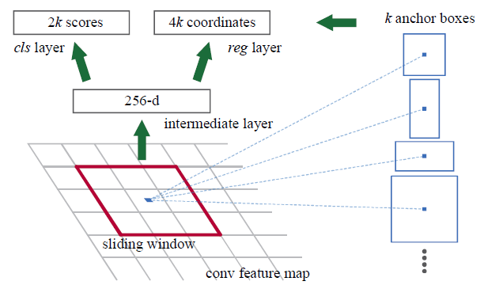

## Region Proposal Network

1. First, the picture goes through conv layers and feature maps are extracted.
2. Then a **sliding window** is used in RPN for each location over the feature map.
3. For each location, **k \(k=9\) anchor** boxes are used \(**3 scales of 128, 256 and 512, and 3 aspect ratios of 1:1, 1:2, 2:1**\) for generating region proposals.
4. A **cls** layer outputs $$2k$$ scores **whether there is object or not** for $$k$$ boxes.
5. A **reg** layer outputs $$4k$$ for the **coordinates** \(box center coordinates, width and height\) of _k_ boxes.
6. With a size of $$W \times H$$ feature map, there are $$WHk$$ anchors in total.

## Network Architecture

- Similar to Fast R-CNN, the image is provided as an input to a convolutional network which provides a convolutional feature map.
- Instead of using selective search algorithm on the feature map to identify the region proposals, a separate network is used to predict the region proposals\(Region Proposal Network\).
- The predicted region proposals are then reshaped using a RoI pooling layer which is then used to classify the image within the proposed region and predict the offset values for the bounding boxes.

## Bounding Box Regression

Given a predicted bounding box coordinate $$\mathbf{p} = (p_x, p_y, p_w, p_h)$$ \(center coordinate, width, height\) and its corresponding ground truth box coordinates $$\mathbf{g} = (g_x, g_y, g_w, g_h)$$ , the regressor is configured to learn scale-invariant transformation between two centers and log-scale transformation between widths and heights. All the transformation functions take $$\mathbf{p}$$ as input.

$$
\begin{aligned}
\hat{g}_x &= p_w d_x(\mathbf{p}) + p_x \\
\hat{g}_y &= p_h d_y(\mathbf{p}) + p_y \\
\hat{g}_w &= p_w \exp({d_w(\mathbf{p})}) \\
\hat{g}_h &= p_h \exp({d_h(\mathbf{p})})
\end{aligned}
$$

An obvious benefit of applying such transformation is that all the bounding box correction functions, $$d_i(\mathbf{p})$$ where $$i \in \{ x, y, w, h \}$$, can take any value between \[-∞, +∞\]. The targets for them to learn are:

$$
\begin{aligned}
t_x &= (g_x - p_x) / p_w \\
t_y &= (g_y - p_y) / p_h \\
t_w &= \log(g_w/p_w) \\
t_h &= \log(g_h/p_h)
\end{aligned}
$$

A standard regression model can solve the problem by minimizing the SSE loss with regularization:

$$
\mathcal{L}_\text{reg} = \sum_{i \in \{x, y, w, h\}} (t_i - d_i(\mathbf{p}))^2 + \lambda \|\mathbf{w}\|^2
$$

The regularization term is critical here and RCNN paper picked the best λ by cross validation. It is also noteworthy that not all the predicted bounding boxes have corresponding ground truth boxes. For example, if there is no overlap, it does not make sense to run bbox regression. Here, only a predicted box with a nearby ground truth box with at least 0.6 IoU is kept for training the bbox regression model.

## Loss Function

Faster R-CNN is optimized for a multi-task loss function, similar to fast R-CNN.

| **Symbol** | **Explanation** |
| :-- | :-- |
| $$p_i$$ | Predicted probability of anchor i being an object. |
| $$p^*_i$$ | Ground truth label \(binary\) of whether anchor i is an object. |
| $$t_i$$ | Predicted four parameterized coordinates. |
| $$t^*_i$$ | Ground truth coordinates. |
| $$N_\text{cls}$$ | Normalization term, set to be mini-batch size \(~256\) in the paper. |
| $$N_\text{box}$$ | Normalization term, set to the number of anchor locations \(~2400\) in the paper. |
| $$\lambda$$ | A balancing parameter, set to be ~10 in the paper \(so that both $$\mathcal{L}_\text{cls}$$ and $$\mathcal{L}_\text{box}$$ terms are roughly equally weighted\). |

The multi-task loss function combines the losses of classification and bounding box regression:

$$
\mathcal{L} = \mathcal{L}_\text{cls} + \mathcal{L}_\text{box}
$$

$$
\mathcal{L}(\{p_i\}, \{t_i\}) = \frac{1}{N_\text{cls}} \sum_i \mathcal{L}_\text{cls} (p_i, p^*_i) + \frac{\lambda}{N_\text{box}} \sum_i p^*_i \cdot L_1^\text{smooth}(t_i - t^*_i)
$$

where $$\mathcal{L}_\text{cls}$$ is the log loss function over two classes, as we can easily translate a multi-class classification into a binary classification by predicting a sample being a target object versus not. $$L_1^\text{smooth}$$ is the smooth L1 loss.

$$
\mathcal{L}_\text{cls} (p_i, p^*_i) = - p^*_i \log p_i - (1 - p^*_i) \log (1 - p_i)
$$
