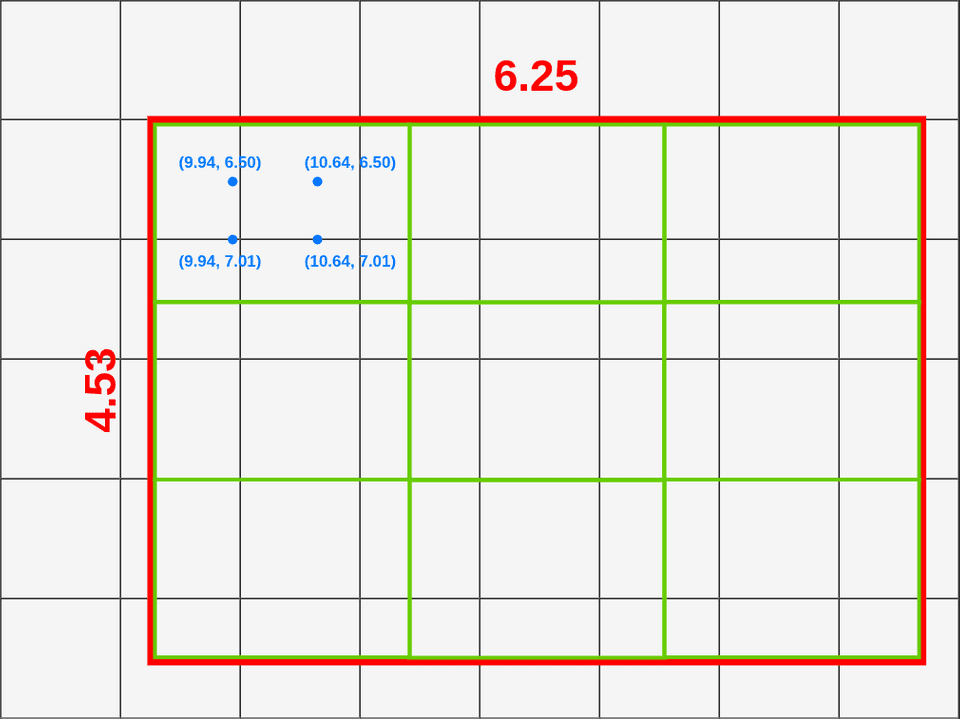
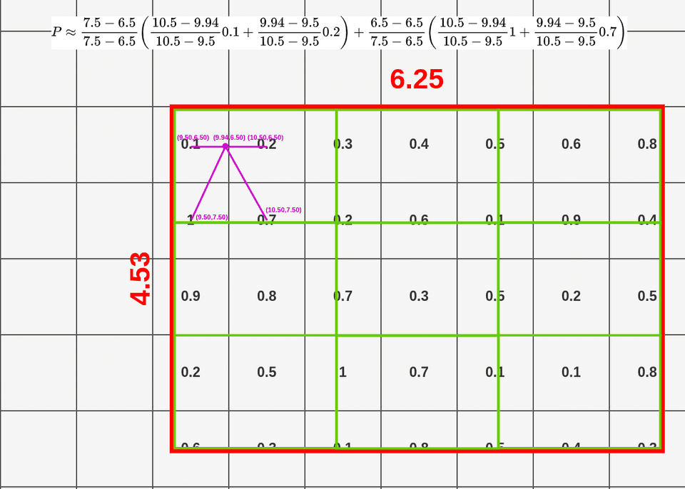

# ROI

## ROI pooling

The layer takes two inputs:

1. A fixed-size feature map obtained from a deep convolutional network with several convolutions and max pooling layers.
2. An N x 5 matrix of representing a list of regions of interest, where N is a number of RoIs. The first column represents the image index and the remaining four are the coordinates of the top left and bottom right corners of the region.

What does the RoI pooling actually do? For every region of interest from the input list, it takes a section of the input feature map that corresponds to it and scales it to some pre-defined size \(e.g., 7×7\). The scaling is done by:

1. Dividing the region proposal into equal-sized sections \(the number of which is the same as the dimension of the output\)
2. Finding the largest value in each section
3. Copying these max values to the output buffer

## [ROI Align](https://towardsdatascience.com/understanding-region-of-interest-part-2-roi-align-and-roi-warp-f795196fc193)

The main difference between RoI Pooling and RoI Align is quantization. RoI Align is not using quantization for data pooling. You know that Fast R-CNN is applying quantization twice. First time in the mapping process and the second time during the pooling process.

If you look at the first box \(top left\), you can notice that it covers six different grid cells. To extract value for the pooling layer we have to sample some data from it. To sample data we have to create four sampling points inside that box.

## ROI Warp

There is a third method of pooling data that was introduced in [_Instance-aware semantic segmentation via multi-task network cascades_](https://arxiv.org/pdf/1512.04412.pdf) and it’s called **RoIWarp**. The idea of RoIWarp is more or less the same as RoIAlign, the only difference is that **RoIWarp is quantizing RoI mapping onto a feature map**.
