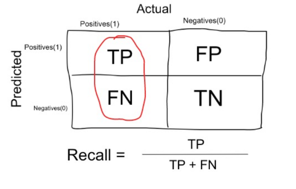
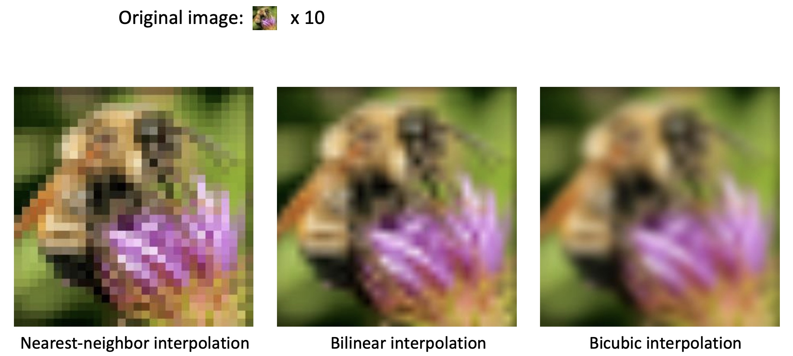

<!-- markdown-toc start - Don't edit this section. Run M-x markdown-toc-refresh-toc -->

**Table of Contents**

- [General](#general)
  - [Project Workflow](#project-workflow)
  - [Confusion matrix](#confusion-matrix)
  - [Weight Initialization](#weight-initialization)
  - [[Optimization](Neural_Networks/Optimization.html)](#optimizationneuralnetworksoptimizationhtml)
  - [Normalization](#normalization)
    - [Batch Normalization](#batch-normalization)
    - [Common pitfall](#common-pitfall)
  - [Cost function](#cost-function)
    - [L1, L2](#l1-l2)
    - [cross-entropy](#cross-entropy)
  - [Clustering - K-means](#clustering---k-means)
    - [K-means algorithm:](#k-means-algorithm)
    - [[kmeans python code](https://github.com/ztlevi/Machine_Learning_Questions/blob/master/codes/kmeans/kmeans.py)](#kmeans-python-codehttpsgithubcomztlevimachinelearningquestionsblobmastercodeskmeanskmeanspy)
  - [Principal Component Analysis](#principal-component-analysis)
  - [Non maximal supression](#non-maximal-supression)
    - [Codes](#codes)
  - [Image interpolation](#image-interpolation)
    - [Examples](#examples)
  - [Blur image](#blur-image)

<!-- markdown-toc end -->

# General

## Project Workflow

Given a data science / machine learning project, what steps should we follow? Here's how I would tackle it:

- **Specify business objective.** Are we trying to win more customers, achieve higher satisfaction, or gain more revenues?
- **Define problem.** What is the specific gap in your ideal world and the real one that requires machine learning to fill? Ask questions that can be addressed using your data and predictive modeling (ML algorithms).
- **Create a common sense baseline.** But before you resort to ML, set up a baseline to solve the problem as if you know zero data science. You may be amazed at how effective this baseline is. It can be as simple as recommending the top N popular items or other rule-based logic. This baseline can also server as a good benchmark for ML algorithms.
- **Review ML literatures.** To avoid reinventing the wheel and get inspired on what techniques / algorithms are good at addressing the questions using our data.
- **Set up a single-number metric.** What it means to be successful - high accuracy, lower error, or bigger AUC - and how do you measure it? The metric has to align with high-level goals, most often the success of your business. Set up a single-number against which all models are measured.
- **Do exploratory data analysis (EDA).** Play with the data to get a general idea of data type, distribution, variable correlation, facets etc. This step would involve a lot of plotting.
- **Partition data.** Validation set should be large enough to detect differences between the models you are training; test set should be large enough to indicate the overall performance of the final model; training set, needless to say, the larger the merrier.
- **Preprocess.** This would include data integration, cleaning, transformation, reduction, discretization and more.
- **Engineer features.** Coming up with features is difficult, time-consuming, requires expert knowledge. Applied machine learning is basically feature engineering. This step usually involves feature selection and creation, using domain knowledge. Can be minimal for deep learning projects.
- **Develop models.** Choose which algorithm to use, what hyperparameters to tune, which architecture to use etc.
- **Ensemble.** Ensemble can usually boost performance, depending on the correlations of the models/features. So it's always a good idea to try out. But be open-minded about making tradeoff - some ensemble are too complex/slow to put into production.
- **Deploy model.** Deploy models into production for inference.
- **Monitor model.** Monitor model performance, and collect feedbacks.
- **Iterate.** Iterate the previous steps. Data science tends to be an iterative process, with new and improved models being developed over time.


## Confusion matrix

- Accuracy:

  

- Precision:

  

- Recall:

  

## Weight Initialization

`W = 0.01 * np.random.randn(D,H)`, where randn samples from a zero mean, unit standard deviation gaussian. One problem with the above suggestion is that the distribution of the outputs from a randomly initialized neuron has a variance that grows with the number of inputs. It turns out that we can normalize the variance of each neuron's output to 1 by scaling its weight vector by the square root of its fan-in (i.e. its number of inputs). `w = np.random.randn(n) / sqrt(n)`, where n is the number of its inputs.

In practice, the current recommendation is to use ReLU units and use the `w = np.random.randn(n) * sqrt(2.0/n)`.

## [Optimization](Neural_Networks/Optimization.html)

## Normalization

Normalization: refers to normalizing the data dimensions so that they are of approximately the same scale. One is to divide each dimension by its standard deviation, once it has been zero-centered: `(X /= np.std(X, axis = 0))`. Another form of this preprocessing normalizes each dimension so that the min and max along the dimension is -1 and 1 respectively.

```python
(x - x.min()) / (x.max() - x.min()) # values from 0 to 1
2*(x - x.min()) / (x.max() - x.min()) - 1 # values from -1 to 1
(x - x.mean()) / x.std() # values from ? to ?, but mean at 0
```

### Batch Normalization

When data flow through a deep network, the weights and parameters adjust those values, some times make the data too big or too small, known as **internal covariate shift**.

To solve the vanishing gradient($$0.9^{k}$$) and gradient explosion($$1.1^{k}$$), batch normalization is introduced.

1. Compute mini-batch mean: $${\mu}_{\beta} \gets \frac{1}{m}\sum_{i=1}^M x_{i}$$
2. Compute mini-batch variance: $${\sigma}_{\beta}^{2} \gets \frac{1}{m}\sum_{i=1}^M (x_{i} - \mu_{\beta})^{2}$$
3. normalize features: $$\hat{x_i} \gets \frac{x_{i} - \mu_{\beta} }{\sqrt{ { {\sigma}_{\beta} +
   \epsilon}^{2} } }$$
4. Put batch mean and variance: $$y_{i} \gets \gamma \hat{x_{i}} + \beta = BN_{\gamma, \beta}(x_{i})$$
5. When test the model, we calculate a moving average and variance estimate of the training population. These estimates are averages of all batch means and variances calculated during training.

- Benefits:
  - Networks train faster
  - Allows higher learning rates
  - Makes weights easier to initialize
  - Makes more activation functions viable
  - Provides a bit of regularlization
  - Simplifies the creation of deeper networks

### Common pitfall

An important point to make about the preprocessing is that any preprocessing statistics (e.g. the data mean) must only be computed on the training data, and then applied to the validation / test data. E.g. computing the mean and subtracting it from every image across the entire dataset and then splitting the data into train/val/test splits would be a mistake. **Instead, the mean must be computed only over the training data and then subtracted equally from all splits (train/val/test).**

## Cost function

A Loss Functions tells us "how good" our model is at making predictions for a given set of parameters. The cost function has its own curve and its own gradients. The slope of this curve tells us how to update our parameters to make the model more accurate.

### L1, L2

### cross-entropy

If M>2 (i.e. multiclass classification), we calculate a separate loss for each class label per observation and sum the result. Usually an activation function (Sigmoid / Softmax) is applied to the scores before the CE Loss computation.

$$
-\sum_{c=1}^M y_{o,c}log(p_{o,c})
$$

> Note:
>
> 1.  M - number of classes (dog, cat, fish)
> 2.  log - the natural log
> 3.  y - binary indicator (0 or 1) if class label c is the correct classification for observation o
> 4.  p - predicted probability observation o is of class c

## Clustering - K-means

- Clustering is a unsupervised learning algorithm that groups data in such a way that data points in the same group are more similar to each other than to those from other groups
- Similarity is usually defined using a distance measure (e.g, Euclidean, Cosine, Jaccard, etc.)
- The goal is usually to discover the underlying structure within the data (usually high dimensional)
- The most common clustering algorithm is K-means, where we define K (the number of clusters) and the algorithm iteratively finds the cluster each data point belongs to

[scikit-learn](http://scikit-learn.org/stable/modules/clustering.html) implements many clustering algorithms. Below is a comparison adopted from its page.

### K-means algorithm:

- Input:
  - $$K$$ (number of clusters)
  - Training set $${x^1,x^2,...,x^m}$$ ($$x^i \in \mathbb{R}^n$$)
- Algorithm:

  1. Randomly initialized $$K$$ cluster centroids $$\mu_1,\mu_2,...,\mu_K \in \mathbb{R}^n$$
  2. Repeat {

     - for i = 1 to $$m$$
       - $$c^i$$ := index (from 1 to K) of cluster centroid closest to $$x^i$$
     - for k = 1 to $$K$$
       - $$\mu_k$$ := average (mean) of points assigned to Cluster k

     }

### [kmeans python code](https://github.com/ztlevi/Machine_Learning_Questions/blob/master/codes/kmeans/kmeans.py)


## Principal Component Analysis

- Principal Component Analysis (PCA) is a dimension reduction technique that projects the data into a lower dimensional space
- PCA uses Singular Value Decomposition (SVD), which is a matrix factorization method that decomposes a matrix into three smaller matrices (more details of SVD [here](https://en.wikipedia.org/wiki/Singular-value_decomposition))
- PCA finds top N principal components, which are dimensions along which the data vary (spread out) the most. Intuitively, the more spread out the data along a specific dimension, the more information is contained, thus the more important this dimension is for the pattern recognition of the dataset
- PCA can be used as pre-step for data visualization: reducing high dimensional data into 2D or 3D. An alternative dimensionality reduction technique is [t-SNE](https://lvdmaaten.github.io/tsne/)

Here is a visual explanation of PCA


## Different ways to update parameters:
- Vanilla update	x += - learning_rate * dx
- Momentum update	v = mu * v - learning_rate * dx # integrate velocity
x += v # integrate position	
Nesterov Momentum	x_ahead = x + mu * v 
v = mu * v - learning_rate * dx_ahead
x += v	
Adagrad 
cache += dx**2
x += - learning_rate * dx / (np.sqrt(cache) + eps)	
Adam	m = beta1*m + (1-beta1)dx
v = beta2*v + (1-beta2)(dx**2)
x += - learning_rate * m / (np.sqrt(v) + eps)

## Non maximal supression

### Codes

- [IOU](https://github.com/ztlevi/Machine_Learning_Questions/blob/master/codes/NMS/IOU.py)
- [NMS](https://github.com/ztlevi/Machine_Learning_Questions/blob/master/codes/NMS/nms.py)
- [NMS_Slow](https://github.com/ztlevi/Machine_Learning_Questions/blob/master/codes/NMS/nms_slow.py)
- [NMS_Fast](https://github.com/ztlevi/Machine_Learning_Questions/blob/master/codes/NMS/nms_fast.py) uses numpy

## Image interpolation

- Nearest Neighbour
- Bilinear
- Bicubic


### Examples



## Blur image

TODO: finish introduction
