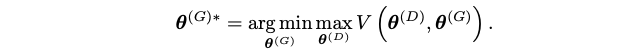

# Generative Adversarial Networks

## Introduction

- The **generator** creates samples that are intended to come from the same distribution as the training data; The **discriminator** examines samples to determine whether they are real or fake.
- The discriminator learns using traditional supervised learning techniques, dividing inputs into two classes (real or fake). The generator is trained to fool the discriminator.

- $$z$$ Input noise
- training examples $$x$$ are randomly sampled from the training set and used as input for the first player, the discriminator, represented by the function $$D$$.
- $$G(z)$$ a fake sample created by the generator

## The training process

The training process consists of simultaneous SGD. On each step, two minibatches are sampled: a minibatch of $$x$$ values from the dataset and a minibatch of $$z$$ values drawn from the model’s prior over latent variables. Then two gradient steps are made simultaneously: one updating $$\theta^{(D)}$$ to reduce $$J ^{(D)}$$ and one updating $$θ^{(G)}$$ o reduce $$J^{(G)}$$.

- Adam is most used in GAN

## Cost functions

### The discriminator’s cost, $$J^{(D)}$$

- standard cross-entropy cost that is minimized when training a standard binary classifier with a sigmoid output.

## Minimax

- In zero-sum game, in which the sum of all player’s costs is always zero: $$J^{(D)} = - J^{(G)}$$

- we can summarize the entire game with a value function specifying the discriminator’s payoff:

  

- Zero-sum games are also called minimax games because their solution involves **minimization in an outer loop and maximization in an inner loop**:

  

- Not work very well in practice

## Heuristic, non-saturating game

- In the minimax game, the discriminator minimizes a cross-entropy, but the generator maximizes the same cross-entropy. This is unfortunate for the generator, because when the discriminator successfully rejects generator samples with high confidence, the generator’s gradient vanishes.

- Instead of flipping the sign on the discriminator’s cost to obtain a cost for the generator, we flip the target used to construct the cross-entropy cost. The cost for the generator then becomes:

  

- The sole motivation for this version of the game is to ensure that each player has a **strong gradient when that player is “losing” the game**

## Maximum likelihood game

We might like to be able to do maximum likelihood learning with GANs, which would mean **minimizing the KL divergence between the data and the model**

- The KL divergence is not symmetric; minimizing $$D_{KL}(p_{data} || p_{model})$$ is different from minimizing $$D_{KL}(p_{model} || p_{data})$$

  

- GANs often choose to generate from very few modes; fewer than the limitation imposed by the model capacity. The reverse KL prefers to generate from as many modes of the data distribution as the model is able to; it does not prefer fewer modes in general. This suggests that **the mode collapse is driven by a factor other than the choice of divergence**.

# Pix2Pix

## Objective

- Conditional GAN loss:

  

- We also explore this option, using L1 distance rather than L2 as L1 encourages less blurring:

  

- The final objective is:

  

- Using **Heuristic instead of minimax**

## Structure

- Borrow structure of DCGAN:

- Both generator and discriminator use modules of the form convolution-BatchNorm-ReLu;
- **Encoder-decoder Network**:In such a network, the input is passed through a series of layers that progressively downsample, until a bottleneck layer, at which point the process is reversed. Such a network requires that **all information flow pass through all the layers**, including the bottleneck.
- To give the generator a means to **circumvent the bottleneck for information**, we add skip connections, following the general shape of a **U-Net**. Specifically, we add **skip connections** between each layer i and layer $$n − i$$, where n is the total number of layers. Each skip connection simply concatenates all channels at layer i with those at layer $$n − i$$.

## Patch GAN

- Problems: GAN discriminator only model high-frequency structure, relying on an L1 term to force low-frequency correctness.
- Solution: In order to model **high-frequencies**, it is sufficient to restrict our attention to the structure in **local image patches**.

Patch GAN only penalizes structure at the scale of patches. This discriminator tries to classify if each $$N ×N$$ patch in an image is real or fake. We run this discriminator convolutionally across the image, averaging all responses to provide the ultimate output of D.

## Evaluation metrics

- Run “real vs. fake” perceptual studies on Amazon Mechanical Turk (AMT);
- Adopt the popular FCN-8s architecture for semantic segmentation;
