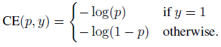
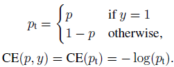
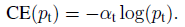
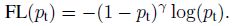

<!-- markdown-toc start - Don't edit this section. Run M-x markdown-toc-refresh-toc -->

**Table of Contents**

- [Focal Loss For Imbalanced Data](#focal-loss-for-imbalanced-data)
  - [Class Imbalance Problem of One-Stage Detector](#class-imbalance-problem-of-one-stage-detector)
  - [Cross Entropy (CE) Loss](#cross-entropy-ce-loss)
  - [alpha-Balanced CE Loss](#alpha-balanced-ce-loss)
  - [Focal Loss](#focal-loss)
  - [alpha-Balanced Variant of FL](#alpha-balanced-variant-of-fl)

<!-- markdown-toc end -->

# Focal Loss For Imbalanced Data

## Class Imbalance Problem of One-Stage Detector

- A much larger set of candidate object locations is regularly sampled across an image (~100k locations), which densely cover spatial positions, scales and aspect ratios.
- The training procedure is still **dominated by easily classified background examples**. It is typically addressed via bootstrapping or hard example mining. But they are not efficient enough.

## Cross Entropy (CE) Loss

For notation convenience, $$p_{t}$$ is defined and CE is rewritten as below:

When summed over **a large number of easy examples**, these small loss values can **overwhelm the rare class**.

## alpha-Balanced CE Loss

- To address the class imbalance, one method is to add a weighting factor $$\alpha$$ for class 1 and $$1 - \alpha$$ for class -1. $$\alpha$$ may be set by inverse class frequency or treated as a hyperparameter to set by cross validation.

## Focal Loss

- The loss function is reshaped to **down-weight easy examples** and thus focus training on hard negatives. A modulating factor $$(1-p_{t})^{\gamma} $$ is added to the cross entropy loss where _γ_ is tested from $$[0,5]$$ in the experiment.
- There are two properties of the FL:

1. When an example is misclassified and $$p_{t}$$ is small, the modulating factor is near 1 and the loss is unaffected. **As $$p_{t} \rightarrow 1$$, the factor goes to 0 and the loss for well-classified examples is down-weighted**.
2. The focusing parameter $$\gamma$$ **smoothly adjusts the rate** at which easy examples are down-weighted. When $$\gamma = 0$$, FL is equivalent to CE. When *γ*is increased, the effect of the modulating factor is likewise increased. ($$\gamma = 2$$ works best in experiment.)

## alpha-Balanced Variant of FL

- The above form is used in experiment in practice where α is added into the equation, which yields slightly improved accuracy over the one without α. And using sigmoid activation function for computing p resulting in greater numerical stability.
- $$\gamma$$: Focus more on hard examples.
- $$\alpha$$: Offset class imbalance of number of examples.
