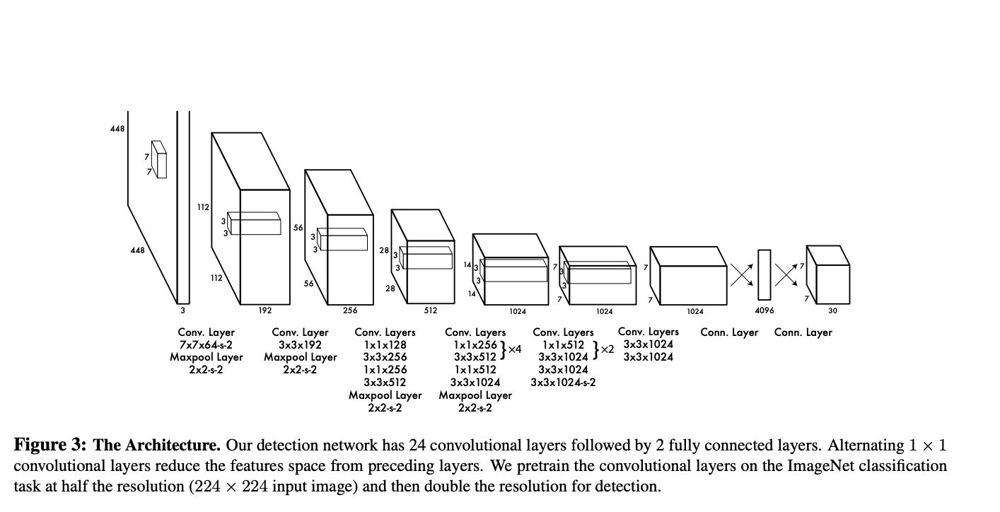

# Yolo v1



- The YOLO design enables end-to-end training and real-time speeds while maintaining high average precision

- Divides the input image into a $$S \times S$$ grid. If the center of an object falls into a grid cell, that grid cell is responsible for detecting that object.

- Each bounding box consists of 5 predictions: $$x, y, w, h$$, and confidence. The $$(x, y)$$ coordinates represent the center of the box relative to the bounds of the grid cell. The width and height are predicted relative to the whole image. The confidence prediction represents the IOU between the predicted box and any ground truth box.

- Each grid cell also predicts C conditional class probabilities

- Models detection as a regression problem. It divides the image into an even grid and simultaneously predicts bounding boxes, confidence in those boxes, and class probabilities. These predictions are encoded as an $$S \times S \times (B \ast 5 + C)$$ tensor.

# Yolo 9000

- **An odd number of locations in feature map**: so there is a single center cell. For Objects, especially large objects, tend to occupy the center of the image so it's good to have a single location right at the center to predict these objects instead of four locations that are all nearby.

- The network predicts 5 bounding boxes at each cell in the output feature map. The network predicts 5 coordinates for each bounding box, $$t_{x}, t_{y}, t_{w}, t_{h}$$, and to. If the cell is offset from the top left corner of the image by $$(cx, cy)$$ and the bounding box prior has width and height $$p_{w}, p_{h}$$, then the predictions correspond to:

<figure>

<figcaption></figcaption>
</figure>

- **Fine-Grained Features**: It reshapes the $$26 \times 26 \times 512$$ layer to $$13 \times 13
  \times 2048$$. Then it concatenates with the original $$13 \times 13 \times 1024$$ output layer. Now we apply convolution filters on the new $$13 \times 13 \times 3072$$ layer to make predictions.

# Yolo v3

## Predictions

- **Objectness Prediction**: predicts an objectness score for each bounding box using **logistic regression**. This should be 1 if the bounding box prior overlaps a ground truth object by more than any other bounding box prior. If a bounding box prior is not assigned to a ground truth object it incurs no loss for coordinate or class predictions, only objectness.

- **Class Prediction**: simply use independent logistic classifiers. During training we use binary cross entropy loss for the class predictions.

## Feature Pyramid Networks (FPN)

FPN composes of a **bottom-up** and a **top-down** pathway. The bottom-up pathway is the usual convolutional network for feature extraction. As we go up, the spatial resolution decreases. With more high-level structures detected, the **semantic** value for each layer increases.

- YOLOv3 predicts boxes at **3 different scales**. Take the feature map from 2 layers previous and **upsample it by 2** and then add a few more convolutional layers to process this combined feature map, and eventually predict a similar tensor, although now **twice the size**.chose 9 clusters and 3 scales arbitrarily and then divide up the clusters **evenly across scales**.

- Detections at different layers helps address the issue of detecting small objects, a frequent complaint with YOLO v2. The upsampled layers concatenated with the previous layers help preserve the fine grained features which help in detecting small objects. The 13 x 13 layer is responsible for detecting large objects, whereas the 52 x 52 layer detects the smaller objects, with the 26 x 26 layer detecting medium objects. Here is a comparative analysis of different objects picked in the same object by different layers.

## Anchor Boxes

YOLO v3 uses K-means to estimate the ideal bounding boxes

Previously: Each object in training image is assigned to grid cell that contains that object's midpoint. Grid: 3x3, Output: 3x3x(5+3) ($$p_c, x, y, h, w, c1, c2, c3$$)

With two anchor boxes: Each object in training image is assigned to grid cell that contains object's midpoint and anchor box for the grid cell with highest IoU. Grid: 3x3, Output: 3x3x2x(5+3) ($$p_c, b_x, b_y, b_h, b_w, c1, c2, c3$$)

As indicated in the [YOLO paper](https://arxiv.org/pdf/1506.02640.pdf), the early training is susceptible to unstable gradients. Initially, YOLO makes arbitrary guesses on the boundary boxes. These guesses may work well for some objects but badly for others resulting in steep gradient changes. In early training, predictions are fighting with each other on what shapes to specialize on.

In the real-life domain, the boundary boxes are not arbitrary. Cars have very similar shapes and pedestrians have an approximate aspect ratio of 0.41.


Since we only need one guess to be right, the initial training will be more stable if we start with diverse guesses that are common for real-life objects.

For example, we can create 5 **anchor** boxes with the following shapes.


Instead of predicting 5 arbitrary boundary boxes, **we predict offsets to each of the anchor boxes above**. If we **constrain** the offset values, we can maintain the diversity of the predictions and have each prediction focuses on a specific shape. So the initial training will be more stable.


### Kmeans implementation

https://lars76.github.io/object-detection/k-means-anchor-boxes/

The standard Euclidean distance causes larger boxes to generate more errors than smaller boxes. By using the Intersection over Union metric (Jaccard index) this problem can be avoided. In this case, the distance metric used in Kmeans is $$1-IOU$$.

The Jaccard index can be defined for two boxes $$b_1 = (w_1 , h_1) , b_2 = (w_2 , h_2)$$ as follows

<figure>

<figcaption></figcaption>
</figure>

The k-means clustering algorithm does not really change a lot when applied to anchor boxes. At initialization we can choose $$k$$ random boxes as our initial means $$a_i$$ . Then we can assign each bounding box $$b_p$$ to a cluster $$C_i$$ :

<figure>

<figcaption></figcaption>
</figure>

```python
def iou(box, clusters):
    x = np.minimum(clusters[:, 0], box[0])
    y = np.minimum(clusters[:, 1], box[1])

    intersection = x * y
    box_area = box[0] * box[1]
    cluster_area = clusters[:, 0] * clusters[:, 1]

    iou_ = intersection / (box_area + cluster_area - intersection)

    return iou_

def kmeans(boxes, k, dist=np.median):
    rows = boxes.shape[0]

    distances = np.empty((rows, k))
    last_clusters = np.zeros((rows,))

    np.random.seed()

    clusters = boxes[np.random.choice(rows, k, replace=False)]

    while True:
        for row in range(rows):
            distances[row] = 1 - iou(boxes[row], clusters)

        nearest_clusters = np.argmin(distances, axis=1)

        if (last_clusters == nearest_clusters).all():
            break

        for cluster in range(k):
            clusters[cluster] = dist(boxes[nearest_clusters == cluster], axis=0)

        last_clusters = nearest_clusters

    return clusters
```

## Multi-scale training


Change the input image size from $$448 \times 448 to 416 \times 416$$. This creates an odd number spatial dimension ($$7\times 7$$ v.s. $$8 \times 8$$ grid cell). The center of a picture is often occupied by a large object. With an odd number grid cell, it is more certain on where the object belongs.

YOLO v3 makes prediction at three scales, which are precisely given by downsampling the dimensions of the input image by 32, 16 and 8 respectively.

The first detection is made by the 82nd layer. For the first 81 layers, the image is down sampled by the network, such that the 81st layer has a stride of 32. If we have an image of 416 x 416, the resultant feature map would be of size 13 x 13. One detection is made here using the 1 x 1 detection kernel, giving us a detection feature map of 13 x 13 x 255.

Then, the feature map from layer 79 is subjected to a few convolutional layers before being up sampled by 2x to dimensions of 26 x 26. This feature map is then depth concatenated with the feature map from layer 61. Then the combined feature maps is again subjected a few 1 x 1 convolutional layers to fuse the features from the earlier layer (61). Then, the second detection is made by the 94th layer, yielding a detection feature map of 26 x 26 x 255.

A similar procedure is followed again, where the feature map from layer 91 is subjected to few convolutional layers before being depth concatenated with a feature map from layer 36. Like before, a few 1 x 1 convolutional layers follow to fuse the information from the previous layer (36). We make the final of the 3 at 106th layer, yielding feature map of size 52 x 52 x 255.

## Loss

- the classification loss.

  

- the localization loss (errors between the predicted boundary box and the ground truth).

  

  (Why square root? Regression errors relative to their respective bounding box size should matter roughly equally. E.g. a 5px deviation on a 500px wide box should have less of an effect on the loss as a 5px deviation in a 20px wide box. The square root **downscales high values** while less affecting low values of width and height.)

- the confidence loss (the objectness of the box).

  

  If an object is not detected in the box, the confidence loss is:

  

  Most boxes do not contain any objects. This causes a class imbalance problem, i.e. we train the model to detect background more frequently than detecting objects. To remedy this, we weight this loss down by a factor $$\lambda noobj$$ (default: 0.5).
