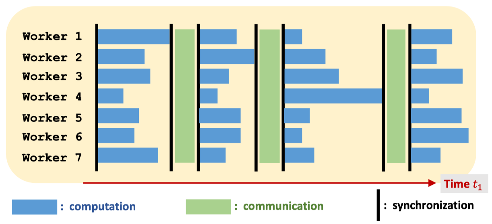
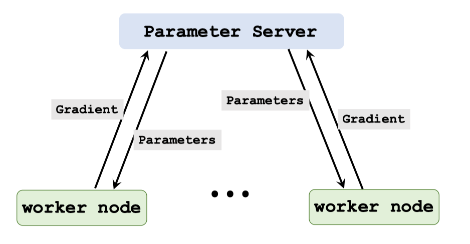
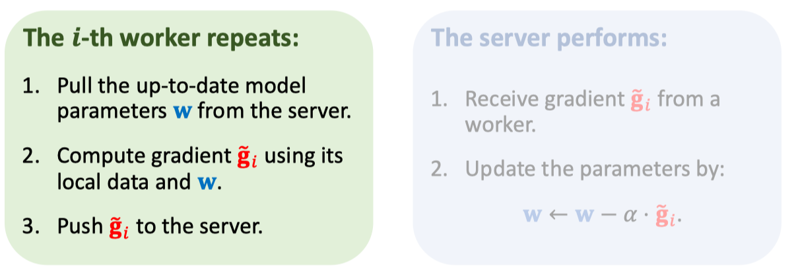
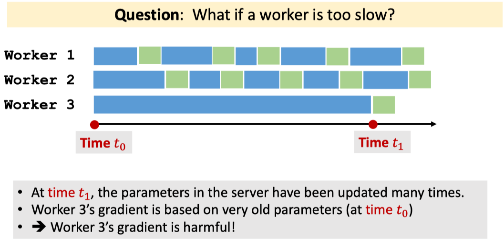

# Asynchronous Parallel Gradient Descent Using Parameter Server

## Parameter Server Architecture

## The Parameter Server

- The parameter server was proposed by [^1] for scalable machine learning.
- Characters: client-server architecture, message-passing communication, and asynchronous.
- (Note that MapReduce is bulk synchronous.)
- Ray [^2], an open-source software system, supports parameter server.

## Synchronous Algorithm

## Asynchronous Algorithm

## Parallel Asynchronous Gradient Descent

## Pro and Con of Asynchronous Algorithms

- In practice, asynchronous algorithms are faster than the synchronous.

- In theory, asynchronous algorithms has slower convergence rate.

- Asynchronous algorithms have restrictions, e.g., a worker cannot be much slower than the others.

## Footnote

[^1]: Li and others: Scaling distributed machine learning with the parameter server. In OSDI, 2014.
[^2]: Moritz and others: Ray: A distributed framework for emerging AI applications. In OSDI, 2018.
