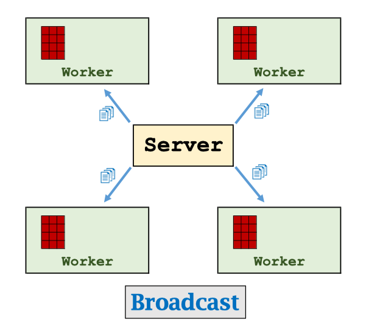
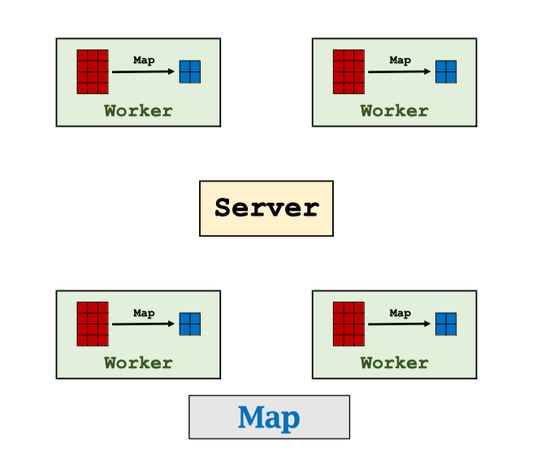
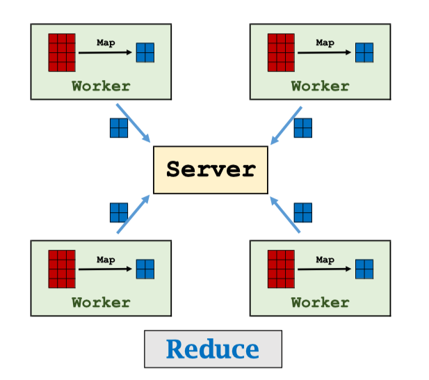
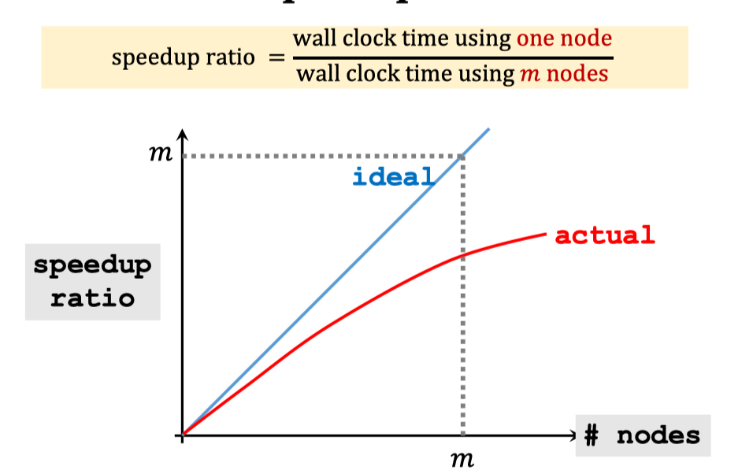
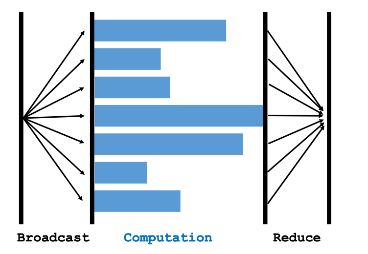

# Synchronous Parallel Gradient Descent using MapReduce

[Slides](https://github.com/wangshusen/DeepLearning/blob/master/Slides/14_Parallel_1.pdf) [Youtube](https://www.youtube.com/watch?v=gVcnOe6_c6Q&list=PLvOO0btloRns6egXueiRju4DXQjNRJQd5)

## MapReduce

- MapReduce is a programming model and software system developed by Google [^1].
- Characters: client-server architecture, message-passing communication, and bulk synchronous parallel.
- Apache Hadoop [^2] is an open-source implementation of MapReduce.
- Apache Spark [^3] is an improved open-source MapReduce.

### Broadcase

### Map

### Reduce

## Data Parallelism

Partition the data among worker nodes. (A node has a subset of data.)

## Parallel Gradient Descent Using MapReduce

- Broadcast: Server broadcast the up-to-date parameters $$w_t$$ o workers.
- Map: Workers do computation locally.
  - Map $$(x_i,y_i,w_t)$$ to $$g_i=(x_i^T w_t-yi)xi$$.
  - Obtain $$n$$ vectors: $$g_1, g_2,g_3,...,g_n$$
- Reduce: Compute the sum: $$g=\sum_{i=1}^{n}g_i$$
- Every worker sums all the $${g_i}$$ stored in its local memory to get a vector.
- Then, the server sums the resulting m vectors. (There are m workers.)
- Server updates the parameters: $$w_{t+1}=t_t-\alpha \cdot g$$

## Speedup Ratio

## Communication Cost

- Communication complexity: How many words are transmitted between server and workers.
  - Proportional to number of parameters.
  - Grow with number of worker nodes.
- Latency: How much time it takes for a packet of data to get from one point to another. (Determined by the compute network.)

- Communication time: $$\frac{comlexity}{bancwith}+latency$$

## Bulk Synchronous

## Synchronization Cost

Question: What if a node fails and then restart?

- This node will be much slower than all the others.
- It is called straggler.
- Straggler effect:
  - The wall-clock time is determined by the slowest node.
  - It is a consequence of synchronization.

## Footnote

[^1]: Dean and Ghemawat: MapReduce: simplified data processing on large clusters. Communications of the ACM, 2008.
[^2]: https://hadoop.apache.org/
[^3]: Zaharia and others: Apache Spark: a unified engine for big data processing. Communications of the ACM, 2016.
