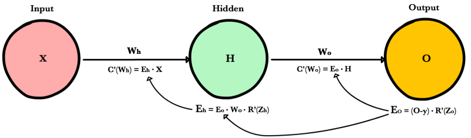

# Optimization

## MLE and MAP

A good video [here](https://www.youtube.com/watch?v=yH_xwGnW-ig) explains the topic.

Assume $$X = \{x_1, x_2,...,x_n\}$$ is a sample follow independent and identical distribution

### Maximum Likelihood Estimation:

$$\hat \theta_{MLE} = argmax logP(\theta ; X) = argmin -logP(\theta ; X)$$,

* Deep Learning uses MLE for we do not know the **real distribution of the dataset**

### Maximum A Posteriori

$$\hat \theta_{MAP} = argmax P(\theta| X)$$

$$\hat \theta_{MAP}= argmin -logP(X |\theta)-logP(\theta)+logP(X)$$,

For $$P(X)$$ is not related to $$\theta$$,

$$\hat \theta_{MAP} =argmin -logP(X |\theta)-logP(\theta)$$

* MAP usually used in Bayisan Machine Learning

**The difference is the prior probability** $$P(\theta)$$

## Gradient Descent

Let's say your hypothesis function contains multiple parameters, defined as $$\theta_1$$, $$\theta_2$$, $$\theta_3$$.

Your cost function takes both your model output and your ground truth, e.g.:

$$
J(\theta_0, \theta_1,...,\theta_n) = \frac{1}{2m}\sum_{i=1}^{m}(h_{\theta}(x^i) - y^i)^2
$$

Then we need to calculate the partial deriative of the cost function with respect to the each $$\theta$$, from 0 to n.

Then we can simultaneously update the $$\theta_j = \theta_j - \alpha\frac{}{\theta_j}J(\theta_0, \theta_1,...,\theta_n)$$

### derivative of a matrix-matrix product

$$
D = W \cdot X
$$

$$
dW = dD \cdot X^T
$$

$$
dX = W^T \cdot dD
$$

## Backpropagation

[https://ml-cheatsheet.readthedocs.io/en/latest/backpropagation.html](https://ml-cheatsheet.readthedocs.io/en/latest/backpropagation.html)

A neural network propagates the signal of the input data forward through its parameters towards the moment of decision, and then backpropagates information about the error through the network so that it can alter the parameters one step at a time.

### Chain Rule

As seen above, foward propagation can be viewed as a long series of nested equations. If you think of feed forward this way, then backpropagation is merely an application the Chain rule to find the Derivatives of cost with respect to any variable in the nested equation. Given a forward propagation function:

$$
f(x) = A(B(C(x)))
$$

A, B, and C are activation functions at different layers. Using the chain rule we easily calculate the derivative of $$f(x)$$ with respect to $$x$$:

$$
f'(x) = f'(A) \cdot A'(B) \cdot B'(C) \cdot C'(x)
$$

How about the derivative with respect to B? To find the derivative with respect to B you can pretend $$B(C(x))$$ is a constant, replace it with a placeholder variable B, and proceed to find the derivative normally with respect to B.

$$
f'(B) = f'(A) \cdot A'(B)
$$

This simple technique extends to any variable within a function and allows us to precisely pinpoint the exact impact each variable has on the total output.

### Applying the chain rule

Let's use the chain rule to calculate the derivative of cost with respect to any weight in the network. The chain rule will help us identify how much each weight contributes to our overall error and the direction to update each weight to reduce our error. Here are the equations we need to make a prediction and calculate total error, or cost:


Given a network consisting of a single neuron, total cost could be calculated as:

$$
Cost = C(R(Z(XW)))
$$

Using the chain rule we can easily find the derivative of Cost with respect to weight W.

$$
C'(W) = C'(R) \cdot R'(Z) \cdot Z'(W) = (\hat{y} - y) \cdot R'(Z) \cdot X
$$

### Example




> NOTE:
>
> $$
> E_0 = \frac{\partial L }{\partial O}
> $$
>
> $$
> E_H = \frac{\partial L }{\partial H}
> $$

## Batch gradient descent

Vanilla gradient descent, aka batch gradient descent, computes the gradient of the cost function to the parameters $$\theta$$ for the entire training dataset.

```python
for i in range(nb_epochs):
  params_grad = evaluate_gradient(loss_function, data, params)
  params = params - learning_rate * params_grad
```

## Stochastic gradient descent

Stochastic gradient descent \(SGD\) in contrast performs a parameter update for each training example $$x^i$$ and label $$y^i$$. Note that we shuffle the training data at every epoch.

SGD performs frequent updates with a high variance that cause the objective function to fluctuate heavily as in Image 1.


```python
for i in range(nb_epochs):
  np.random.shuffle(data)
  for example in data:
    params_grad = evaluate_gradient(loss_function, example, params)
    params = params - learning_rate * params_grad
```

* Efficient when update gradient
* Slow converge speed, need good learning rate

## Mini-batch gradient descent

Mini-batch gradient descent finally takes the best of both worlds and performs an update for every mini-batch of n training examples. Common mini-batch sizes range between 50 and 256, but can vary for different applications.

```python
for i in range(nb_epochs):
  np.random.shuffle(data)
  for batch in get_batches(data, batch_size=50):
    params_grad = evaluate_gradient(loss_function, batch, params)
    params = params - learning_rate * params_grad
```

## SGD momentum

Momentum is a mehod that helps accelerate SGD in the relevant direction and dampends oscillations seen in the image below.


$$
m_t = \gamma m_{t-1}+\eta\nabla_{\theta}J(\theta)
$$

$$
\theta=\theta - m_t
$$

Essentially, when using momentum, we push a ball down a hill. The ballaccumulates momentum as it rolls downhill, becoming faster and faster onthe way \(until it reaches its terminal velocity if there is air resistance, i.e. $$\gamma<1$$\). The same thing happens to our parameter updates: The momentumterm increases for dimensions whose gradients point in the same directionsand reduces updates for dimensions whose gradients change directions. Asa result, we gain **faster convergence** and **reduced oscillation**.

## ADAM

Adaptive Moment Estimation \(ADAM\) is a method that **computes adaptive learning rate** for each parameter. In addition to storing an exponentially decaying averagae of past squared gradients $$v_t$$ like Adadelta and RMSprop, Adam also keeps an exponentially decaying average of past gradients $$m_t$$, similar to momentum. Whereas momentum can be seen as a ball running down a slope, Adam behaves like a heavy ball with friction, which thus prefers flat minima in the error surface.

1. $$m_t$$ and $$v_t$$ are estimates of the first moment \(the mean\) and the second moment \(the uncentered variance\) of the gradients respectively.

$$
m_t = \beta_1 m_{t-1} + (1-\beta_1) g_t
$$

$$
v_t = \beta_2 v_{t-1} + (1-\beta_2) g_t^2
$$

1. Compute bias-corrected first moment estimate and bias-corrected second raw moment estimate.

$$
\hat{m_t} = \frac{m_t}{1-\beta_1^t}
$$

$$
\hat{v_t} = \frac{v_t}{1-\beta_2^t}
$$

$$
\theta_{t+1} = \theta_t - \frac{\eta}{\sqrt{\hat{v_t}} + \epsilon } \hat{m_t}
$$

The authors propose default values of 0.9 for $$\beta_1$$, 0.999 for $$\beta_2$$, and $$10^{-8}$$ for $$\epsilon$$.

