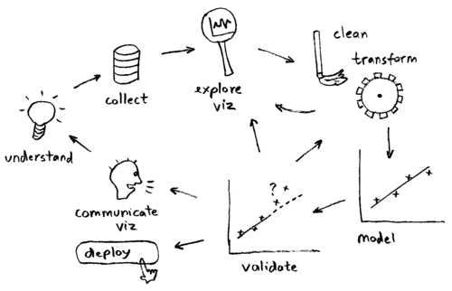
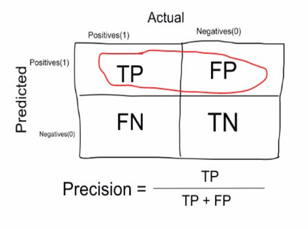
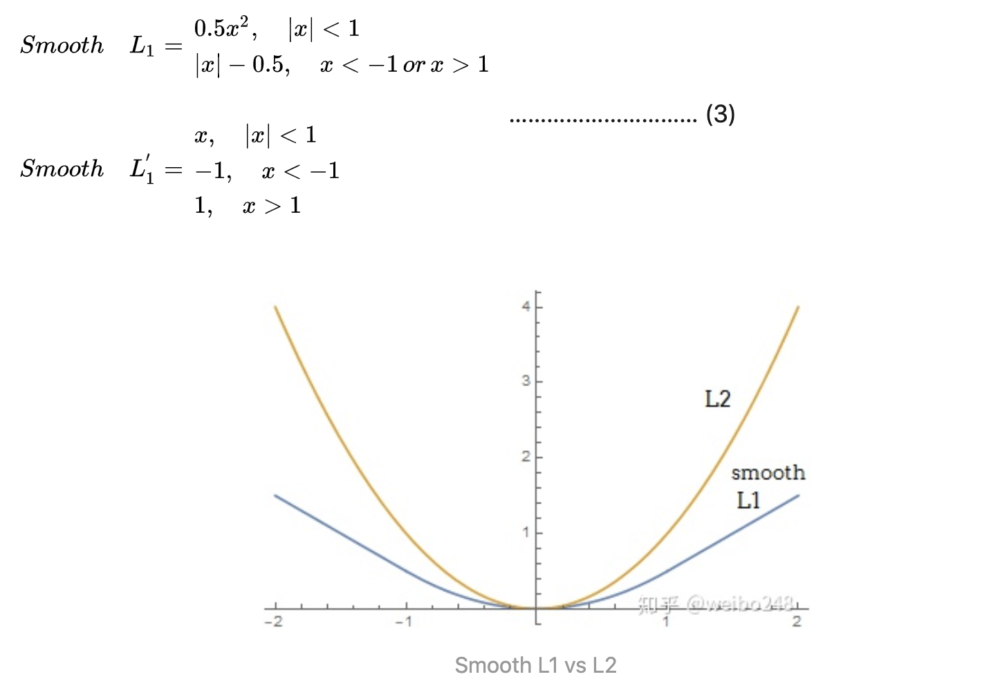
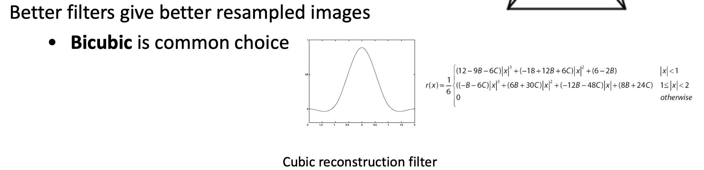
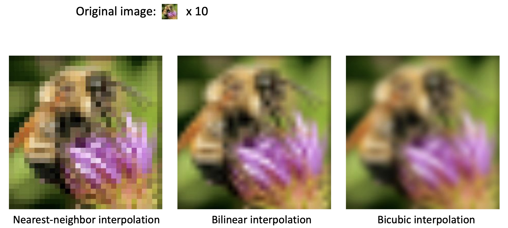
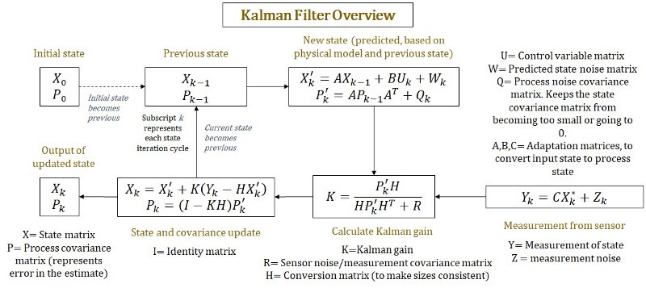

# Basics

## Project Workflow

Given a data science / machine learning project, what steps should we follow? Here's how I would tackle it:

* **Specify business objective.** Are we trying to win more customers, achieve higher satisfaction, or gain more revenues?
* **Define problem.** What is the specific gap in your ideal world and the real one that requires machine learning to fill? Ask questions that can be addressed using your data and predictive modeling \(ML algorithms\).
* **Create a common sense baseline.** But before you resort to ML, set up a baseline to solve the problem as if you know zero data science. You may be amazed at how effective this baseline is. It can be as simple as recommending the top N popular items or other rule-based logic. This baseline can also server as a good benchmark for ML algorithms.
* **Review ML literatures.** To avoid reinventing the wheel and get inspired on what techniques / algorithms are good at addressing the questions using our data.
* **Set up a single-number metric.** What it means to be successful - high accuracy, lower error, or bigger AUC - and how do you measure it? The metric has to align with high-level goals, most often the success of your business. Set up a single-number against which all models are measured.
* **Do exploratory data analysis \(EDA\).** Play with the data to get a general idea of data type, distribution, variable correlation, facets etc. This step would involve a lot of plotting.
* **Partition data.** Validation set should be large enough to detect differences between the models you are training; test set should be large enough to indicate the overall performance of the final model; training set, needless to say, the larger the merrier.
* **Preprocess.** This would include data integration, cleaning, transformation, reduction, discretization and more.
* **Engineer features.** Coming up with features is difficult, time-consuming, requires expert knowledge. Applied machine learning is basically feature engineering. This step usually involves feature selection and creation, using domain knowledge. Can be minimal for deep learning projects.
* **Develop models.** Choose which algorithm to use, what hyperparameters to tune, which architecture to use etc.
* **Ensemble.** Ensemble can usually boost performance, depending on the correlations of the models/features. So it's always a good idea to try out. But be open-minded about making tradeoff - some ensemble are too complex/slow to put into production.
* **Deploy model.** Deploy models into production for inference.
* **Monitor model.** Monitor model performance, and collect feedbacks.
* **Iterate.** Iterate the previous steps. Data science tends to be an iterative process, with new and improved models being developed over time.



## [IID: independent and identically distributed](https://github.com/ztlevi/Machine_Learning_Questions/blob/master/codes/IID/IID.ipynb)

[Youtube](https://www.youtube.com/watch?v=lhzndcgCXeo)

## Confusion matrix

* Accuracy:

  

* Precision:

  

* Recall:

  

* F1 Score:

  $$
  F_1 score = \frac{2 * precision * recall}{precision + recall}
  $$

## Weight Initialization

`W = 0.01 * np.random.randn(D,H)`, where `randn`  generates a random list with size n. It samples from a zero mean, unit standard deviation gaussian. One problem with the above suggestion is that the distribution of the outputs from a randomly initialized neuron has a variance that grows with the number of inputs. It turns out that we can normalize the variance of each neuron's output to 1 by scaling its weight vector by the square root of its fan-in \(i.e. its number of inputs\). `w = np.random.randn(n) / sqrt(n)`, where n is the number of its inputs.

In practice, the current recommendation is:

* to use ReLU units: use the `w = np.random.randn(n) * sqrt(2.0/n)`
* To use Tanh units: use the `w = np.random.randn(n) * sqrt(1.0/n)`

## Normalization

Normalization: refers to normalizing the data dimensions so that they are of approximately the same scale. One is to divide each dimension by its standard deviation, once it has been zero-centered: `(X /= np.std(X, axis = 0))`. Another form of this preprocessing normalizes each dimension so that the min and max along the dimension is -1 and 1 respectively.

```python
(x - x.min()) / (x.max() - x.min()) # values from 0 to 1
2*(x - x.min()) / (x.max() - x.min()) - 1 # values from -1 to 1
(x - x.mean()) / x.std() # values from ? to ?, but mean at 0
```

### Batch Normalization

When data flow through a deep network, the weights and parameters adjust those values, some times make the data too big or too small, known as **internal covariate shift**.

To solve the vanishing gradient\($$0.9^{k}$$\) and gradient explosion\($$1.1^{k}$$\), batch normalization is introduced.

* Input: Values of $$x$$ over a mini-batch: $$\mathcal{B}={x_{1...m}}$$; Parameters to be learned: $$\gamma , \beta$$
* Output: $${y_i = BN_{\gamma , \beta} (x_i)}$$
* Steps:
  1. Compute mini-batch mean: $${\mu}_{\mathcal{B}} \gets \frac{1}{m}\sum_{i=1}^M x_{i}$$
  2. Compute mini-batch variance: $${\sigma}_{\mathcal{B}}^{2} \gets \frac{1}{m}\sum_{i=1}^M (x_{i} - \mu_{\mathcal{B}})^{2}$$
  3. normalize features: $$\hat{x_i} \gets \frac{x_{i} - \mu_{\mathcal{B}} }{\sqrt{ { {\sigma}_{\mathcal{B}}^2 + \epsilon} } }$$
  4. Scale and shift: $$y_{i} \gets \gamma \hat{x_{i}} + \beta = BN_{\gamma, \beta}(x_{i})$$
* Pros: 
  1. Networks train faster
  2. Allows higher learning rates 
  3. Make weights easier to initialize
  4. Makes more activation functions viable
  5. Provides a bit of regularization
  6. Simplifies the creation of deeper networks
* Cons
  1. Slower predictions due to the extra computations at each layer

> **Note**: When test the model, we calculate a moving average and variance estimate of the training population. These estimates are averages of all batch means and variances calculated during training.

### Common pitfall

An important point to make about the preprocessing is that any preprocessing statistics \(e.g. the data mean\) must only be computed on the training data, and then applied to the validation / test data. E.g. computing the mean and subtracting it from every image across the entire dataset and then splitting the data into train/val/test splits would be a mistake. **Instead, the mean must be computed only over the training data and then subtracted equally from all splits \(train/val/test\).**

## Cost function

A Loss Functions tells us "how good" our model is at making predictions for a given set of parameters. The cost function has its own curve and its own gradients. The slope of this curve tells us how to update our parameters to make the model more accurate.

### L1 Loss vs L2 Loss

* **Robustness**: L1 &gt; L2

  Intuitively speaking, since a L2-norm squares the error \(increasing by a lot if error &gt; 1\), the model will see a much larger error than the L1-norm, so the model is much more sensitive to outliers.

* **Stability**: L2 &gt; L1

  In the case of a more “outlier” point, both norms still have big change, but again the L1-norm has more changes in general.

* **Solution uniqueness**: Minimizing the L2 loss corresponds to calculating **the arithmetic mean**, which is unambiguous, while minimizing the L1 loss corresponds to calculating **the median**, which is ambiguous if an even number of elements are included in the median calculation, So L2 has unique solution while L1 has multiple solution
* Smooth l1 loss



Smooth L1 loss that is less sensitive to outliers than the L2 loss used in R-CNN and SPPne.

### cross-entropy

If M&gt;2 \(i.e. multiclass classification\), we calculate a separate loss for each class label per observation and sum the result. Usually an activation function \(Sigmoid / Softmax\) is applied to the scores before the CE Loss computation.

$$
-\sum_{c=1}^M y_{o,c}log(p_{o,c})
$$

> Note:
>
> 1. M - number of classes \(dog, cat, fish\)
> 2. log - the natural log
> 3. y - binary indicator \(0 or 1\) if class label c is the correct classification for observation o
> 4. p - predicted probability observation o is of class c

### Why CE?

* During back-propagation training, you want to drive output node values to either 1.0 or 0.0 depending on the target values.
* If you use MSE, the weight adjustment factor \(the gradient\) contains a term of \(output\) _\(1 – output\). As the computed output gets closer and closer to either 0.0 or 1.0 the value of \(output\)_ \(1 – output\) gets smaller and smaller.
* For example, if output = 0.6 then \(output\) _\(1 – output\) = 0.24 but if output is 0.95 then \(output\)_ \(1 – output\) = 0.0475.
* As the adjustment factor gets smaller and smaller, the change in weights gets smaller and smaller and training can stall out, so to speak.
* But if you use cross-entropy error, the \(output\) \* \(1 – output\) term goes away \(the math is very cool\). So, the weight changes don’t get smaller and smaller and so training isn’t s likely to stall out.

from [this blog](https://jamesmccaffrey.wordpress.com/2013/11/05/why-you-should-use-cross-entropy-error-instead-of-classification-error-or-mean-squared-error-for-neural-network-classifier-training/)

## Non maximal supression

### Codes

* [IOU](https://github.com/ztlevi/Machine_Learning_Questions/blob/master/codes/NMS/IOU.py)
* [NMS](https://github.com/ztlevi/Machine_Learning_Questions/blob/master/codes/NMS/nms.py)
* [NMS\_Slow](https://github.com/ztlevi/Machine_Learning_Questions/blob/master/codes/NMS/nms_slow.py)
* [NMS\_Fast](https://github.com/ztlevi/Machine_Learning_Questions/blob/master/codes/NMS/nms_fast.py) uses numpy

## Image interpolation

* Nearest Neighbour
* Bilinear
* Bicubic




### Examples



## Types of Stratified Sampling

### Proportionate Stratified Random Sampling

The sample size of each stratum in this technique is proportionate to the population size of the stratum when viewed against the entire population. This means that the each stratum has the same sampling fraction.

For example, you have 3 strata with 100, 200 and 300 population sizes respectively. And the researcher chose a sampling fraction of ½. Then, the researcher must randomly sample 50, 100 and 150 subjects from each stratum respectively.

| Stratum | A | B | C |
| :--- | :--- | :--- | :--- |
| Population Size | 100 | 200 | 300 |
| Sampling Fraction | 1/2 | 1/2 | 1/2 |
| Final Sample Size | 50 | 100 | 150 |

The important thing to remember in this technique is to use the same sampling fraction for each stratum regardless of the differences in population size of the strata. It is much like assembling a smaller population that is specific to the relative proportions of the subgroups within the population.

### Disproportionate Stratified Random Sampling

The only difference between proportionate and disproportionate stratified random sampling is their sampling fractions. With disproportionate sampling, the different strata have different sampling fractions.

The precision of this design is highly dependent on the sampling fraction allocation of the researcher. If the researcher commits mistakes in allotting sampling fractions, a stratum may either be overrepresented or underrepresented which will result in skewed results.

## Kalman Filter

* Kalman filter helps us to obtain more reliable estimates from a sequence of observed measurements.
* We make a prediction of a state, based on some previous values and model to get $$X_k'$$ and $$P_k$$
* We obtain the measurement of that state, from sensor.
* We update our prediction, based on our errors
* Repeat.

  

* process noise $$W_k \sim \mathcal{N} (0, Q_k)$$
* process noise covariance matrix try to **keep the state convariance matrix from being too small**
* We can also write the update formula as:

  $$X_k = (1 - KH)X_k' + KY_k$$

  $$P_k = (1 - KH)P_k'$$

### Kalman Gain

$$K = \frac{P_{k}'H_{k}^{T}}{HP_{k}'H_{k} + R}$$

$$S = HP_{k}'H_{k} + R$$

The Kalman gain tells you **how much** I want to change my estimate by given a measurement.

* $$S$$ is the estimated covariance matrix of the measurements. this tells us the "variability" in our measurements, if $$S$$ is small, variability is low, our confidence in the measurement increases.
* $$P_{k}'$$ is the estimated state covariance matrix. This tells us the "variability" of the state $$X_k'$$. If $$P_k'$$ is large, it means that the state is estimated to change a lot.

