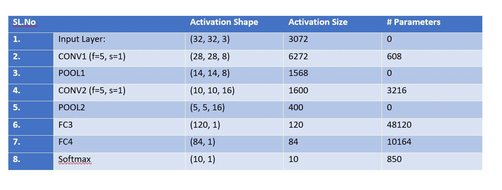

# Calculate Parameters in CNN

## Context

Basically, the number of parameters in a given layer is the count of “learnable” \(assuming such a word exists\) elements for a filter aka parameters for the filter for that layer.

1. **Input layer:** Input layer has nothing to learn, at it’s core, what it does is just provide the input image’s shape. So no learnable parameters here. Thus number of **parameters = 0**.
2. **CONV layer:** This is where CNN learns, so certainly we’ll have weight matrices. To calculate the learnable parameters here, all we have to do is just multiply the by the shape of **width m**, **height n**, **previous layer’s filters** **d** and account for all such filters **k in the current layer**. Don’t forget the bias term for each of the filter. Number of parameters in a CONV layer would be : **\(\(m** _**n**_ **d\)+1\)\* k\)**, added 1 because of the bias term for each filter. The same expression can be written as follows: **\(\(shape of width of the filter** _**shape of height of the filter**_ **number of filters in the previous layer+1\)\*number of filters\).** Where the term “filter” refer to the number of filters in the current layer.
3. **POOL layer:** This has got no learnable parameters because all it does is calculate a specific number, no backprop learning involved! Thus number of **parameters = 0**.
4. **Fully Connected Layer \(FC\):** This certainly has learnable parameters, matter of fact, in comparison to the other layers, this category of layers has the highest number of parameters, why? because, every neuron is connected to every other neuron! So, how to calculate the number of parameters here? You probably know, it is the product of the number of neurons in the current layer **c** and the number of neurons on the previous layer **p** and as always, do not forget the bias term. Thus number of parameters here are: **\(\(current layer neurons c** _**previous layer neurons p\)+1**_**c\)**.

## Try it

1. The first **input layer** has no parameters. You know why.
2. Parameters in the second **CONV1\(filter shape =5\*5, stride=1\) layer is:**, `((shape of width of filter*shape of height filter*number of filters in the previous layer+1)*number of filters) = (((5*5*3)+1)*8) = 608`.
3. The third **POOL1 layer** has no parameters. You know why.
4. Parameters in the fourth `CONV2(filter shape =5*5, stride=1) layer is`: `((shape of width of filter * shape of height filter * number of filters in the previous layer+1) * number of filters) = (((5*5*8)+1)*16) = 3216`.
5. The fifth **POOL2 layer** has no parameters. You know why.
6. Parameters in the Sixth `FC3 layer is((current layer c*previous layer p)+1*c) = 120*400+1*120= 48120`.
7. Parameters in the Seventh `FC4 layer is: ((current layer c*previous layer p)+1*c) = 84*120+1* 84 = 10164`.
8. The Eighth Softmax layer has `((current layer c*previous layer p)+1*c) parameters = 10*84+1*10 = 850`.

