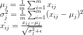
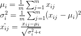
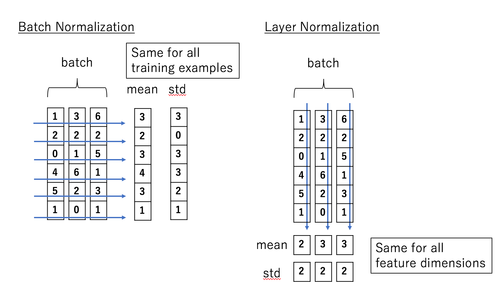

# Normalization

## Normalization

Normalization: refers to normalizing the data dimensions so that they are of approximately the same scale. One is to divide each dimension by its standard deviation, once it has been zero-centered: `(X /= np.std(X, axis = 0))`. Another form of this preprocessing normalizes each dimension so that the min and max along the dimension is -1 and 1 respectively.

```python
(x - x.min()) / (x.max() - x.min()) # values from 0 to 1
2*(x - x.min()) / (x.max() - x.min()) - 1 # values from -1 to 1
(x - x.mean()) / x.std() # values from ? to ?, but mean at 0
```

### Batch Normalization

When data flow through a deep network, the weights and parameters adjust those values, some times make the data too big or too small, known as **internal covariate shift**.

To solve the vanishing gradient\($$0.9^{k}$$\) and gradient explosion\($$1.1^{k}$$\), batch normalization is introduced.

* Input: Values of $$x$$ over a mini-batch: $$\mathcal{B}={x_{1...m}}$$; Parameters to be learned: $$\gamma , \beta$$
* Output: $${y_i = BN_{\gamma , \beta} (x_i)}$$
* Steps:
  1. Compute mini-batch mean: $${\mu}_{\mathcal{B}} \gets \frac{1}{m}\sum_{i=1}^M x_{i}$$
  2. Compute mini-batch variance: $${\sigma}_{\mathcal{B}}^{2} \gets \frac{1}{m}\sum_{i=1}^M (x_{i} - \mu_{\mathcal{B}})^{2}$$
  3. normalize features: $$\hat{x_i} \gets \frac{x_{i} - \mu_{\mathcal{B}} }{\sqrt{ { {\sigma}_{\mathcal{B}}^2 + \epsilon} } }$$
  4. Scale and shift: $$y_{i} \gets \gamma \hat{x_{i}} + \beta = BN_{\gamma, \beta}(x_{i})$$
* Pros: 
  1. Networks train faster
  2. Allows higher learning rates 
  3. Make weights easier to initialize
  4. Makes more activation functions viable
  5. Provides a bit of regularization
  6. Simplifies the creation of deeper networks
* Cons
  1. Slower predictions due to the extra computations at each layer

> **Note**: When test the model, we calculate a moving average and variance estimate of the training population. These estimates are averages of all batch means and variances calculated during training.

### Common pitfall

An important point to make about the preprocessing is that any preprocessing statistics \(e.g. the data mean\) must only be computed on the training data, and then applied to the validation / test data. E.g. computing the mean and subtracting it from every image across the entire dataset and then splitting the data into train/val/test splits would be a mistake. **Instead, the mean must be computed only over the training data and then subtracted equally from all splits \(train/val/test\).**

## Weight Normalization

[Weight normalization](https://arxiv.org/pdf/1602.07868.pdf) is a method developed by Open AI that, instead of normalizing the mini-batch, **normalizes the weights of the layer**.

Weight normalization reparameterizes the weights $$w$$ of any layer in the neural network in the following way:

$$
w = \frac{g}{||v||} v
$$

Similar to batch normalization, weight normalization does not reduce the expressive power of the network. What it does is it **separates the norm of the weight vector from its direction**. It then optimizes both $$g$$ and $$v$$ using gradient descent. This change in learning dynamics makes optimization easier, as I have explained in the [previous post](http://mlexplained.com/2018/01/10/an-intuitive-explanation-of-why-batch-normalization-really-works-normalization-in-deep-learning-part-1/).

**Advantages**

Other than the mean and variance being independent of the batch, weight normalization is often **much faster** than batch normalization. In convolutional neural networks, the number of weights tends to be far smaller than the number of inputs, meaning weight normalization is computationally cheaper compared to batch normalization. Batch normalization requires passing through all the elements of the input, which can be extremely expensive, especially when the dimensionality of the input is high, such as in the case of images. Convolutions use the same filter at multiple locations, so a pass through the weights is a lot faster.

Although weight normalization on its own can assist training, the authors of the paper proposed using a method called "mean-only batch normalization" in conjunction with weight normalization. This method is the same as batch normalization, except it does not divide the inputs by the standard deviation or rescale them. Though this method counteracts some of the computational speed-up of weight normalization, it is cheaper than batch-normalization since it does not need to compute the standard deviations. The authors claim that this method provides the following benefits:

1. It makes the mean of the activations independent from $$v$$ Weight normalization independently cannot isolate the mean of the activations from the weights of the layer, causing high-level dependencies between the means of each layer. Mean-only batch normalization can resolve this problem.
2. It adds "gentler noise" to the activations

One of the side-effects of batch normalization is that it adds some stochastic noise to the activations as a result of using noisy estimates computed on the mini-batches. This has a regularization effect in some applications, but can be potentially harmful in some noise-sensitive domains like reinforcement learning. The noise caused by the mean estimations, however, are "gentler" since the law of large numbers ensures the mean of the activations is approximately normally distributed.

The experimental results of the paper show that weight normalization combined with mean-only batch normalization achieves the best results on CIFAR-10, an image classification dataset. For detailed experimental results, please refer to the original paper.

## Layer Normalization

[Layer normalization](https://arxiv.org/pdf/1607.06450.pdf) is a method developed by Geoffery Hinton. Compared to weight normalization, layer normalization is slightly harder to grasp intuitively.

To understand layer normalization, recall that a mini-batch consists of multiple examples with the same number of features. Mini-batches are matrices - or tensors if each input is multi-dimensional - where one axis corresponds to the batch and the other axis - or axes - correspond to the feature dimensions.

Batch normalization normalizes the input features across the batch dimension. The key feature of layer normalization is that it **normalizes the inputs across the features**.

The equations of batch normalization and layer normalization are deceptively similar:

Batch normalization:



Layer normalization:



where $$x_{ij}$$ is the i,j-th element of the input, the first dimension represents the batch and the second represents the feature \(I have modified the notation from the original papers to make the contrast clearer\).

The difference becomes a bit clearer when we visualize it:



In batch normalization, the statistics are computed across the batch and are the same for each example in the batch. In contrast, in layer normalization, the statistics are computed across each feature and are **independent of other examples**.

This means that layer normalization is not a simple reparameterization of the network, unlike the case of weight normalization and batch normalization, which both have the same expressive power as an unnormalized neural network. A detailed discussion of the differences this creates involves a lot of math and is beyond the scope of this article, so if you are interested, please refer to the original paper.

**Advantages**

The independence between inputs means that each input has a different normalization operation, allowing arbitrary mini-batch sizes to be used.

The experimental results show that layer normalization performs well for recurrent neural networks.

