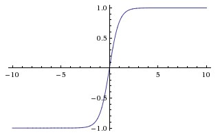

# Activation function

the activation function is usually an abstraction representing the rate of action potential firing in the cell. In its simplest form, this function is binary-that is, either the neuron is firing or not.

**Important**: The most important meaning add activation function is by adding the activation funciton, we are adding non-linearity to the model.

For neural networks

* **Sigmoid Function**: $$f(x) = \frac{1}{1 + e^{-x}}$$

  

  * Sigmoid non-linearity squashes real numbers to range between \[0,1\]
  * Sigmoids saturate\(when $$x$$ is small, gradient is large\) and kill gradients \(when $$x$$ is large, gradient is small\)
  * Sigmoid outputs are not zero-centered.

* **Tanh function**: $$f(x) = \frac{e^{x} - e^{-x}}{e^{x} + e^{-x}}$$

  

  * It squashes a real-valued number to the range \[-1, 1\]
  * its activations saturate
  * its output is zero-centered.

* **ReLU function**: $$f(x)=max(0,x)$$ or $$f(x)=min(6, max(0,x))$$ for ReLU6

  

  * It was found to greatly accelerate the convergence of stochastic gradient descent compared to the sigmoid/tanh functions.
  * Compared to tanh/sigmoid neurons that involve expensive operations \(exponentials, etc.\), the ReLU can be implemented by simply thresholding a matrix of activations at zero.
  * ReLU units can be fragile during training and can die.

* **Leaky ReLU function**:

  if $$x >= 0$$ , $$f(x) = x$$; else, $$f(x) = ax$$

  * Reduce death during training for ReLU

* Multi-class: softmax, see [derivative](https://eli.thegreenplace.net/2016/the-softmax-function-and-its-derivative/)
  * $$
    p_{o,c} = \frac{e^{y_{k}}}{\sum_{c=1}^M e^{y_{c}}}
    $$
* Binary: sigmoid
* Regression: linear

