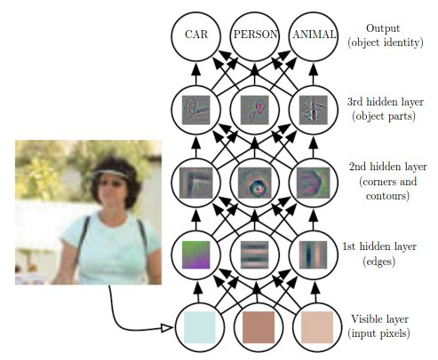

# Basics

## Pooling

1. Pooling layers control the number of features the CNN model is learning and it avoids over fitting.
2. There are 2 different types of pooling layers - MAX pooling layer and AVG pooling layer. As the names suggest the MAX pooling layer picks maximum values from the convoluted feature maps and AVG pooling layer takes the average value of the features from the feature maps.
3. MAX pooling focus on edge ,work better in practice
4. Progressively reduce the spatial size of the representation to reduce the amount of parameters and computation in the network, and hence to also control overfitting.

## Model compression

### Weight Pruning

**Getting faster/smaller networks is important for running these deep learning networks on mobile devices.**

The ranking can be done according to the L1/L2 mean of neuron weights, their mean activations, the number of times a neuron wasn't zero on some validation set, and other creative methods . After the pruning, the accuracy will drop \(hopefully not too much if the ranking clever\), and the network is usually trained more to recover.

If we prune too much at once, the network might be damaged so much it won't be able to recover.

So in practice this is an iterative process - often called 'Iterative Pruning': Prune / Train / Repeat.

## Two \(Multi Task Learning\) MTL methods for Deep Learning

So far, we have focused on theoretical motivations for MTL. To make the ideas of MTL more concrete, we will now look at the two most commonly used ways to perform multi-task learning in deep neural networks. In the context of Deep Learning, multi-task learning is typically done with either _hard_ or _soft parameter sharing_ of hidden layers.

### Hard parameter sharing

Hard parameter sharing is the most commonly used approach to MTL in neural networks and goes back to [\[6\]](http://ruder.io/multi-task/index.html#fn6). It is generally applied by sharing the hidden layers between all tasks, while keeping several task-specific output layers.

Figure 1: Hard parameter sharing for multi-task learning in deep neural networks

Hard parameter sharing greatly reduces the risk of overfitting. In fact, [\[7\]](http://ruder.io/multi-task/index.html#fn7) showed that the risk of overfitting the shared parameters is an order N -- where N is the number of tasks -- smaller than overfitting the task-specific parameters, i.e. the output layers. This makes sense intuitively: The more tasks we are learning simultaneously, the more our model has to find a representation that captures all of the tasks and the less is our chance of overfitting on our original task.

### Soft parameter sharing

In soft parameter sharing on the other hand, each task has its own model with its own parameters. The distance between the parameters of the model is then regularized in order to encourage the parameters to be similar. [\[8\]](http://ruder.io/multi-task/index.html#fn8) for instance use the ℓ2ℓ2 norm for regularization, while [\[9\]](http://ruder.io/multi-task/index.html#fn9) use the trace norm.

Figure 2: Soft parameter sharing for multi-task learning in deep neural networks

The constraints used for soft parameter sharing in deep neural networks have been greatly inspired by regularization techniques for MTL that have been developed for other models, which we will soon discuss.

## Deep Learning

### CNN

### 2d Convolution

[Faster convolution](https://laurentperrinet.github.io/sciblog/posts/2017-09-20-the-fastest-2d-convolution-in-the-world.html)

The Conv layer is the building block of a Convolutional Network. The Conv layer consists of a set of learnable filters \(such as 5 x 5 x 3, width x height x depth\). During the forward pass, we slide \(or more precisely, convolve\) the filter across the input and compute the dot product. Learning happens when the network back propagate the error layer by layer.

Initial layers capture low-level features such as angle and edges, while later layers learn a combination of the low-level features and in the previous layers and can therefore represent higher level feature, such as shape and object parts.

### Bottleneck layer

The bottleneck in a neural network is just a layer \(e.g. convolution layer\) with less neurons then the layer below or above it. Having such a layer encourages the network to compress feature representations to best fit in the available space, in order to get the best loss during training.

## Reference

1. [standford cs231 notes](http://cs231n.github.io/)
2. [mobilenet v1](https://arxiv.org/pdf/1704.04861.pdf)
3. [mobilenet v2](https://arxiv.org/pdf/1801.04381.pdf)
4. [yolo v1](https://arxiv.org/pdf/1506.02640.pdf)
5. [yolo 9000](https://arxiv.org/pdf/1612.08242.pdf)
6. [yolo v3](https://pjreddie.com/media/files/papers/YOLOv3.pdf)
7. [real-time-object-detection-with-yolo-yolov2-](https://medium.com/@jonathan_hui/real-time-object-detection-with-yolo-yolov2-28b1b93e2088)

