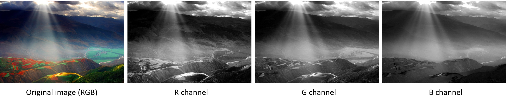
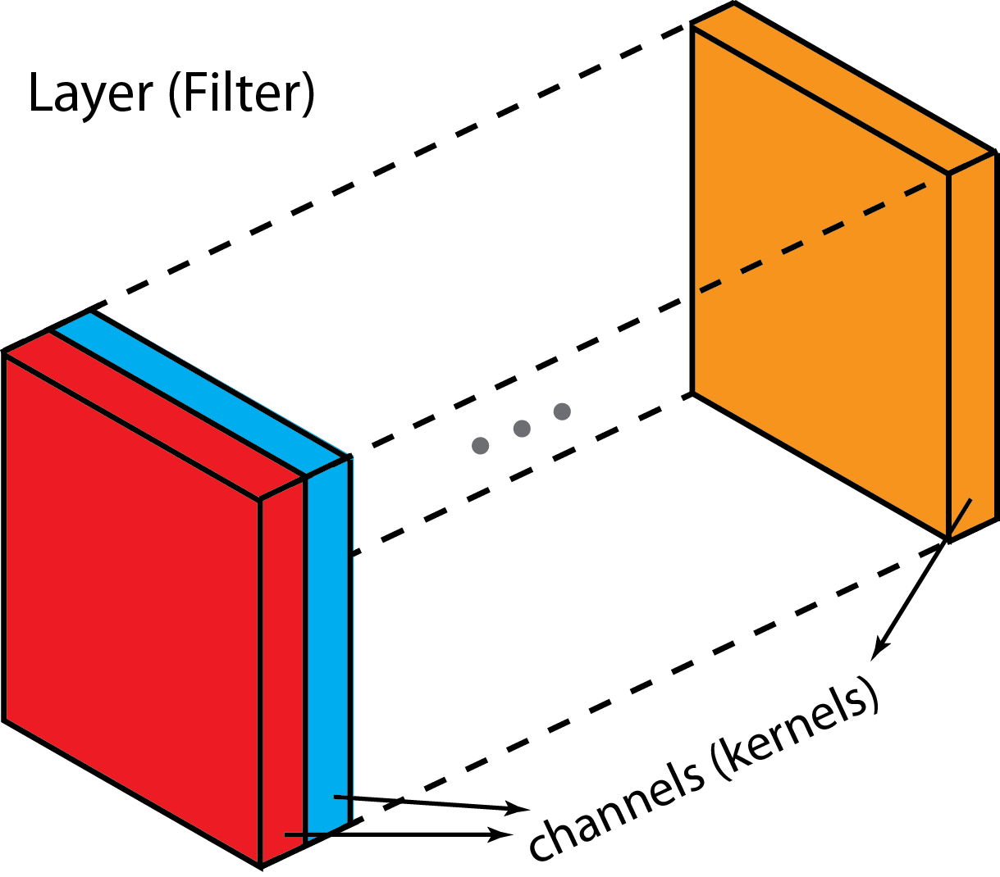
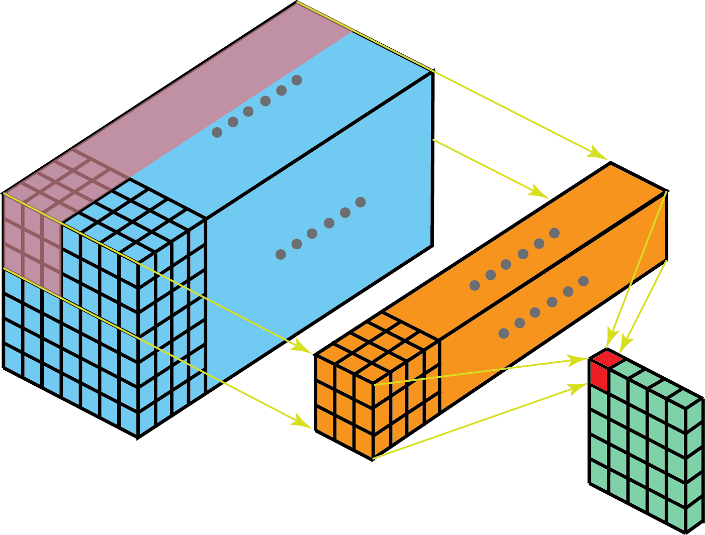
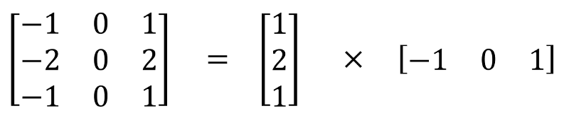
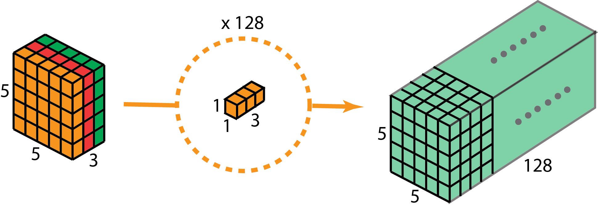
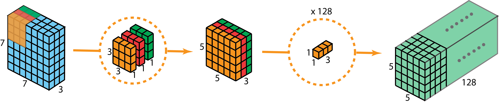
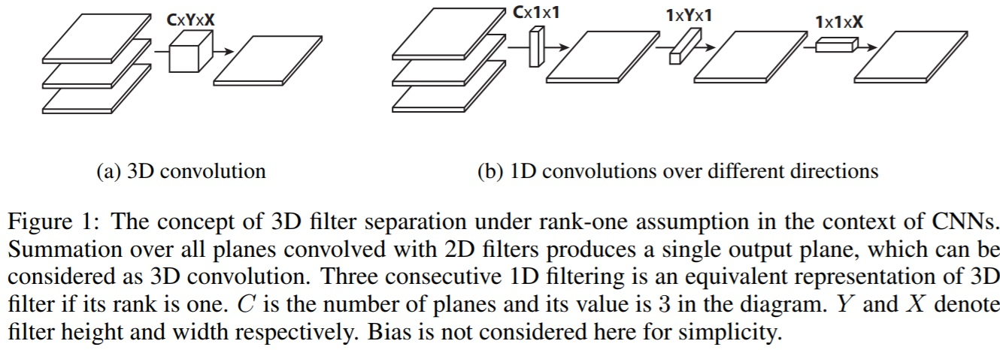
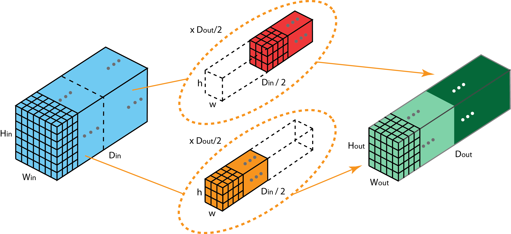
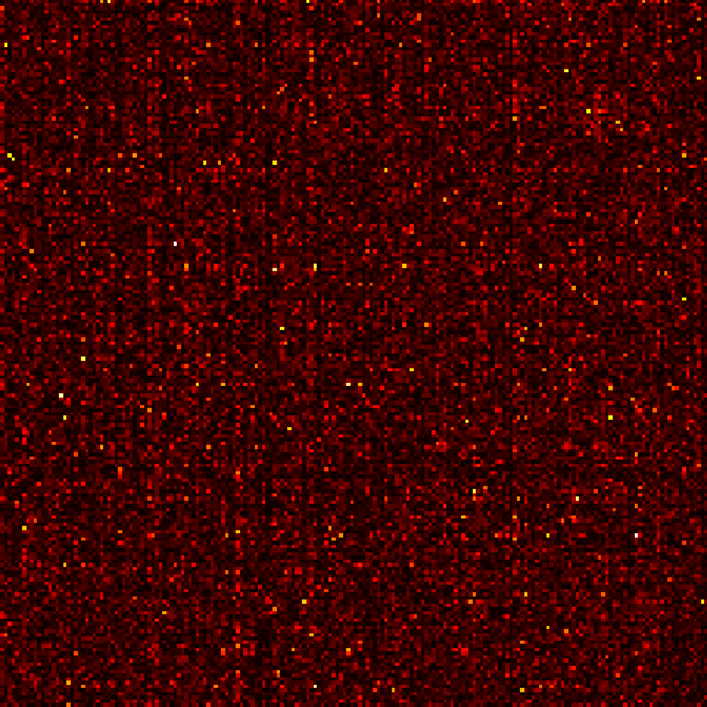

# Different Types of Convolution

This post is copied from [Kunlun Bai's post](https://towardsdatascience.com/a-comprehensive-introduction-to-different-types-of-convolutions-in-deep-learning-669281e58215).

## Different Types of Convolution

If you’ve heard of different kinds of convolutions in Deep Learning \(e.g. 2D / 3D / 1x1 / Transposed / Dilated \(Atrous\) / Spatially Separable / Depthwise Separable / Flattened / Grouped / Shuffled Grouped Convolution\), and got confused what they actually mean, this article is written for you to understand how they actually work.

Here in this article, I summarize several types of convolution commonly used in Deep Learning, and try to explain them in a way that is accessible for everyone. Besides this article, there are several good articles from others on this topic. Please check them out \(listed in the Reference\).

### Output shape

Use the formula $$[(W-K+2P)/S]+1$$.

### **1. Convolution v.s. Cross-correlation**

Convolution is a widely used technique in signal processing, image processing, and other engineering / science fields. In Deep Learning, a kind of model architecture, Convolutional Neural Network \(CNN\), is named after this technique. However, convolution in deep learning is essentially the cross-correlation in signal / image processing. There is a subtle difference between these two operations.

Without diving too deep into details, here is the difference. In signal / image processing, convolution is defined as:

It is defined as the integral of the product of the two functions after one is reversed and shifted. The following visualization demonstrated the idea.

Convolution in signal processing. The filter g is reversed, and then slides along the horizontal axis. For every position, we calculate the area of the intersection between f and reversed g. The intersection area is the convolution value at that specific position. Image is adopted and edited from this [link](http://fourier.eng.hmc.edu/e161/lectures/convolution/index.html).

Here, function g is the filter. It’s reversed, and then slides along the horizontal axis. For every position, we calculate the area of the intersection between $$f$$ and reversed $$g$$. That intersection area is the convolution value at that specific position.

On the other hand, cross-correlation is known as sliding dot product or sliding inner-product of two functions. The filter in cross-correlation is not reversed. It directly slides through the function f. The intersection area between $$f$$ and $$g$$ is the cross-correlation. The plot below demonstrates the difference between correlation and cross-correlation.

Difference between convolution and cross-correlation in signal processing. Image is adopted and edited from [Wikipedia](https://en.wikipedia.org/wiki/Convolution).

In Deep Learning, the filters in convolution are not reversed. Rigorously speaking, it’s cross-correlation. We essentially perform element-wise multiplication and addition. But it’s a convention to just call it convolution in deep learning. It is fine because the weights of filters are learned during training. If the reversed function g in the example above is the right function, then after training the learned filter would look like the reversed function g. Thus, there is no need to reverse the filter first before training as in true convolution.

### 2. Convolution in Deep Learning

The purpose of doing convolution is to extract useful features from the input. In image processing, there is a wide range of different filters one could choose for convolution. Each type of filters helps to extract different aspects or features from the input image, e.g. horizontal / vertical / diagonal edges. Similarly, in Convolutional Neural Network, _different features are extracted through convolution using filters whose weights are automatically learned during training_. All these extracted features then are ‘combined’ to make decisions.

There are a few advantages of doing convolution, such as weights sharing and translation invariant. Convolution also takes spatial relationship of pixels into considerations. These could be very helpful especially in many computer vision tasks, since those tasks often involve identifying objects where certain components have certain spatially relationship with other components \(e.g. a dog’s body usually links to a head, four legs, and a tail\).

#### 2.1. Convolution: the single channel version

Convolution for a single channel. Image is adopted from this [link](https://towardsdatascience.com/intuitively-understanding-convolutions-for-deep-learning-1f6f42faee1).

In Deep Learning, convolution is the element-wise multiplication and addition. For an image with 1 channel, the convolution is demonstrated in the figure below. Here the filter is a $$3 \times 3$$ matrix with element $$[[0, 1, 2], [2, 2, 0], [0, 1, 2]]$$. The filter is sliding through the input. At each position, it’s doing element-wise multiplication and addition. Each sliding position ends up with one number. The final output is then a $$3 \times 3$$ matrix. \(Notice that stride = 1 and padding = 0 in this example. These concepts will be described in the section of arithmetic below.

#### 2.2. Convolution: the multi-channel version

In many applications, we are dealing with images with multiple channels. A typical example is the RGB image. Each RGB channel emphasizes different aspects of the original image, as illustrated in the following image.

Different channels emphasize different aspects of the raw image. The image was taken at Yuanyang, Yunnan, China.

Another example of multi-channel data is the layers in Convolutional Neural Network. A convolutional-net layer usually consists of multiple channels \(typically hundreds of channels\). Each channel describes different aspects of the previous layer. How do we make transition between layers with different depth? How do we transform a layer with depth $$n$$ to the following layer with depth $$m$$?

Before describing the process, we would like to clarify a few terminologies: layers, channels, feature maps, filters, and kernels. From a hierarchical point of view, the concepts of layers and filters are at the same level, while channels and kernels are at one level below. Channels and feature maps are the same thing. A layer could have multiple channels \(or feature maps\): an input layer has 3 channels if the inputs are RGB images. “channel” is usually used to describe the structure of a “layer”. Similarly, “kernel” is used to describe the structure of a “filter”.

Difference between “layer” \(“filter”\) and “channel” \(“kernel”\).

The difference between filter and kernel is a bit tricky. Sometimes, they are used interchangeably, which could create confusions. Essentially, these two terms have subtle difference. A “Kernel” refers to a 2D array of weights. The term “filter” is for 3D structures of multiple kernels stacked together. For a 2D filter, filter is same as kernel. But _for a 3D filter and most convolutions in deep learning, a filter is a collection of kernels. Each kernel is unique, emphasizing different aspects of the input channel_.

With these concepts, the multi-channel convolution goes as the following. Each kernel is applied onto an input channel of the previous layer to generate one output channel. This is a kernel-wise process. We repeat such process for all kernels to generate multiple channels. Each of these channels are then summed together to form one single output channel. The following illustration should make the process clearer.

Here the input layer is a $$5 \times 5 \times 3$$ matrix, with 3 channels. The filter is a $$3 \times 3 \times 3$$ matrix. First, each of the kernels in the filter are applied to three channels in the input layer, separately. Three convolutions are performed, which result in 3 channels with size $$3 \times 3$$.

The first step of 2D convolution for multi-channels: each of the kernels in the filter are applied to three channels in the input layer, separately. The image is adopted from this [link](https://towardsdatascience.com/intuitively-understanding-convolutions-for-deep-learning-1f6f42faee1).

Then these three channels are summed together \(element-wise addition\) to form one single channel \($$3 \times 3 \times 1$$\). This channel is the result of convolution of the input layer \($$5 \times 5 \times 3$$ matrix\) using a filter \($$3 \times 3 \times 3$$ matrix\).

Equivalently, we can think of this process as sliding a 3D filter matrix through the input layer. Notice that the input layer and the filter have the same depth \(channel number = kernel number\). _The 3D filter moves only in 2-direction, height & width of the image \(That’s why such operation is called as 2D convolution although a 3D filter is used to process 3D volumetric data\)._ At each sliding position, we perform element-wise multiplication and addition, which results in a single number. In the example shown below, the sliding is performed at 5 positions horizontally and 5 positions vertically. Overall, we get a single output channel.

Another way to think about 2D convolution: thinking of the process as sliding a 3D filter matrix through the input layer. Notice that the input layer and the filter have the same depth \(channel number = kernel number\). The 3D filter moves only in 2-direction, height & width of the image \(That’s why such operation is called as 2D convolution although a 3D filter is used to process 3D volumetric data\). The output is a one-layer matrix.

Now we can see how one can make transitions between layers with different depth. Let’s say the input layer has $$D_{in}$$ channels, and we want the output layer has $$D_{out}$$ channels. What we need to do is to just apply $$D_{out}$$ filters to the input layer. Each filter has $$D_{in}$$ kernels. Each filter provides one output channel. After applying $$D_{out}$$ filters, we have $$D_{out}$$ channels, which can then be stacked together to form the output layer.

Standard 2D convolution. Mapping one layer with depth Din to another layer with depth Dout, by using Dout filters.

### 3. 3D Convolution

In the last illustration of the previous section, we see that we were actually perform convolution to a 3D volume. But typically, we still call that operation as 2D convolution in Deep Learning. _It’s a 2D convolution on a 3D volumetric data. The filter depth is same as the input layer depth. The 3D filter moves only in 2-direction \(height & width of the image\). The output of such operation is a 2D image \(with 1 channel only\)._

Naturally, there are 3D convolutions. They are the generalization of the 2D convolution. _Here in 3D convolution, the filter depth is smaller than the input layer depth \(kernel size &lt; channel size\). As a result, the 3D filter can move in all 3-direction \(height, width, channel of the image\)_. At each position, the element-wise multiplication and addition provide one number. Since the filter slides through a 3D space, the _output numbers are arranged in a 3D space as well. The output is then a 3D data._

\_In 3D convolution, a 3D filter can move in all 3-direction \(height, width, channel of the image\)\_. At each position, the element-wise multiplication and addition provide one number. Since the filter slides through a 3D space, the \_output numbers are arranged in a 3D space as well. The output is then a 3D data.\_

Similar as 2D convolutions which encode spatial relationships of objects in a 2D domain, 3D convolutions can describe the spatial relationships of objects in the 3D space. Such 3D relationship is important for some applications, such as in 3D segmentations / reconstructions of biomedical imagining, e.g. CT and MRI where objects such as blood vessels meander around in the 3D space.

### 4. 1 x 1 Convolution

Since we talked about depth-wise operation in the previous section of 3D convolution, let’s look at another interesting operation, $$1 \times 1$$ convolution.

You may wonder why this is helpful. Do we just multiply a number to every number in the input layer? Yes and No. The operation is trivial for layers with only one channel. There, we multiply every element by a number.

Things become interesting if the input layer has multiple channels. The following picture illustrates how $$1 \times 1$$ convolution works for an input layer with dimension $$H \times W \times D$$. After $$1 \times 1$$ convolution with filter size $$1 \times 1 \times D$$, the output channel is with dimension $$H \times W \times 1$$. If we apply N such $$1 \times 1$$ convolutions and then concatenate results together, we could have a output layer with dimension $$H \times W \times N$$.

1 x 1 convolution, where the filter size is 1 x 1 x D.

Initially, 1 x 1 convolutions were proposed in the Network-in-network [paper](https://arxiv.org/abs/1312.4400). They were then highly used in the Google Inception [paper](https://arxiv.org/abs/1409.4842)[.](https://arxiv.org/abs/1409.4842).\) A few advantages of 1 x 1 convolutions are:

* Dimensionality reduction for efficient computations
* Efficient low dimensional embedding, or feature pooling
* Applying nonlinearity again after convolution

The first two advantages can be observed in the image above. After $$1 \times 1$$ convolution, we significantly reduce the dimension depth-wise. Say if the original input has 200 channels, the $$1 \times 1$$ convolution will embed these channels \(features\) into a single channel. The third advantage comes in as after the $$1 \times 1$$ convolution, non-linear activation such as ReLU can be added. The non-linearity allows the network to learn more complex function.

These advantages were described in Google’s Inception [paper](https://arxiv.org/abs/1409.4842) as:

> “One big problem with the above modules, at least in this naïve form, is that even a modest number of 5x5 convolutions can be prohibitively expensive on top of a convolutional layer with a large number of filters.
>
> This leads to the second idea of the proposed architecture: judiciously applying dimension reductions and projections wherever the computational requirements would increase too much otherwise. This is based on the success of embeddings: even low dimensional embeddings might contain a lot of information about a relatively large image patch... That is, 1 x 1 convolutions are used to compute reductions before the expensive 3 x 3 and 5 x 5 convolutions. Besides being used as reductions, they also include the use of rectified linear activation which makes them dual-purpose.”

One interesting perspective regarding 1 x 1 convolution comes from Yann LeCun “In Convolutional Nets, there is no such thing as “fully-connected layers”. There are only convolution layers with 1x1 convolution kernels and a full connection table.”

### 5. Convolution Arithmetic

We now know how to deal with depth in convolution. Let’s move on to talk about how to handle the convolution in the other two directions \(height & width\), as well as important convolution arithmetic.

Here are a few terminologies:

* Kernel size: kernel is discussed in the previous section. The kernel size defines the field of view of the convolution.
* Stride: it defines the step size of the kernel when sliding through the image. Stride of 1 means that the kernel slides through the image pixel by pixel. Stride of 2 means that the kernel slides through image by moving 2 pixels per step \(i.e., skipping 1 pixel\). We can use stride \(&gt;= 2\) for downsampling an image.
* Padding: the padding defines how the border of an image is handled. A padded convolution \(‘same’ padding in Tensorflow\) will keep the spatial output dimensions equal to the input image, by padding 0 around the input boundaries if necessary. On the other hand, unpadded convolution \(‘valid’ padding in Tensorflow\) only perform convolution on the pixels of the input image, without adding 0 around the input boundaries. The output size is smaller than the input size.

This following illustration describes a 2D convolution using a kernel size of 3, stride of 1 and padding of 1.

There is an excellent article about detailed arithmetic \(“[A guide to convolution arithmetic for deep learning](https://arxiv.org/abs/1603.07285)”\)[.](https://arxiv.org/abs/1603.07285).\) One may refer to it for detailed descriptions and examples for different combinations of kernel size, stride, and padding. Here I just summarize results for the most general case.

For an input image with size of i, kernel size of k, padding of p, and stride of s, the output image from convolution has size o:

### 6. Transposed Convolution \(Deconvolution\)

For many applications and in many network architectures, we often want to do transformations going in the opposite direction of a normal convolution, i.e. we’d like to perform up-sampling. A few examples include generating high-resolution images and mapping low dimensional feature map to high dimensional space such as in auto-encoder or semantic segmentation. \(In the later example, semantic segmentation first extracts feature maps in the encoder and then restores the original image size in the decoder so that it can classify every pixel in the original image.\)

Traditionally, one could achieve up-sampling by applying interpolation schemes or manually creating rules. Modern architectures such as neural networks, on the other hand, tend to let the network itself learn the proper transformation automatically, without human intervention. To achieve that, we can use the transposed convolution.

The transposed convolution is also known as deconvolution, or fractionally strided convolution in the literature. However, it’s worth noting that the name “deconvolution” is less appropriate, since transposed convolution is not the real deconvolution as defined in signal / image processing. Technically speaking, deconvolution in signal processing reverses the convolution operation. That is not the case here. Because of that, some authors are strongly against calling transposed convolution as deconvolution. People call it deconvolution mainly because of simplicity. Later, we will see why calling such operation as transposed convolution is natural and more appropriate.

It is always possible to implement a transposed convolution with a direct convolution. For an example in the image below, we apply transposed convolution with a $$3 \times 3$$ kernel over a $$2 \times 2$$ input padded with a $$2 \times 2$$ border of zeros using unit strides. The up-sampled output is with size $$4 \times 4$$.

Up-sampling a 2 x 2 input to a 4 x 4 output. Image is adopted from this \[link\]\([https://github.com/vdumoulin/conv\_arithmetic\](https://github.com/vdumoulin/conv_arithmetic%29\).

Interestingly enough, one can map the same 2 x 2 input image to a different image size, by applying fancy padding & stride. Below, transposed convolution is applied over the same 2 x 2 input \(with 1 zero inserted between inputs\) padded with a 2 x 2 border of zeros using unit strides. Now the output is with size 5 x 5.

Up-sampling a 2 x 2 input to a 5 x 5 output. Image is adopted from this \[link\]\([https://github.com/vdumoulin/conv\_arithmetic\](https://github.com/vdumoulin/conv_arithmetic%29\).

Viewing transposed convolution in the examples above could help us build up some intuitions. But to generalize its application, it is beneficial to look at how it is implemented through matrix multiplication in computer. From there, we can also see why “transposed convolution” is an appropriate name.

In convolution, let us define _C_ as our kernel, _Large_ as the input image, _Small_ as the output image from convolution. After the convolution \(matrix multiplication\), we down-sample the large image into a small output image. The implementation of convolution in matrix multiplication follows as $$C_ x Large = Small$$.

The following example shows how such operation works. It flattens the input to a 16 x 1 matrix, and transforms the kernel into a sparse matrix \(4 x 16\). The matrix multiplication is then applied between sparse matrix and the flattened input. After that, the resulting matrix \(4 x 1\) is then transformed back to a 2 x 2 output.

Matrix multiplication for convolution: from a Large input image \(4 x 4\) to a Small output image \(2 x 2\).

Now, if we multiple the transpose of matrix _CT_ on both sides of the equation, and use the property that multiplication of a matrix with its transposed matrix gives an Unit matrix, then we have the following formula _CT_ x Small = Large, as demonstrated in the figure below.

Matrix multiplication for convolution: from a Small input image \(2 x 2\) to a Large output image \(4 x 4\).

As you can see here, we perform up-sampling from a small image to a large image. That is what we want to achieve. And now, you can also see where the name “transposed convolution” comes from.

The general arithmetic for transposed convolution can be found from Relationship 13 and Relationship 14 in this excellent [article](https://arxiv.org/abs/1603.07285) \(“A guide to convolution arithmetic for deep learning”\).

#### 6.1. Checkerboard artifacts.

One unpleasant behavior that people observe when using transposed convolution is the so-called checkerboard artifacts.

A few examples of checkerboard artifacts. Images are adopted from this \[paper\]\([https://distill.pub/2016/deconv-checkerboard/\](https://distill.pub/2016/deconv-checkerboard/%29\).

The [paper](https://distill.pub/2016/deconv-checkerboard) “Deconvolution and Checkerboard Artifacts” has an excellent description about this behavior. Please check out this article for more details. Here, I just summarize a few key points.

Checkerboard artifacts result from “uneven overlap” of transposed convolution. Such overlap puts more of the metaphorical paint in some places than others.

In the image below, the layer on the top is the input layer, and the layer on the bottom is the output layer after transposed convolution. During transposed convolution, a layer with small size is mapped to a layer with larger size.

In the example \(a\), the stride is 1 and the filer size is 2. As outlined in red, the first pixel on the input maps to the first and second pixels on the output. As outlined in green, the second pixel on the input maps to the second and the third pixels on the output. The second pixel on the output receives information from both the first and the second pixels on the input. Overall, the pixels in the middle portion of the output receive same amount of information from the input. Here exist a region where kernels overlapped. As the filter size is increased to 3 in the example \(b\), the center portion that receives most information shrinks. But this may not be a big deal, since the overlap is still even. The pixels in the center portion of the output receive same amount of information from the input.

The image is adopted and modified from the paper \(\[link\]\([https://distill.pub/2016/deconv-checkerboard/\)\](https://distill.pub/2016/deconv-checkerboard/%29%29\).

Now for the example below, we change stride = 2. In the example \(a\) where filter size = 2, all pixels on the output receive same amount of information from the input. They all receive information from a single pixel on the input. There is no overlap of transposed convolution here.

The image is adopted and modified from the paper \(\[link\]\([https://distill.pub/2016/deconv-checkerboard/\)\](https://distill.pub/2016/deconv-checkerboard/%29%29\).

If we change the filter size to 4 in the example \(b\), the evenly overlapped region shrinks. But still, one can use the center portion of the output as the valid output, where each pixel receives the same amount of information from the input.

However, things become interesting if we change the filter size to 3 and 5 in the example \(c\) and \(d\). For these two cases, every pixel on the output receives different amount of information compared to its adjacent pixels. One cannot find a continuous and evenly overlapped region on the output.

_The transposed convolution has uneven overlap when the filter size is not divisible by the stride. This “uneven overlap” puts more of the paint in some places than others, thus creates the checkerboard effects. In fact, the unevenly overlapped region tends to be more extreme in two dimensions. There, two patterns are multiplied together, the unevenness gets squared._

Two things one could do to reduce such artifacts, while applying transposed convolution. First, make sure you use a filer size that is divided by your stride, avoiding the overlap issue. Secondly, one can use transposed convolution with stride = 1, which helps to reduce the checkerboard effects. However, artifacts can still leak through, as seen in many recent models.

The [paper](https://distill.pub/2016/deconv-checkerboard/) further proposed a better up-sampling approach: resize the image first \(using nearest-neighbor interpolation or bilinear interpolation\) and then do a convolutional layer. By doing that, the authors avoid the checkerboard effects. You may want to try it for your applications.

### 7. Dilated Convolution \(Atrous Convolution\)

Dilated convolution was introduced in the [paper](https://arxiv.org/abs/1412.7062) \([link](https://arxiv.org/abs/1412.7062)\) and the paper “Multi-scale context aggregation by dilated convolutions” \([link](https://arxiv.org/abs/1511.07122)\).

This is the standard discrete convolution:

The standard convolution.

The dilated convolution follows:

When _l = 1_, the dilated convolution becomes as the standard convolution.

The dilated convolution.

Intuitively, dilated convolutions “inflate” the kernel by inserting spaces between the kernel elements. This additional parameter l \(dilation rate\) indicates how much we want to widen the kernel. Implementations may vary, but there are usually _l-1_ spaces inserted between kernel elements. The following image shows the kernel size when _l = 1, 2,_ and _4_.

Receptive field for the dilated convolution. We essentially observe a large receptive field without adding additional costs.

In the image, the 3 x 3 red dots indicate that after the convolution, the output image is with 3 x 3 pixels. Although all three dilated convolutions provide the output with the same dimension, the receptive field observed by the model is dramatically different. The receptive filed is 3 x 3 for _l =1_. It is 7 x 7 for _l =2_. The receptive filed increases to 15 x 15 for _l = 3_. Interestingly, the numbers of parameters associated with these operations are essentially identical. _We “observe” a large receptive filed without adding additional costs._ Because of that, dilated convolution is used to cheaply increase the receptive field of output units without increasing the kernel size, which is especially effective when multiple dilated convolutions are stacked one after another.

The authors in the paper “Multi-scale context aggregation by dilated convolutions” build a network out of multiple layers of dilated convolutions, where the dilation rate _l_ increases exponentially at each layer. As a result, the effective receptive field grows exponentially while the number of parameters grows only linearly with layers!

The dilated convolution in the paper is used to systematically aggregate multi-scale contextual information without losing resolution. The paper shows that the proposed module increases the accuracy of state-of-the-art semantic segmentation systems at that time \(2016\). Please check out the paper for more information.

### 8. Separable Convolutions

Separable Convolutions are used in some neural net architectures, such as the MobileNet \([Link](https://arxiv.org/abs/1704.04861)\). One can perform separable convolution spatially \(spatially separable convolution\) or depthwise \(depthwise separable convolution\).

#### 8.1. Spatially Separable Convolutions

The spatially separable convolution operates on the 2D spatial dimensions of images, i.e. height and width. Conceptually, spatially separable convolution decomposes a convolution into two separate operations. For an example shown below, a Sobel kernel, which is a 3x3 kernel, is divided into a 3x1 and 1x3 kernel.

A Sobel kernel can be divided into a 3 x 1 and a 1 x 3 kernel.

In convolution, the 3x3 kernel directly convolves with the image. In spatially separable convolution, the 3x1 kernel first convolves with the image. Then the 1x3 kernel is applied. This would require 6 instead of 9 parameters while doing the same operations.

Moreover, one need less matrix multiplications in spatially separable convolution than convolution. For a concrete example, convolution on a 5 x 5 image with a 3 x 3 kernel \(stride=1, padding=0\) requires scanning the kernel at 3 positions horizontally \(and 3 positions vertically\). That is 9 positions in total, indicated as the dots in the image below. At each position, 9 element-wise multiplications are applied. Overall, that’s _9 x 9 = 81_ multiplications.

Standard convolution with 1 channel.

On the other hand, for spatially separable convolution, we first apply a 3 x 1 filter on the 5 x 5 image. We scan such kernel at 5 positions horizontally and 3 positions vertically. That’s _5 x 3=15_ positions in total, indicated as dots on the image below. At each position, 3 element-wise multiplications are applied. That is _15 x 3 = 45_ multiplications. We now obtained a 3 x 5 matrix. This matrix is now convolved with a 1 x 3 kernel, which scans the matrix at 3 positions horizontally and 3 positions vertically. For each of these 9 positions, 3 element-wise multiplications are applied. This step requires _9 x 3=27_ multiplications. Thus, overall, the spatially separable convolution takes _45 + 27 = 72_ multiplications, which is less than convolution.

Spatially separable convolution with 1 channel.

Let’s generalize the above examples a little bit. Let’s say we now apply convolutions on a N x N image with a m x m kernel, with stride=1 and padding=0. Traditional convolution requires $$(N-2) \times (N-2) \times m \times m$$ multiplications. Spatially separable convolution requires $$N \times (N-2) \times m + (N-2) \times (N-2) \times m = (2N-2) \times (N-2) \times m$$ multiplications. The ratio of computation costs between spatially separable convolution and the standard convolution is

For layers where the image size N is larger than filter size \(N &gt;&gt; m\), this ratio becomes 2 / m. It means at this asymptotic situation \(N &gt;&gt; m\), computational cost of spatially separable convolution is 2/3 of the standard convolution for a 3 x 3 filter. It is 2 / 5 for a 5 x 5 filter, 2 / 7 for a 7 x 7 filter, and so on.

Although spatially separable convolutions save cost, it is rarely used in deep learning. One of the main reason is that not all kernels can be divided into two, smaller kernels. If we replace all traditional convolutions by the spatially separable convolution, we limit ourselves for searching all possible kernels during training. The training results may be sub-optimal.

#### 8.2. Depthwise Separable Convolutions

Now, let’s move on to the depthwise separable convolutions, which is much more commonly used in deep learning \(e.g. in [MobileNet](https://arxiv.org/abs/1704.04861) and [Xception](https://arxiv.org/abs/1610.02357)\). The depth wise separable convolutions consist of two steps: depthwise convolutions and 1x1 convolutions.

Before describing these steps, it is worth revisiting the 2D convolution and 1 x 1 convolution we talked about in my previous sections. Let’s have a quick recap of standard 2D convolutions. For a concrete example, let’s say the input layer is of size 7 x 7 x 3 \(height x width x channels\), and the filter is of size 3 x 3 x 3. After the 2D convolution with one filter, the output layer is of size 5 x 5 x 1 \(with only 1 channel\).

Standard 2D convolution to create output with 1 layer, using 1 filter.

Typically, multiple filters are applied between two neural net layers. Let’s say we have 128 filters here. After applying these 128 2D convolutions, we have 128 5 x 5 x 1 output maps. We then stack these maps into a single layer of size 5 x 5 x 128. By doing that, we transform the input layer \(7 x 7 x 3\) into the output layer \(5 x 5 x 128\). The spatial dimensions, i.e. height & width, are shrunk, while the depth is extended.

Standard 2D convolution to create output with 128 layer, using 128 filters.

Now with depthwise separable convolutions, let’s see how we can achieve the same transformation.

First, we apply depthwise convolution to the input layer. Instead of using a single filter of size 3 x 3 x 3 in 2D convolution, we used 3 kernels, separately. Each filter has size 3 x 3 x 1. Each kernel convolves with 1 channel of the input layer \(1 channel only, not all channels!\). Each of such convolution provides a map of size 5 x 5 x 1. We then stack these maps together to create a 5 x 5 x 3 image. After this, we have the output with size 5 x 5 x 3. We now shrink the spatial dimensions, but the depth is still the same as before.

Depthwise separable convolution — first step: Instead of using a single filter of size 3 x 3 x 3 in 2D convolution, we used 3 kernels, separately. Each filter has size 3 x 3 x 1. Each kernel convolves with 1 channel of the input layer \(1 channel only, not all channels!\). Each of such convolution provides a map of size 5 x 5 x 1. We then stack these maps together to create a 5 x 5 x 3 image. After this, we have the output with size 5 x 5 x 3.

As the second step of depthwise separable convolution, to extend the depth, we apply the 1x1 convolution with kernel size 1x1x3. Convolving the 5 x 5 x 3 input image with each 1 x 1 x 3 kernel provides a map of size 5 x 5 x 1.

Thus, after applying 128 1x1 convolutions, we can have a layer with size 5 x 5 x 128.

Depthwise separable convolution — second step: apply multiple 1 x 1 convolutions to modify depth.

With these two steps, depthwise separable convolution also transform the input layer \(7 x 7 x 3\) into the output layer \(5 x 5 x 128\).

The overall process of depthwise separable convolution is shown in the figure below.

The overall process of depthwise separable convolution.

So, what’s the advantage of doing depthwise separable convolutions? Efficiency! One needs much less operations for depthwise separable convolutions compared to 2D convolutions.

Let’s recall the computation costs for our example of 2D convolutions. There are $$128 3 \times 3 \times 3$$ kernels that move $$5 \times 5$$ times. That is $$128 \times 3 \times 3 \times 3 \times 5 \times 5 = 86,400$$ multiplications.

How about the separable convolution? In the first depthwise convolution step, there are 3 3x3x1 kernels that moves $$5 \times 5$$ times. That is $$3 \times 3 \times 3 \times 1 \times 5 \times 5 = 675$$ multiplications. In the second step of 1 x 1 convolution, there are 128 1x1x3 kernels that moves $$5 \times 5$$ times. That is $$128 \times 1 \times 1 \times 3 \times 5 \times 5 = 9,600$$ multiplications. Thus, overall, the depthwise separable convolution takes $$675 + 9600 = 10,275$$ multiplications. This is only about 12% of the cost of the 2D convolution!

So, for an image with arbitrary size, how much time can we save if we apply depthwise separable convolution. Let’s generalize the above examples a little bit. Now, for an input image of size $$H \times W \times D$$, we want to do 2D convolution \(stride=1, padding=0\) with Nc kernels of size $$h \times h \times D$$, where h is even. This transform the input layer \($$H \times W \times D$$\) into the output layer \($$H-h+1 \times W-h+1 \times Nc$$\). The overall multiplications needed is

$$
Nc \times h \times h \times D \times (H-h+1) \times (W-h+1)
$$

On the other hand, for the same transformation, the multiplication needed for depthwise separable convolution is

$$
D \times h \times h \times 1 \times (H-h+1) \times (W-h+1) + Nc \times 1 \times 1 \times D \times (H-h+1) \times (W-h+1)
$$

$$
= (h \times h + Nc) \times D \times (H-h+1) \times (W-h+1)
$$

The ratio of multiplications between depthwise separable convolution and 2D convolution is now:

For most modern architectures, it is common that the output layer has many channels, e.g. several hundreds if not several thousands. For such layers \(Nc &gt;&gt; h\), then the above expression reduces down to 1 / h / h. It means for this asymptotic expression, if 3 x 3 filters are used, 2D convolutions spend 9 times more multiplications than a depthwise separable convolutions. For 5 x 5 filters, 2D convolutions spend 25 times more multiplications.

Is there any drawback of using depthwise separable convolutions? Sure, there are. The depthwise separable convolutions reduces the number of parameters in the convolution. As such, for a small model, the model capacity may be decreased significantly if the 2D convolutions are replaced by depthwise separable convolutions. As a result, the model may become sub-optimal. However, if properly used, depthwise separable convolutions can give you the efficiency without dramatically damaging your model performance.

### 9. Flattened convolutions

The flattened convolution was introduced in the [paper](https://arxiv.org/abs/1412.5474) “[Flattened convolutional neural networks for feedforward acceleration](https://arxiv.org/abs/1412.5474)”. Intuitively, the idea is to apply filter separation. Instead of applying one standard convolution filter to map the input layer to an output layer, we separate this standard filter into 3 1D filters. Such idea is similar as that in the spatial separable convolution described above, where a spatial filter is approximated by two rank-1 filters.

The image is adopted from the \[paper\]\([https://arxiv.org/abs/1412.5474\](https://arxiv.org/abs/1412.5474%29\).

One should notice that if the standard convolution filter is a rank-1 filter, such filter can always be separated into cross-products of three 1D filters. But this is a strong condition and the intrinsic rank of the standard filter is higher than one in practice. As pointed out in the [paper](https://arxiv.org/abs/1412.5474) “As the difficulty of classification problem increases, the more number of leading components is required to solve the problem... Learned filters in deep networks have distributed eigenvalues and applying the separation directly to the filters results in significant information loss.”

To alleviate such problem, the [paper](https://arxiv.org/abs/1412.5474) restricts connections in receptive fields so that the model can learn 1D separated filters upon training. The paper claims that by training with flattened networks that consists of consecutive sequence of 1D filters across all directions in 3D space provides comparable performance as standard convolutional networks, with much less computation costs due to the significant reduction of learning parameters.

### 10. Grouped Convolution

Grouped convolution was introduced in the AlexNet paper \([link](https://papers.nips.cc/paper/4824-imagenet-classification-with-deep-convolutional-neural-networks.pdf)\) in 2012. The main reason of implementing it was to allow the network training over two GPUs with limited memory \(1.5 GB memory per GPU\). The AlexNet below shows two separate convolution paths at most of the layers. It’s doing model-parallelization across two GPUs \(of course one can do multi-GPUs parallelization if more GPUs are available\).

This image is adopted from the AlexNet \[paper\]\([https://papers.nips.cc/paper/4824-imagenet-classification-with-deep-convolutional-neural-networks.pdf\](https://papers.nips.cc/paper/4824-imagenet-classification-with-deep-convolutional-neural-networks.pdf%29\).

Here we describe how the grouped convolutions work. First of all, conventional 2D convolutions follow the steps showing below. In this example, the input layer of size \(7 x 7 x 3\) is transformed into the output layer of size \(5 x 5 x 128\) by applying 128 filters \(each filter is of size 3 x 3 x 3\). Or in general case, the input layer of size \($$H_{in} \times W_{in} \times D_{in}$$\) is transformed into the output layer of size \($$H_{out} \times W_{out} \times D_{out}$$\) by applying $$D_{out}$$ kernels \(each is of size $$h \times w \times D_{in}$$\).

Standard 2D convolution.

In grouped convolution, the filters are separated into different groups. Each group is responsible for a conventional 2D convolutions with certain depth. The following examples can make this clearer.

Grouped convolution with 2 filter groups.

Above is the illustration of grouped convolution with 2 filter groups. In each filter group, the depth of each filter is only half of the that in the nominal 2D convolutions. They are of depth $$D_{in} / 2$$. Each filter group contains $$D_{out} /2$$ filters. The first filter group \(red\) convolves with the first half of the input layer \($$[:, :, 0:D_{in}/2]$$\), while the second filter group \(blue\) convolves with the second half of the input layer \($$[:, :, D_{in}/2:D_{in}]$$\). As a result, each filter group creates $$D_{out}/2$$ channels. Overall, two groups create $$2 \times D_{out}/2 = D_{out}$$ channels. We then stack these channels in the output layer with $$D_{out}$$ channels.

#### 10.1. Grouped convolution v.s. depthwise convolution

You may already observe some linkage and difference between grouped convolution and the depthwise convolution used in the depthwise separable convolution. If the number of filter groups is the same as the input layer channel, each filter is of depth $$D_{in} / D_{in} = 1$$. This is the same filter depth as in depthwise convolution.

On the other hand, each filter group now contains $$D_{out} / D_{in}$$ filters. Overall, the output layer is of depth $$D_{out}$$. This is different from that in depthwise convolution, which does not change the layer depth. The layer depth is extended later by 1x1 convolution in the depthwise separable convolution.

There are a few advantages of doing grouped convolution.

**The first advantage** is the efficient training. Since the convolutions are divided into several paths, each path can be handled separately by different GPUs. This procedure allows the model training over multiple GPUs, in a parallel fashion. Such model-parallelization over multi-GPUs allows more images to be fed into the network per step, compared to training with everything with one GPU. The model-parallelization is considered to be better than data parallelization. The later one split the dataset into batches and then we train on each batch. However, when the batch size becomes too small, we are essentially doing stochastic than batch gradient descent. This would result in slower and sometimes poorer convergence.

The grouped convolutions become important for training very deep neural nets, as in the ResNeXt shown below

The image is adopted from the ResNeXt \[paper\]\([https://arxiv.org/abs/1611.05431\](https://arxiv.org/abs/1611.05431%29\).

**The second advantage** is the model is more efficient, i.e. the model parameters decrease as number of filter group increases. In the previous examples, filters have h x w x $$D_{in}$$ x $$D_{out}$$ parameters in a nominal 2D convolution. Filters in a grouped convolution with 2 filter groups has \($$h \times w \times D_{in}/2 \times D_{out}/2) \times 2$$ parameters. The number of parameters is reduced by half.

**The third advantage** is a bit surprising. Grouped convolution may provide a better model than a nominal 2D convolution. This another fantastic blog \([link](https://blog.yani.io/filter-group-tutorial/)\) explains it. Here is a brief summary.

The reason links to the sparse filter relationship. The image below is the correlation across filters of adjacent layers. The relationship is sparse.

The correlation matrix between filters of adjacent layers in a Network-in-Network model trained on CIFAR10. Pairs of highly correlated filters are brighter, while lower correlated filters are darker. The image is adopted from this \[article\]\([https://blog.yani.io/filter-group-tutorial/\](https://blog.yani.io/filter-group-tutorial/%29\).

How about the correlation map for grouped convolution?

The correlations between filters of adjacent layers in a Network-in-Network model trained on CIFAR10, when trained with 1, 2, 4, 8 and 16 filter groups. The image is adopted from this \[article\]\([https://blog.yani.io/filter-group-tutorial/\](https://blog.yani.io/filter-group-tutorial/%29\).

The image above is the correlation across filters of adjacent layers, when the model is trained with 1, 2, 4, 8, and 16 filter groups. The article proposed one reasoning \([link](https://blog.yani.io/filter-group-tutorial/)\): “The effect of filter groups is to learn with a block-diagonal structured sparsity on the channel dimension... the filters with high correlation are learned in a more structured way in the networks with filter groups. In effect, filter relationships that don’t have to be learned are on longer parameterized. In reducing the number of parameters in the network in this salient way, it is not as easy to over-fit, and hence a regularization-like effect allows the optimizer to learn more accurate, more efficient deep networks.”

AlexNet conv1 filter separation: as noted by the authors, filter groups appear to structure learned filters into two distinct groups, black-and-white and color filters. The image is adopted from the AlexNet \[paper\]\([https://papers.nips.cc/paper/4824-imagenet-classification-with-deep-convolutional-neural-networks.pdf\](https://papers.nips.cc/paper/4824-imagenet-classification-with-deep-convolutional-neural-networks.pdf%29\).

In addition, each filter group learns a unique representation of the data. As noticed by the authors of the AlexNet, filter groups appear to structure learned filters into two distinct groups, black-white filter and color filters.

### 11. Shuffled Grouped Convolution

Shuffled grouped convolution was introduced in the [ShuffleNet](https://arxiv.org/abs/1707.01083) from Magvii Inc \(Face++\). ShuffleNet is a computation-efficient convolution architecture, which is designed specially for mobile devices with very limited computing power \(e.g. 10–150 MFLOPs\).

The ideas behind the shuffled grouped convolution are linked to the ideas behind grouped convolution \(used in [MobileNet](https://arxiv.org/abs/1704.04861) and [ResNeXt](https://arxiv.org/abs/1611.05431) for examples\) and depthwise separable convolution \(used in [Xception](https://arxiv.org/abs/1610.02357)\).

Overall, the shuffled grouped convolution involves grouped convolution and channel shuffling.

In the section about grouped convolution, we know that the filters are separated into different groups. Each group is responsible for a conventional 2D convolutions with certain depth. The total operations are significantly reduced. For examples in the figure below, we have 3 filter groups. The first filter group convolves with the red portion in the input layer. Similarly, the second and the third filter group convolves with the green and blue portions in the input. The kernel depth in each filter group is only 1/3 of the total channel count in the input layer. In this example, after the first grouped convolution GConv1, the input layer is mapped to the intermediate feature map. This feature map is then mapped to the output layer through the second grouped convolution GConv2.

Grouped convolution is computationally efficient. But the problem is that each filter group only handles information passed down from the fixed portion in the previous layers. For examples in the image above, the first filter group \(red\) only process information that is passed down from the first 1/3 of the input channels. The blue filter group \(blue\) only process information that is passed down from the last 1/3 of the input channels. As such, each filter group is only limited to learn a few specific features. This property blocks information flow between channel groups and weakens representations during training. To overcome this problem, we apply the channel shuffle.

The idea of channel shuffle is that we want to mix up the information from different filter groups. In the image below, we get the feature map after applying the first grouped convolution GConv1 with 3 filter groups. Before feeding this feature map into the second grouped convolution, we first divide the channels in each group into several subgroups. The we mix up these subgroups.

Channel shuffle.

After such shuffling, we continue performing the second grouped convolution GConv2 as usual. But now, since the information in the shuffled layer has already been mixed, we essentially feed each group in GConv2 with different subgroups in the feature map layer \(or in the input layer\). As a result, we allow the information flow between channels groups and strengthen the representations.

### 12. Pointwise grouped convolution

The ShuffleNet paper \([link](https://arxiv.org/abs/1707.01083)\) also introduced the pointwise grouped convolution. Typically for grouped convolution such as in MobileNet \([link](https://arxiv.org/abs/1704.04861)\) or ResNeXt \([link](https://arxiv.org/abs/1611.05431)\), the group operation is performed on the 3x3 spatial convolution, but not on 1 x 1 convolution.

The shuffleNet paper argues that the 1 x 1 convolution are also computationally costly. It suggests applying group convolution for 1 x 1 convolution as well. The pointwise grouped convolution, as the name suggested, performs group operations for 1 x 1 convolution. The operation is identical as for grouped convolution, with only one modification — performing on 1x1 filters instead of NxN filters \(N&gt;1\).

In the ShuffleNet paper, authors utilized three types of convolutions we have learned: \(1\) shuffled grouped convolution; \(2\) pointwise grouped convolution; and \(3\) depthwise separable convolution. Such architecture design significantly reduces the computation cost while maintaining the accuracy. For examples the classification error of ShuffleNet and AlexNet is comparable on actual mobile devices. However, the computation cost has been dramatically reduced from 720 MFLOPs in AlexNet down to 40–140 MFLOPs in ShuffleNet. With relatively small computation cost and good model performance, ShuffleNet gained popularity in the field of convolutional neural net for mobile devices.

Thank you for reading the article. Please feel free to leave questions and comments below.

### Reference

#### Blogs & articles

* “An Introduction to different Types of Convolutions in Deep Learning” \([Link](https://towardsdatascience.com/types-of-convolutions-in-deep-learning-717013397f4d)\)
* “Review: DilatedNet — Dilated Convolution \(Semantic Segmentation\)” \([Link](https://towardsdatascience.com/review-dilated-convolution-semantic-segmentation-9d5a5bd768f5)\)
* “ShuffleNet: An Extremely Efficient Convolutional Neural Network for Mobile Devices” \([Link](https://medium.com/syncedreview/shufflenet-an-extremely-efficient-convolutional-neural-network-for-mobile-devices-72c6f5b01651)\)
* “Separable convolutions “A Basic Introduction to Separable Convolutions” \([Link](https://towardsdatascience.com/a-basic-introduction-to-separable-convolutions-b99ec3102728)\)
* Inception network “A Simple Guide to the Versions of the Inception Network” \([Link](https://towardsdatascience.com/a-simple-guide-to-the-versions-of-the-inception-network-7fc52b863202)\)
* “A Tutorial on Filter Groups \(Grouped Convolution\)” \([Link](https://blog.yani.io/filter-group-tutorial/)\)
* “Convolution arithmetic animation” \([Link](https://github.com/vdumoulin/conv_arithmetic)\)
* “Up-sampling with Transposed Convolution” \([Link](https://towardsdatascience.com/up-sampling-with-transposed-convolution-9ae4f2df52d0)\)
* “Intuitively Understanding Convolutions for Deep Learning” \([Link](https://towardsdatascience.com/intuitively-understanding-convolutions-for-deep-learning-1f6f42faee1)\)

#### Papers

* Network in Network \([Link](https://arxiv.org/abs/1312.4400)\)
* Multi-Scale Context Aggregation by Dilated Convolutions \([Link](https://arxiv.org/abs/1511.07122)\)
* Semantic Image Segmentation with Deep Convolutional Nets and Fully Connected CRFs \([Link](https://arxiv.org/abs/1412.7062)\)
* ShuffleNet: An Extremely Efficient Convolutional Neural Network for Mobile Devices \([Link](https://arxiv.org/abs/1707.01083)\)
* A guide to convolution arithmetic for deep learning \([Link](https://arxiv.org/abs/1603.07285)\)
* Going deeper with convolutions \([Link](https://arxiv.org/abs/1409.4842)\)
* Rethinking the Inception Architecture for Computer Vision \([Link](https://arxiv.org/pdf/1512.00567v3.pdf)\)
* Flattened convolutional neural networks for feedforward acceleration \([Link](https://arxiv.org/abs/1412.5474)\)
* Xception: Deep Learning with Depthwise Separable Convolutions \([Link](https://arxiv.org/abs/1610.02357)\)
* MobileNets: Efficient Convolutional Neural Networks for Mobile Vision Applications \([Link](https://arxiv.org/abs/1704.04861)\)
* Deconvolution and Checkerboard Artifacts \([Link](https://distill.pub/2016/deconv-checkerboard/)\)
* ResNeXt: Aggregated Residual Transformations for Deep Neural Networks \([Link](https://arxiv.org/abs/1611.05431)\)

