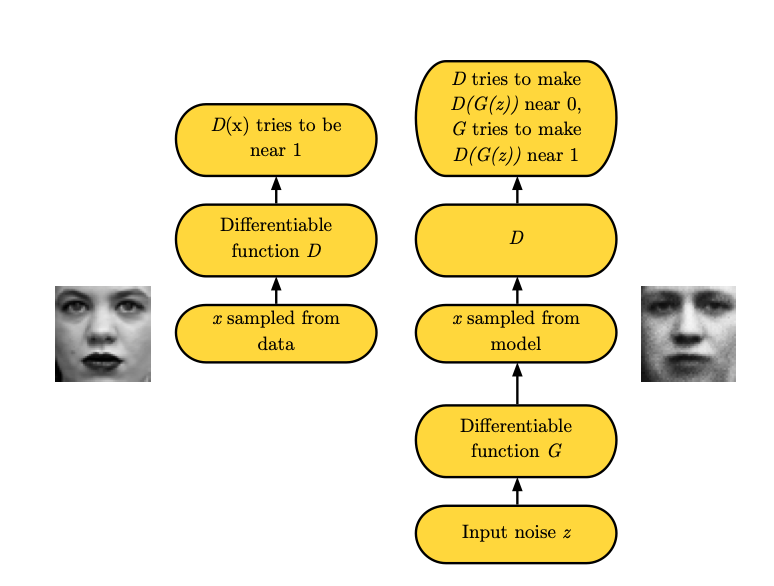
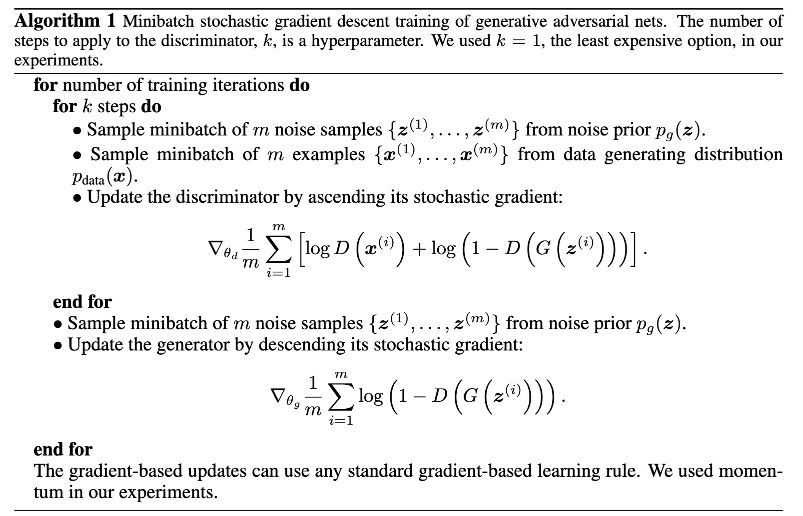
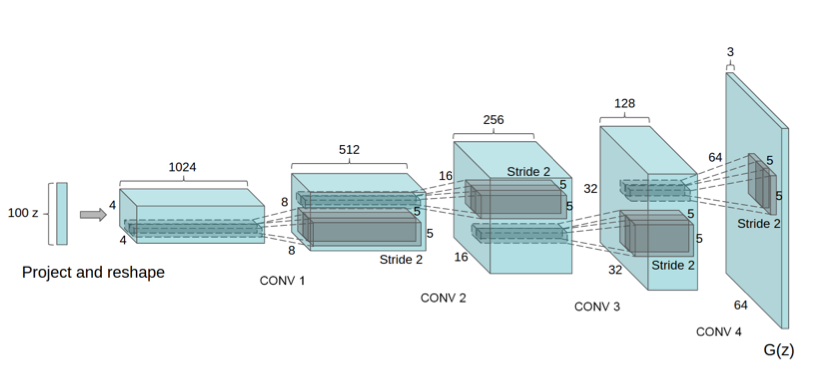

# GAN

## Introduction

* The **generator** creates samples that are intended to come from the same distribution as the training data; The **discriminator** examines samples to determine whether they are real or fake.
* The discriminator learns using traditional supervised learning techniques, dividing inputs into two classes \(real or fake\). The generator is trained to fool the discriminator.



* $$z$$ Input noise
* training examples $$x$$ are randomly sampled from the training set and used as input for the first player, the discriminator, represented by the function $$D$$.
* $$G(z)$$ a fake sample created by the generator

## The training process

The training process consists of simultaneous SGD. On each step, two minibatches are sampled: a minibatch of $$x$$ values from the dataset and a minibatch of $$z$$ values drawn from the model’s prior over latent variables. Then two gradient steps are made simultaneously: one updating $$\theta^{(D)}$$ to reduce $$J ^{(D)}$$ and one updating $$\theta ^{(G)}$$ o reduce $$J^{(G)}$$.

* Adam is most used in GAN



## KL divergence

In mathematical statistics, the Kullback–Leibler divergence \(also called relative entropy\) is a measure of how one probability distribution is different from a second, reference probability distribution.

For discrete probability distributions $$P$$ and $$Q$$ defined on the same probability space, the Kullback–Leibler divergence between $$P$$ and $$Q$$ is defined to be

$$
D_{\text{KL}}(P\parallel Q)=-\sum _{x\in {\mathcal {X}}}P(x)\log \left({\frac {Q(x)}{P(x)}}\right)
$$

## Cost functions

### Discriminator loss

This method quantifies how well the discriminator is able to distinguish real images from fakes. It compares the discriminator's predictions on real images to an array of 1s, and the discriminator's predictions on fake \(generated\) images to an array of 0s.

Goal: Minimize $$- log(D(x)) - log(1-D(G(z)))$$

```python
def discriminator_loss(real_output, fake_output):
    real_loss = cross_entropy(tf.ones_like(real_output), real_output)
    fake_loss = cross_entropy(tf.zeros_like(fake_output), fake_output)
    total_loss = real_loss + fake_loss
    return total_loss
```

Assume real samples' labels are always 1: $$y_x = 1$$, fake samples' labels are always 0: $$y_z = 0$$.

$$
Loss_{real} = -y_x log(D(x)) - (1-y_x) log(D(x)) = - log(D(x))
$$

$$
Loss_{fake} = -y_z log(D(G(z))) - (1-y_z) log(1-D(G(z))) = - log(1-D(G(z)))
$$

$$
Loss = Loss_{real} + Loss_{fake} =- log(D(x)) - log(1-D(G(z)))
$$

### Generator loss

The generator's loss quantifies how well it was able to trick the discriminator. Intuitively, if the generator is performing well, the discriminator will classify the fake images as real \(or 1\). Here, we will compare the discriminators decisions on the generated images to an array of 1s. $$y_z = 1$$

```python
def generator_loss(fake_output):
    return cross_entropy(tf.ones_like(fake_output), fake_output)
```

$$
Loss_{fake} = -y_z log(D(G(z))) - (1-y_z) log(1-D(G(z))) = - log(D(G(z)))
$$

## Maximum likelihood game

We might like to be able to do maximum likelihood learning with GANs, which would mean **minimizing the KL divergence between the data and the model**


* The KL divergence is not symmetric; minimizing $$D_{KL}(p_{data} || p_{model})$$ is different from minimizing $$D_{KL}(p_{model} || p_{data})$$

  

* GANs often choose to generate from very few modes; fewer than the limitation imposed by the model capacity. The reverse KL prefers to generate from as many modes of the data distribution as the model is able to; it does not prefer fewer modes in general. This suggests that **the mode collapse is driven by a factor other than the choice of divergence**.

## Pix2Pix

### Objective

* Conditional GAN loss:

  

* We also explore this option, using L1 distance rather than L2 as L1 encourages less blurring:

  

* The final objective is:

  

* Using **Heuristic instead of minimax**

### Structure

* Borrow structure of DCGAN:



* Both generator and discriminator use modules of the form convolution-BatchNorm-ReLu;
* **Encoder-decoder Network**:In such a network, the input is passed through a series of layers that progressively downsample, until a bottleneck layer, at which point the process is reversed. Such a network requires that **all information flow pass through all the layers**, including the bottleneck.
* To give the generator a means to **circumvent the bottleneck for information**, we add skip connections, following the general shape of a **U-Net**. Specifically, we add **skip connections** between each layer i and layer $$n - i$$, where n is the total number of layers. Each skip connection simply concatenates all channels at layer i with those at layer $$n - i$$.

### Patch GAN

* Problems: GAN discriminator only model high-frequency structure, relying on an L1 term to force low-frequency correctness.
* Solution: In order to model **high-frequencies**, it is sufficient to restrict our attention to the structure in **local image patches**.

Patch GAN only penalizes structure at the scale of patches. This discriminator tries to classify if each $$N \times N$$ patch in an image is real or fake. We run this discriminator convolutionally across the image, averaging all responses to provide the ultimate output of D.

### Evaluation metrics

* Run “real vs. fake” perceptual studies on Amazon Mechanical Turk \(AMT\);
* Adopt the popular FCN-8s architecture for semantic segmentation;

$$ $$

