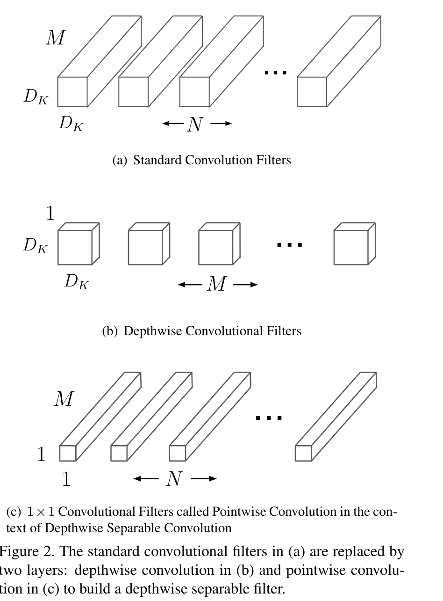
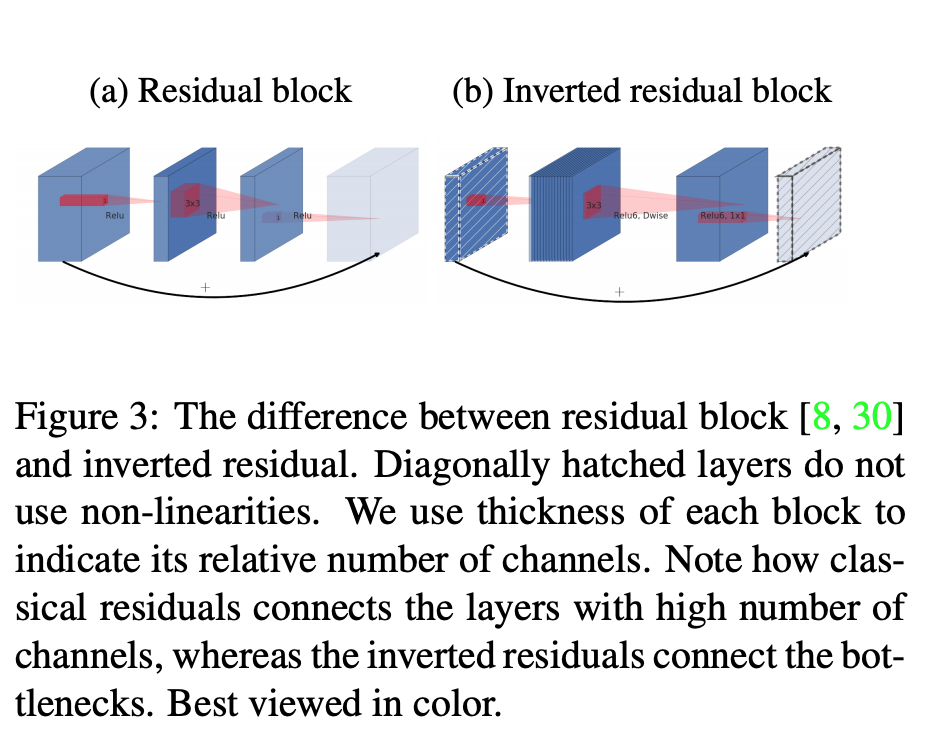
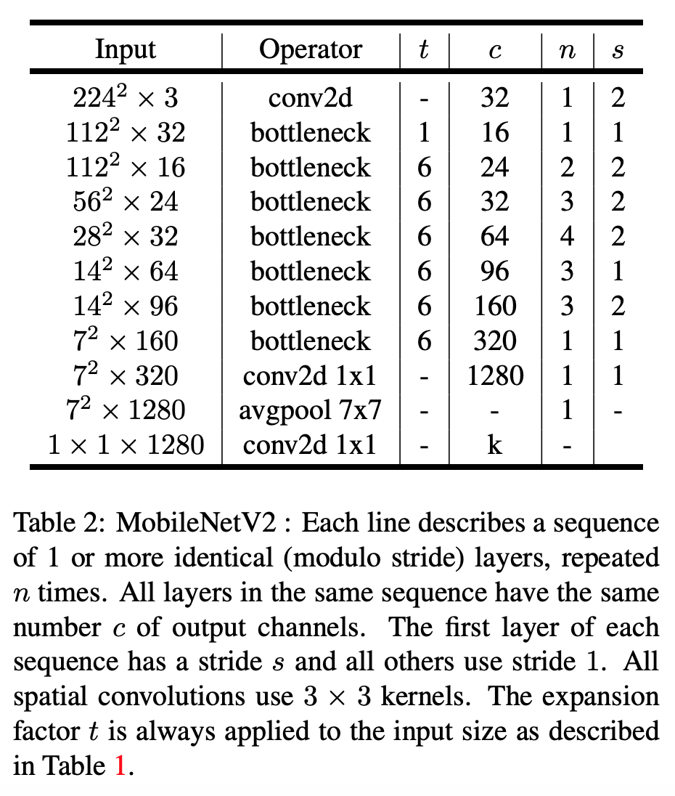
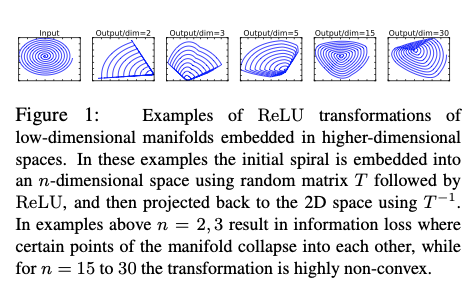
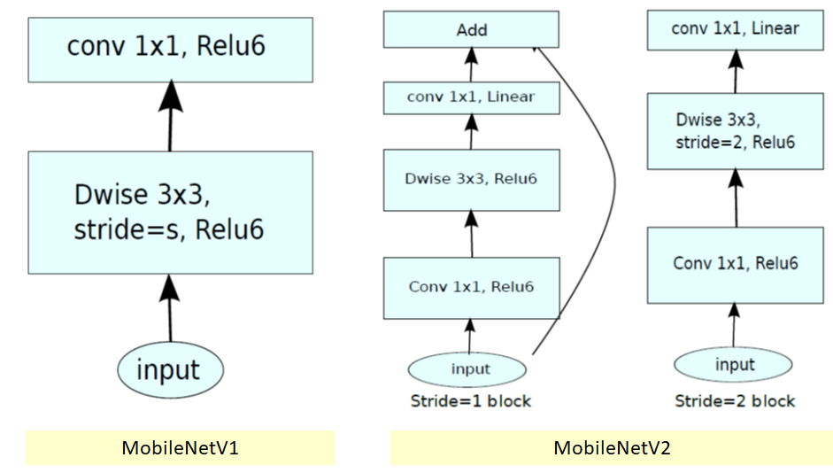

## Mobilenet v1

### Depthwise Separable Convolution.

Standard convolutions have the computational cost of :

$$
D_K \cdot D_K \cdot M \cdot N \cdot D_F \cdot D_F
$$

where the computational cost depends multiplicatively onthe number of input channels M, the number of output channe is N, the kernel size $$D_K \cdot D_K$$ and the feature map size $$D_F \cdot D_F$$.



Depthwise convolution is extremely efficient relative to standard convolution. However it only filters input channels, it does not combine them to create new features. So an additional layer that computes a linear combination ofthe output of depthwise convolution via $$1 \times 1$$ convolutionis needed in order to generate these new features.

The combination of depthwise convolution and $$1 \times 1$$ \(pointwise\) convolution is called depthwise separable con-volution.

Depthwise separable convolutions cost:

$$
D_K \cdot D_K \cdot M \cdot D_F \cdot D_F + \cdot M \cdot N \cdot D_F \cdot D_F
$$

- $$D_{F}$$ is the spatial width and height of a square input feature map1
- $$M$$ is the number of input channels \(input depth\)
- $$D_{G}$$ is the spatial width and height of a square output feature map
- $$N$$ is the number of output channel \(output depth\).

### Depth Multiplier: Thinner Models

For a given layer, and depth multiplier $$\alpha$$, the number of input channels $$M$$ becomes $$\alpha M$$ and the number of output channels $$N$$ becomes $$\alpha N$$

## Mobilenet v2

### Inverted residuals

The bottleneck blocks appear similar to residual block where each block contains an input followed by several bottlenecks then followed by expansion. detail code [here](https://github.com/keras-team/keras-applications/blob/master/keras_applications/mobilenet_v2.py#L425).



- Use shortcuts directly between the bottlenecks.
- The ratio between the size of the input bottleneck and the inner size as the **expansion ratio**.

  In which, when stride = 1

  ```python
  def bottleneck_block(x, expand=64, squeeze=16):
      m = Conv2D(expand, (1,1))(x)
      m = BatchNormalization()(m)
      m = Activation('relu6')(m)
      m = DepthwiseConv2D((3,3))(m)
      m = BatchNormalization()(m)
      m = Activation('relu6')(m)
      m = Conv2D(squeeze, (1,1))(m)
      m = BatchNormalization()(m)
      return Add()([m, x])
  ```

  when stride = 2, no shortcut



- Why using expansion ratio = 6 and use relu with expanded dimension and then use shortcuts directly between the bottlenecks?

  - From the paper, the author summarized that:

    1. If the manifold of interest remains non-zero volume after ReLU transformation, it corresponds to a linear transformation.
    2. ReLU is capable of preserving complete information about the input manifold, but only if the input manifold lies in a low-dimensional subspace of the input space.

    

  - if we have lots of channels, and there is a a structure in the activation manifold that **information might still be preserved in the other channels**.
  - inspired by the intuition that **the bottlenecks actually contain all the necessary information**, while an expansion layer acts merely as an implementation detail that accompanies a non-linear transformation of the tensor, we use shortcuts directly between the bottlenecks.

- Comparison of Mobilenet v1 and Mobilenet v2


