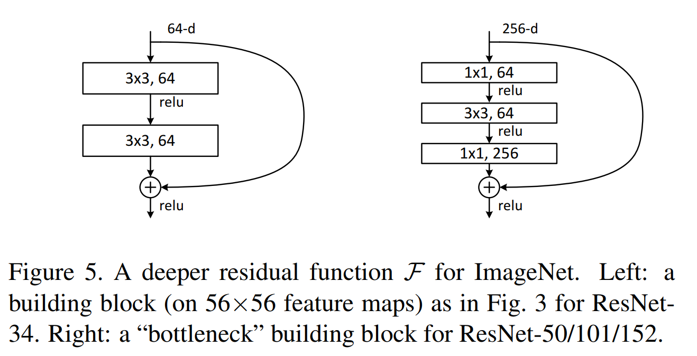

# Resnet

Increasing network depth does not work by simply stacking layers together. Deep networks are hard to train because of the notorious vanishing gradient problem-as the gradient is back-propagated to earlier layers, repeated multiplication may make the gradient infinitively small. As a result, as the network goes deeper, its performance gets saturated or even starts degrading rapidly.

The authors argues that stacking layers shouldn't degrade the network performance, because we could simply stack identity mappings \(layer that doesn't do anything\) upon the current network, and the resulting architecture would perform the same. This indicates that the deeper model should not produce a training error higher than its shallower counterparts.

## Shortcut

The core idea of ResNet is introducing a so-called shortcut.

* When the input and output are of the same dimensions, we use "identity shortcut connection" that skips one or more layers, as shown in the following figure:

  

* When the dimensions increase, we consider two options: \(A\) The shortcut still performs identity mapping, with extra zero entries padded for increasing dimensions. \(B\) The projection shortcut is used to match dimensions.

```python
# Residual block: Pytorch implementation
class ResidualBlock(nn.Module):
    def __init__(self, in_channels, out_channels, stride=1, downsample=None):
        super(ResidualBlock, self).__init__()
        self.conv1 = conv3x3(in_channels, out_channels, stride)
        self.bn1 = nn.BatchNorm2d(out_channels)
        self.relu = nn.ReLU(inplace=True)
        self.conv2 = conv3x3(out_channels, out_channels)
        self.bn2 = nn.BatchNorm2d(out_channels)
        self.downsample = downsample

    def forward(self, x):
        residual = x
        out = self.conv1(x)
        out = self.bn1(out)
        out = self.relu(out)
        out = self.conv2(out)
        out = self.bn2(out)
        if self.downsample:
            residual = self.downsample(x)
        out += residual
        out = self.relu(out)
        return out
```

## Experimental Result

Residual Network. Based on the above plain network, we insert shortcut connections \(Fig. 3, right\) which turn the network into its counterpart residual version. The identity shortcuts can be directly used when the input and output are of the same dimensions. When the dimensions increase, we consider two options: \(A\) The shortcut still performs identity mapping, with extra zero entries padded for increasing dimensions. This option introduces no extra parameter; \(B\) The projection shortcut in the following equation is used to match dimensions \(done by 1×1 convolutions\). For both options, when the shortcuts go across feature maps of two sizes, they are performed with a stride of 2.

$$
y = \mathcal{F} (x, { W_i }) + W_s x
$$

The following table shows that all three options are considerably better than the plain counterpart. B is slightly better than A. We argue that this is because the zero-padded dimensions in A indeed have no residual learning. C is marginally better than B, and we attribute this to the extra parameters introduced by many \(thirteen\) projection shortcuts. But the small differences among A/B/C indicate that projection shortcuts are not essential for addressing the degradation problem.

| model | top-1 err. | top-5 err. |
| :--- | :--- | :--- |
| plain-34 | 28.54 | 10.02 |
| ResNet-34 A | 25.03 | 7.76 |
| ResNet-34 B | 24.52 | 7.46 |
| ResNet-34 C | 24.19 | 7.40 |
| ResNet-50 | 22.85 | 6.71 |
| ResNet-101 | 21.75 | 6.05 |
| ResNet-152 | 21.43 | 5.71 |

The parameter-free identity shortcuts are particularly important for the bottleneck architectures. If the identity shortcut is replaced with projection, one can show that the time complexity and model size are doubled, as the shortcut is connected to the two high-dimensional ends. So identity shortcuts lead to more efficient models for the bottleneck designs.

