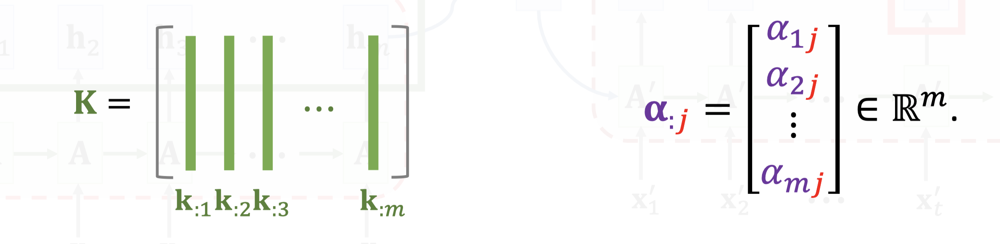
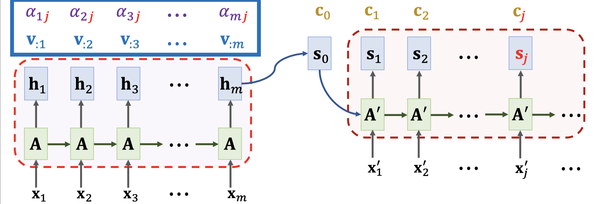
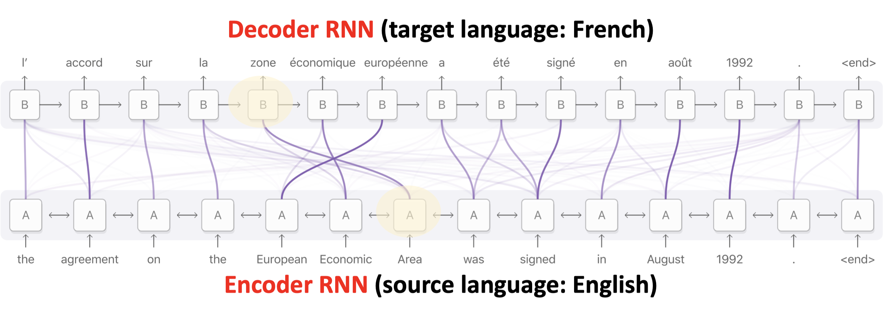

# Attention

## Shortcoming of Seq2Seq

The final state is incapable of remembering a long sequence

 (1) (1).png>)

## Seq2Seq Model with Attention

* Attention tremendously improves Seq2Seq model.
* With attention, Seq2Seq model does not forget source input.
* With attention, the decoder knows where to focus.
* Downside: much more computation.

## Simple RNN + Attention

 (2) (1) (1).png>)

There are two options to calculate weight: $$\alpha_i = align(h_i, s_0)$$

### Option1: (Used in original paper)

 (2) (1) (1).png>)

Then normalize $$\tilde\alpha_1, ..., \tilde\alpha_m$$ (so that they sum to 1):

* $$[\tilde\alpha_1,...,\tilde\alpha_m] = Softmax([\tilde\alpha_1, ..., \tilde\alpha_m])$$

### Option2: More popular; the same to Transformer

1. Linear maps:
   1. $$k_i=W_K \cdot h_i$$, for i = 1 to m
   2. $$q_0=W_Q \cdot s_0$$
2. Inner product:
   1. $$\tilde\alpha_i = k_i^T q_0$$, for i = 1 to m
3. Normalization
   1. $$[\tilde\alpha_1,...,\tilde\alpha_m] = Softmax([\tilde\alpha_1, ..., \tilde\alpha_m])$$

### Calculate the next state

Simple RNN: $$s_1 = tanh(A' \cdot \begin{bmatrix} x'_1 \\ s_0 \end{bmatrix} + b)$$

Simple RNN + Attention: $$s_1 = tanh(A' \cdot \begin{bmatrix} x'_1 \\ s_0 \\ c_0 \end{bmatrix} + b)$$

Context vector: $$c_0 = \alpha_1 h_1 + ... + \alpha_m h_m$$

 (2) (2).png>)

For next state $$s_2$$, do not use the previously calculated $$\alpha_i$$

### Compute parameters For $$j^{th}$$state

* Query: $$q_{:j}=W_Q s_j$$ (To match others)
* Key: $$k_{:i}=W_K h_i$$ (To be matched)
* Value: $$v_{:i}=W_Vh_i$$ (To be weighted averaged)
* Weights:$$\alpha_{ij} = align(h_i, s_j)$$
  * Compute $$k_{:i}=W_K h_i$$and $$q_{:j}=W_Q s_j$$
  * Compute weights: $$\alpha_{:j}=Softmax(K^T q_{:j}) \in R^m$$

* Context vector: $$c_j=\alpha_{ij} v_{:1} + ... +\alpha_{mj} v_{:m}$$

## Time complexity

* Question: How many weights $$\alpha_i$$ have been computed?
  *   To compute one vector $$c_j$$, we compute $$m$$ weights: $$\alpha_1, ... , \alpha_m$$.

      • The decoder has $$t$$ states, so there are totally $$m \cdot t$$ weights.

## Weights Visualization

## Summary

* Standard Seq2Seq model: the decoder looks at only its current state.
* Attention: decoder additionally looks at all the states of the encoder.
* Attention: decoder knows where to focus.
* Downside: higher time complexity.
  * $$m$$: source sequence length
  * $$t$$: target sequence length
  * Standard Seq2Seq: $$O(m+t)$$ time complexity
  * Seq2Seq + attention: $$O(m \cdot t)$$ time complexity

## References:

1. [youtube video](https://www.youtube.com/watch?v=XhWdv7ghmQQ\&list=PLvOO0btloRnuTUGN4XqO85eKPeFSZsEqK\&index=8)
2.  Bahdanau, Cho, & Bengio. Neural machine translation by jointly learning to align and translate.

    In ICLR, 2015.
