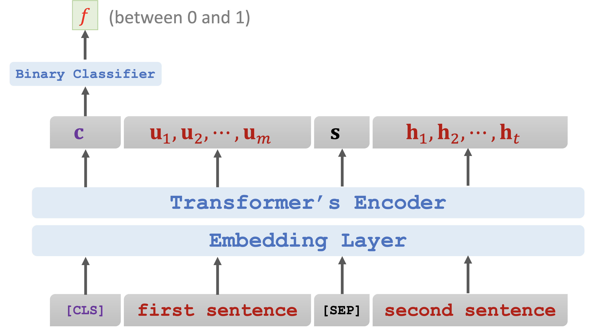

# BERT

## What is BERT?

* BERT \[1] is for pre-training Transformer’s \[2] encoder.
* How?
* Predict masked word.
* Predict next sentence.

## Task 1: Predict Masked Words

### Randomly mask a word

* "The **\_** sat on the mat"
* What is the masked word?

 (2).png>)

### Predict the masked word

* $$e$$: one-hot vector of the masked word "cat".
* $$p$$ : output probability distribution at the masked position.
* $$Loss = CrossEntropy( e,p)$$.
* Performing one gradient descent to update the model parameters.

## Task 2: Predict the Next Sentence

* Given the sentence: "calculus is a branch of math"
* Is this the next sentence?
  * "it was developed by newton and leibniz"
* Is this the next sentence?
  * "panda is native to south central china"

### Input Representation

* Input:
  * \[CLS] “calculus is a branch of math”
  * \[SEP] “it was developed by newton and leibniz”
* Target: true
* Input:
  * \[CLS] “calculus is a branch of math”
  * \[SEP] “panda is native to south central china”
* Target: false

> Note: \[CLS] is a token for classification. \[SEP] is for separating sentences.

## Combining the two methods

* Input:
  * "\[CLS] calculus is a \[MASK] of math \[SEP] it \[MASK] developed by newton and leibniz".
  * Targets: true, “branch”, “was”.

## Training

* Loss 1 is for binary classification (i.e., predicting the next sentence.)
* Loss 2 and Loss 3 are for multi-class classification (i.e., predicting the masked words.)
* Objective function is the sum of the three loss functions.
* Update model parameters by performing one gradient descent.

## Data

* BERT does not need manually labeled data. (Nice! Manual labeling is expensive.)
* Use large-scale data, e.g., English Wikipedia (2.5 billion words.)
* Randomly mask words (with some tricks.)
* 50% of the next sentences are real. (The other 50% are fake.)

## Cost of computation

* BERT Base
  * 110M parameters.
  * 16 TPUs, 4 days of training (without hyper-parameter tuning.)
* BERT Large
  * 235M parameters.
  * 64 TPUs, 4 days of training (without hyper-parameter tuning.)

## Reference

1. Devlin, Chang, Lee, and Toutanova. BERT: Pre-training of deep bidirectional transformers for language understanding. In ACL, 2019.
2. Vaswani and others. Attention is all you need. In NIPS, 2017.
3. [youtube](https://www.youtube.com/watch?v=UlC6AjQWao8\&t=17s)
