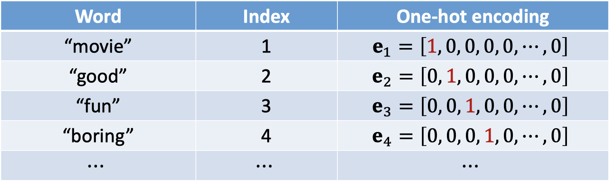
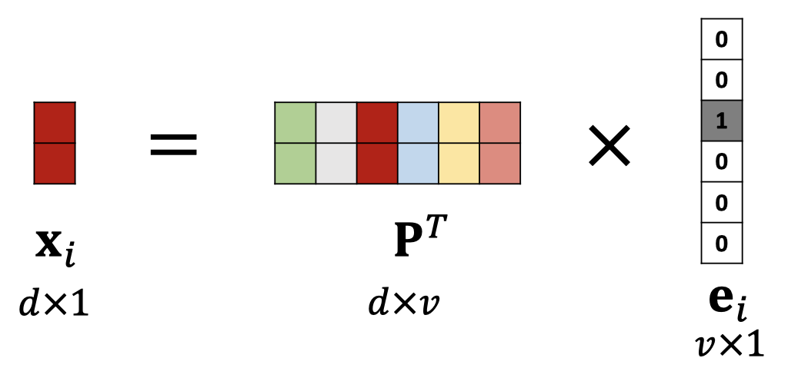
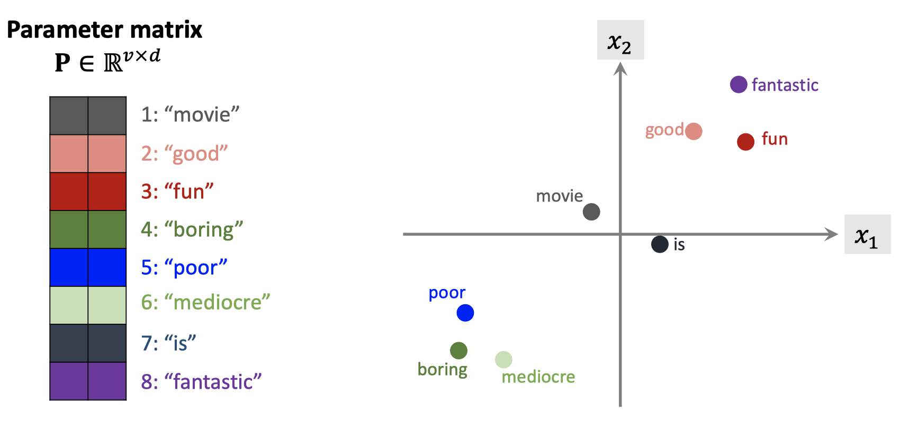

# Embedding

[Reference](https://www.tensorflow.org/tutorials/text/word_embeddings)

[Youtube](https://www.youtube.com/watch?v=NWcShtqr8kc&list=PLvOO0btloRnuTUGN4XqO85eKPeFSZsEqK)

[Slides](https://github.com/wangshusen/DeepLearning/blob/master/Slides/9_RNN_1.pdf)

## Map word to vector

* First, represent words using one-hot vectors
  * Suppose the dictionary contains $$v$$ unique words \(vocabulary = $$v$$\).
  * Then the one-hot vectors $$e_1,e_2,e_3,...,e_v$$ are $$v$$-dimensional.



* Second, map the one-hot vectors to low dimensional vectors by

word-embedding

* $$P$$ is parameter matrix which can be learned from training data.
* $$e_i$$ is the one-hot vector of the i-th word in dictionary.

## How to interpret the parameter matrix




## Visualization

This document introduces the concept of embeddings, gives a simple example of how to train an embedding in TensorFlow, and explains how to view embeddings with the TensorBoard Embedding Projector \([live example](http://projector.tensorflow.org/)\). The first two parts target newcomers to machine learning or TensorFlow, and the Embedding Projector how-to is for users at all levels.

An alternative tutorial on these concepts is available in the [Embeddings section of Machine Learning Crash Course](https://developers.google.com/machine-learning/crash-course/embeddings/video-lecture).

An **embedding** is a mapping from discrete objects, such as words, to vectors of real numbers. For example, a 300-dimensional embedding for English words could include:

```text
blue:  (0.01359, 0.00075997, 0.24608, ..., -0.2524, 1.0048, 0.06259)
blues:  (0.01396, 0.11887, -0.48963, ..., 0.033483, -0.10007, 0.1158)
orange:  (-0.24776, -0.12359, 0.20986, ..., 0.079717, 0.23865, -0.014213)
oranges:  (-0.35609, 0.21854, 0.080944, ..., -0.35413, 0.38511, -0.070976)
```

The individual dimensions in these vectors typically have no inherent meaning. Instead, it's the overall patterns of location and distance between vectors that machine learning takes advantage of.

Embeddings are important for input to machine learning. Classifiers, and neural networks more generally, work on vectors of real numbers. They train best on dense vectors, where all values contribute to define an object. However, many important inputs to machine learning, such as words of text, do not have a natural vector representation. Embedding functions are the standard and effective way to transform such discrete input objects into useful continuous vectors.

Embeddings are also valuable as outputs of machine learning. Because embeddings map objects to vectors, applications can use similarity in vector space \(for instance, Euclidean distance or the angle between vectors\) as a robust and flexible measure of object similarity. One common use is to find nearest neighbors. Using the same word embeddings as above, for instance, here are the three nearest neighbors for each word and the corresponding angles:

```text
blue:  (red, 47.6°), (yellow, 51.9°), (purple, 52.4°)
blues:  (jazz, 53.3°), (folk, 59.1°), (bluegrass, 60.6°)
orange:  (yellow, 53.5°), (colored, 58.0°), (bright, 59.9°)
oranges:  (apples, 45.3°), (lemons, 48.3°), (mangoes, 50.4°)
```

This would tell an application that apples and oranges are in some way more similar \(45.3° apart\) than lemons and oranges \(48.3° apart\).

