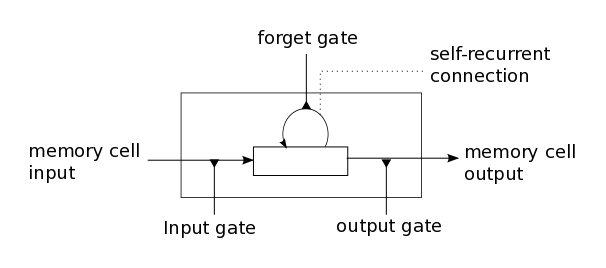

# LSTM

This seems great, but in practice RNN barely works due to **exploding/vanishing gradient**, which is cause by a series of multiplication of the same matrix. On the other side, it also have the problem of **long-term dependencies**. To solve this, we can use a variation of RNN, called long short-term memory \(LSTM\), which is capable of learning long-term dependencies.

**sigmoid** - gate function \[0, 1\], **tanh** - regular information to \[-1, 1\]


The sigmoid layer outputs numbers between zero and one, describing how much of each component should be let through. A value of zero means "let nothing through," while a value of one means “let everything through!”

The math behind LSTM can be pretty complicated, but intuitively LSTM introduce

* input gate
* output gate
* forget gate
* memory cell \(internal state\)


The cell state is kind of like a conveyor belt. It runs straight down the entire chain, with only some minor linear interactions. It's very easy for information to just flow along it unchanged.

LSTM resembles human memory: it forgets old stuff \(old internal state _forget gate\) and learns from new input \(input node_ input gate\)



LSTMs also have this chain like structure, but the repeating module has a different structure. Instead of having a single neural network layer, there are four, interacting in a very special way.


## Step-by-Step LSTM Walk Through


1. At first, we apply **Forget gate**: $$f_{t} = \sigma(W_f \cdot [h_{t-1}, x_{t}] + b_{f})$$, caculate what information we should forget for previous information

   

2. The next step is to decide what new information we're going to store in the cell state.

   * **Input gate**: $$i_{t} = \sigma(W_i \cdot [h_{t-1}, x_{t}] + b_{i})$$, a sigmoid layer decides which values we’ll update.
   * A tanh layer creates a vector of new candidate values: $$\tilde{ C_{t} } = tanh(W_{c} \cdot [h_{t-1}, x_{t}] + b_{c})$$, that could be added to the state.

   

3. Then we update **Memory cell C**: $$C_{t} = f_{t} * C_{t - 1} + i_{t} * \tilde{ C_{t} }$$,

   We multiply the old state by $$f_t$$, forgetting the things we decided to forget earlier. Then we add $$i_t * \tilde{C_t}$$. This is the new candidate values, scaled by how much we decided to update each state value.

   

4. This output will be based on our cell state, but will be a **filtered version**.
   * First, we run a **Output gate**: $$o_{t} = \sigma(W_o \cdot [h_{t-1}, x_{t}] + b_{o})$$, which decides what parts of the cell state we’re going to output, .
   * Then, we put the cell state through tanhtanh \(to push the values to be between $$[-1, 1]$$ \) and multiply it by the output of the sigmoid gate, so that we only output the parts we decided to: $$h_{t} = tanh(C_{t}) * o_{t}$$

### Why solve vanishing gradient?

Details from [here](https://weberna.github.io/blog/2017/11/15/LSTM-Vanishing-Gradients.html)

* The additive update function for the cell state gives a derivative thats much more ‘well behaved’
* The **gating functions allow the network to decide how much the gradient vanishes**, and can take on different values at each time step. The values that they take on are learned functions of the current input and hidden state.

## \(Optional\) Implementation

* LSTM for IMDB review

```python
from keras.models import Sequential
from keras.layers import LSTM, Embedding, Dense, Flatten

vocabulary = 10000
embedding_dim = 32
word_num = 500
state_dim = 32

model = Sequential()
model.add(Embedding(vocabulary, embedding_dim, input_length=word_num)
model.add(LSTM(state_dim, return_sequences=False, dropout=0.2)
model.add(Dense(1, activation='sigmoid')

model.summary()
```

* Shapes
  * The output shape of the Embedding layer is \(?, 500, 32\).
  * $$C_t$$: \(?, 100\)
  * $$h_t$$: \(?, 100\)

The calculation for forget gate $$f_{t} = \sigma(W_f \cdot [h_{t-1}, x_{t}] + b_{f})$$ is composed of:

$$
\sigma ( (?,32) \cdot (32,100) + (?, 100) \cdot (100, 100) + (1, 100))
$$

## Summary

* LSTM uses a "conveyor belt" to get longer memory than SimpleRNN.
* Each of the following blocks has a parameter matrix:
* Forget gate.
* Input gate.
* New values.
* Output gate.
* Number of parameters:
* $$4 \times shape(h) \times [shape(h)+shape(x)]$$

