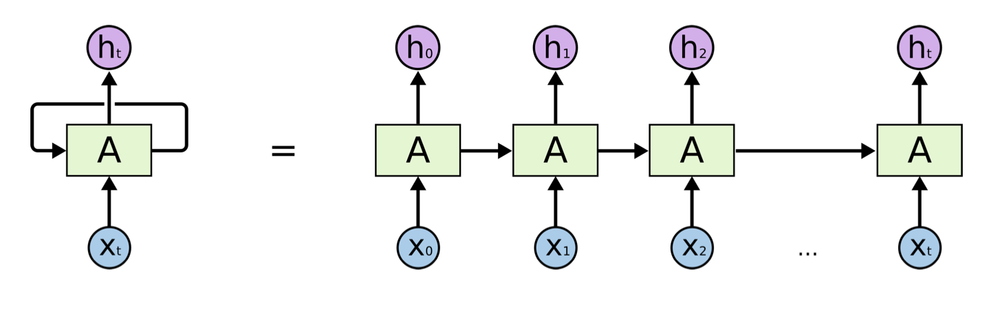

[https://colah.github.io/posts/2015-08-Understanding-LSTMs/](https://colah.github.io/posts/2015-08-Understanding-LSTMs/)

RNN is another paradigm of neural network where we have difference layers of cells, and each cell not only takes the cell from the previous layer as input, but also the previous cell within the same layer. This gives RNN the power to model sequence.


A recurrent neural network can be thought of as multiple copies of the same network, each passing a message to a successor. Consider what happens if we unroll the loop:


All recurrent neural networks have the form of a chain of repeating modules of neural network. In standard RNNs, this repeating module will have a very simple structure, such as a single tanh layer.




- $$h_{t} = f(h_{t-1}, x_{t}; \theta)$$, where the current hidden state $$h_{t}$$ is a function $$f$$ of the previous hidden state and $$h_{t - 1}$$ the current input $$x_{t}$$. The are $$\theta$$ the parameters of the function $$f$$.

### Simple RNN for IMDB review

```python
from keras.models import Sequential
from keras.layers import SimpleRNN, Embedding, Dense

vocabulary = 10000
embedding_dim = 32
word_num = 500
state_dim = 32

model = Sequential()
model.add(Embedding(vocabulary, embedding_dim, input_length=word_num))
# return_sequences=True will return all the states h1, ..., ht
model.add(SimpleRNN(state_dim, return_sequences=True))
model.add(Flatten())
model.add(Dense(1, activation='sigmoid'))

model.summary()
```

| Layer (type)             | Output Shape        | Param  |
| ------------------------ | ------------------- | ------ |
| embedding_2 (Embedding)  | (None, 500, 32)     | 320000 |
| simple_rnn_2 (SimpleRNN) | **(None, 500, 32)** | 2080   |
| flatten_2 (Flatten)      | (None, 16000)       | 0      |
| dense_2 (Dense)          | (None, 1)           | 16001  |

Total params: 338,081

Trainable params: 338,081

Non-trainable params: 0

> Note: without `return_sequence=True`, `simple_rnn_2 (SimpleRNN)` output shape will be (None, 32)

### Summary

- RNN for text, speech and time series data
- Hidden state $$h_t$$ aggregates information in the inputs $$x_0,...,x_t$$.
- RNNs can forget early inputs.
  - It forgets what it has seen eraly on
  - if it is large, $$h_t$$ is almost irrelvent to $$x_0$$.

### Number of parameters

- SimpleRNN has a parameter matrix (and perhaps an intercept vector).
- Shape of the parameter matrix is
  - $$ shape(h) \times [shape(h)+shape(x)]$$
- Only one such parameter matrix, no matter how long the sequence is.
