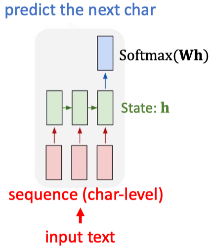
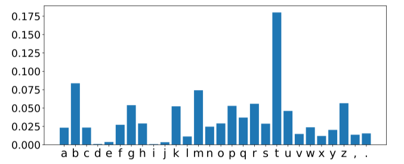

# RNN for text prediction

- Input text: “the cat sat on the ma”
- Question: what is the next char?
- RNN outputs a distribution over the chars.

- Sample a char from it; we may get ‘t’.
- Take “the cat sat on the mat” as input.
- Maybe the next char is period ‘.’.

## Training

- Cut text to segments \(with overlap\). E.g., seg_len=40 and stride=3.
  - Partition text to \(segment, next_char\) pairs.
- A segment is used as input text.
- Its next char is used as label.
- One-hot encode the characters.
  - Character -&gt; $$v \times 1$$ vector.
  - Segment $$l \times v$$ matrix.
- Training data: \(segment, next_char\) pairs
- It is a multi-class classification problem. \#class = \#unique chars.
