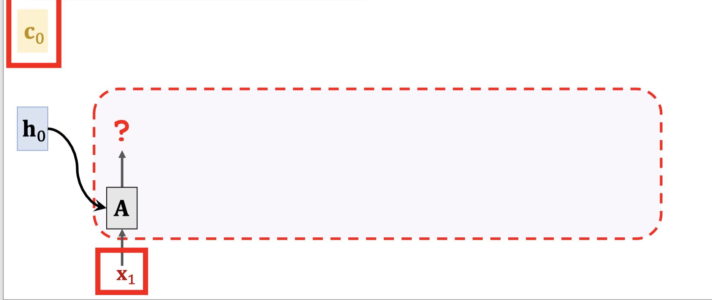
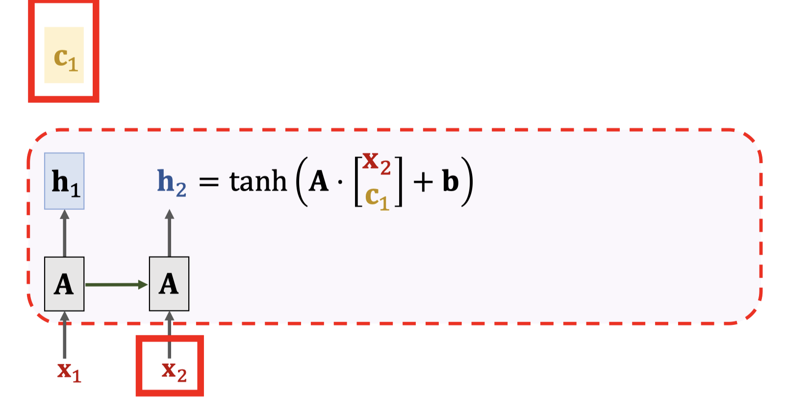
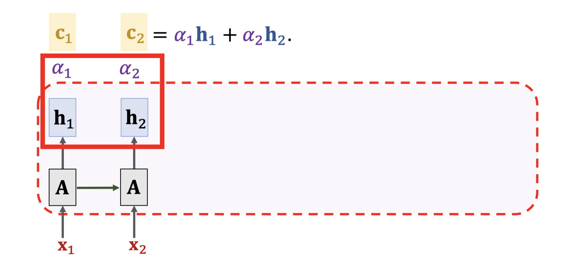
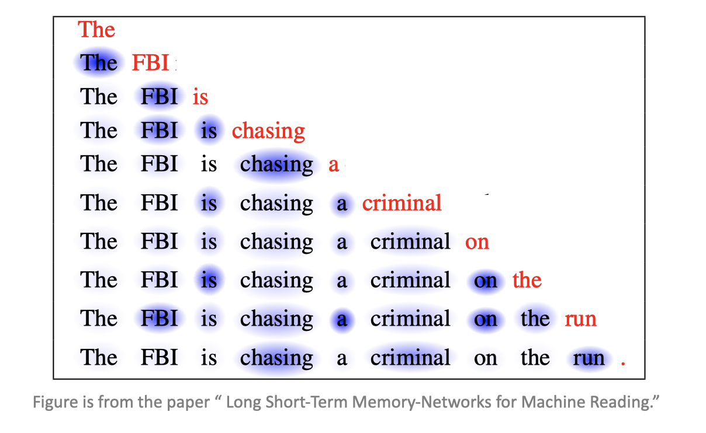

# Self Attention

## Simple RNN + Self Attention

$$
c_0 = 0 \\
h_0 = 0 \\
$$

Simple RNN: $$h_i = tanh(A \cdot [ \begin{matrix} x_i \\ h_{i-1}\end{matrix} ] + b)$$

Simple RNN + Self Attention: $$h_i = tanh(A \cdot [ \begin{matrix} x_i \\ c_{i-1}\end{matrix} ] + b)$$

Calculate Weights: $$\alpha_i=align(h_i, h_2)$$

## Summary

* With self-attention, RNN is less likely to forget.
* Pay attention to the context relevant to the new input.

