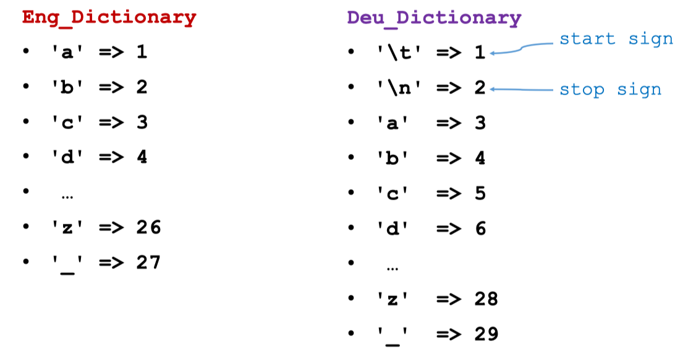
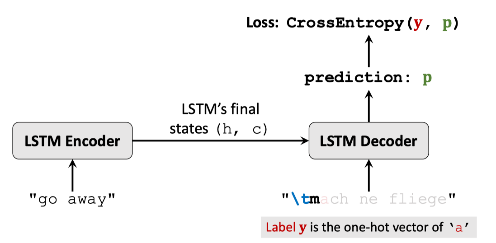
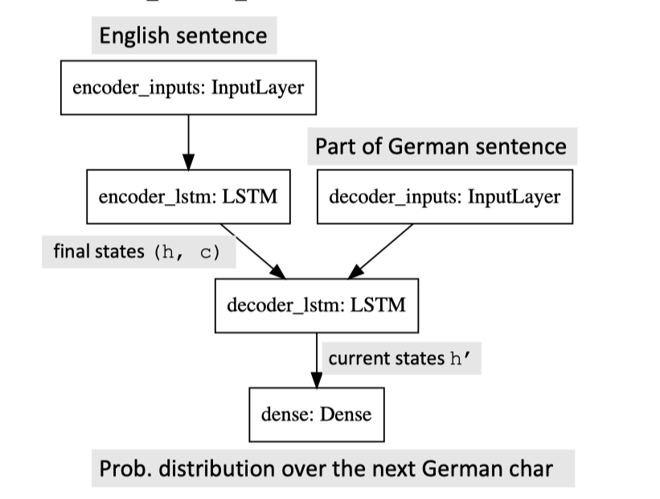
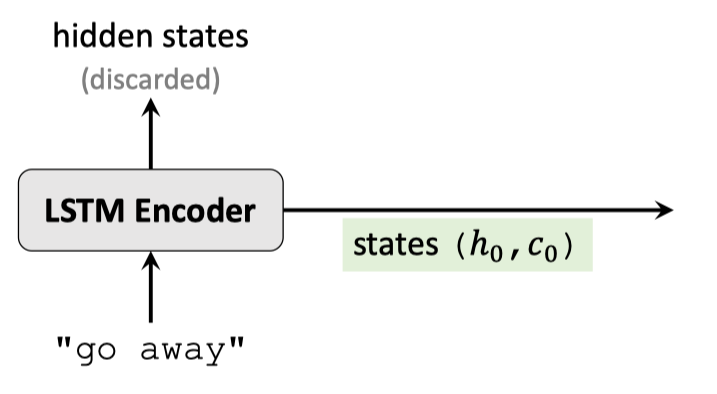
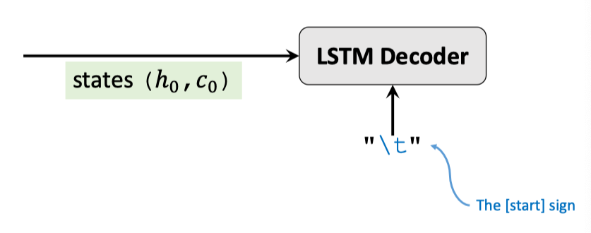
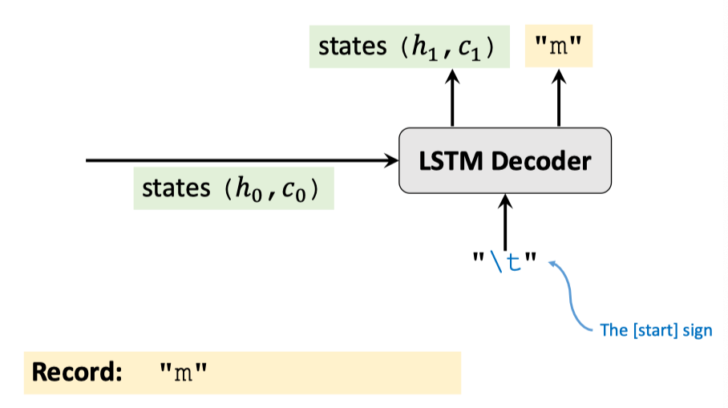
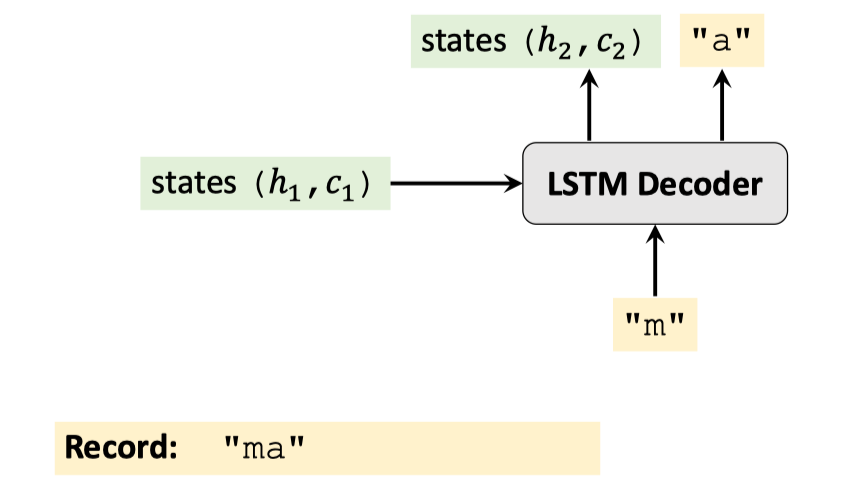
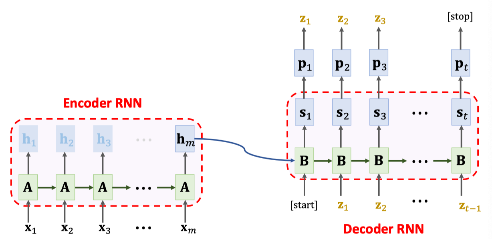

# Sequence-to-Sequence Model (Seq2Seq)

## 1. Tokenization & Build Dictionary

- input_texts => [Eng_Tokenizer] => input_tokens
- target_texts => [Deu_Tokenizer] => target_tokens
  - Use 2 different tokenizers for the 2 languages.
  - Then build 2 different dictionaries.
- Tokenization can be char-level or word-level

```
Eng_Tokenizer: "I_am_okay." => ['i', '_', 'a', 'm', ..., 'a', 'y']
Deu_Tokenizer: "Es geht mir gut" => ['e', 's', '_', ..., 'u', 't']
```

### Question: Why 2 different tokenizers and dictionaries?

Answer: In the char-level, languages have different alphabets/chars.

- English: A a, B b, C c …, Z z. (26 letters × 2).
- German: 26 letters, 3 umlauts (Ä,Ö,Ü), and one ligature (ß).
- Greek: Α α, Β β, Γ γ, Δ δ, …, Ω ω. (24 letters × 2).
- Chinese: 金 木 水 火 土 … 赵 钱 孙 李 (a few thousands characters).

### Question: Why 2 different tokenizers and dictionaries?

Answer: In the word-level, languages have different vocabulary.

## 2. One-Hot Encoding

<figure>

<figcaption style="text-align:center"></figcaption>
</figure>

## 3. Training Seq2Seq Model

<figure>

<figcaption style="text-align:center"></figcaption>
</figure>

<figure>

<figcaption style="text-align:center"></figcaption>
</figure>

## 4. Inference

<figure>

<figcaption style="text-align:center"></figcaption>
</figure>

<figure>

<figcaption style="text-align:center"></figcaption>
</figure>

<figure>

<figcaption style="text-align:center"></figcaption>
</figure>

<figure>

<figcaption style="text-align:center"></figcaption>
</figure>

## Summary

<figure>

<figcaption style="text-align:center"></figcaption>
</figure>

- Encoder’s final states (𝐡 < and 𝐜 < ) have all the information of the English sentence.
- If the sentence is long, the final states have forgotten early inputs.
- Bi-LSTM (left-to-right and right-to-left) has longer memory.
- Use Bi-LSTM in the encoder; use unidirectional LSTM in the decoder.
- Word-level tokenization instead of char-level.
  - The average length of English words is 4.5 letters.
  - The sequences will be 4.5x shorter.
  - Shorter sequence -> less likely to forget.
- But you will need a large dataset!
  - # of (frequently used) chars is ~$$10^2$$ ) -> one-hot suffices.
  - # of (frequently used) words is ~$$10^4$$ -> must use embedding.
  - Embedding Layer has many parameters -> overfitting!
