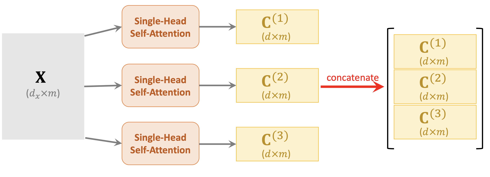
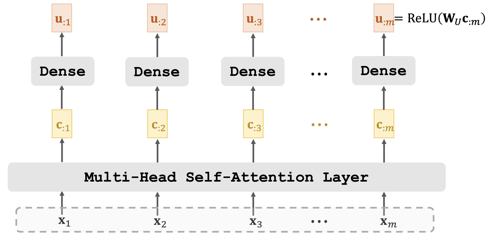
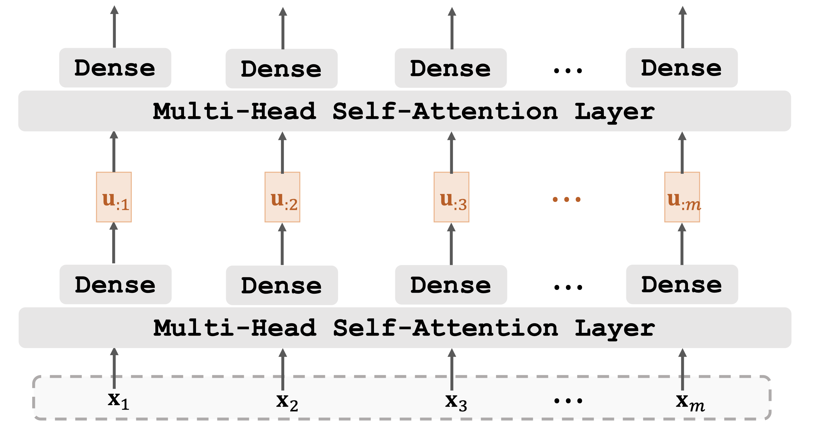
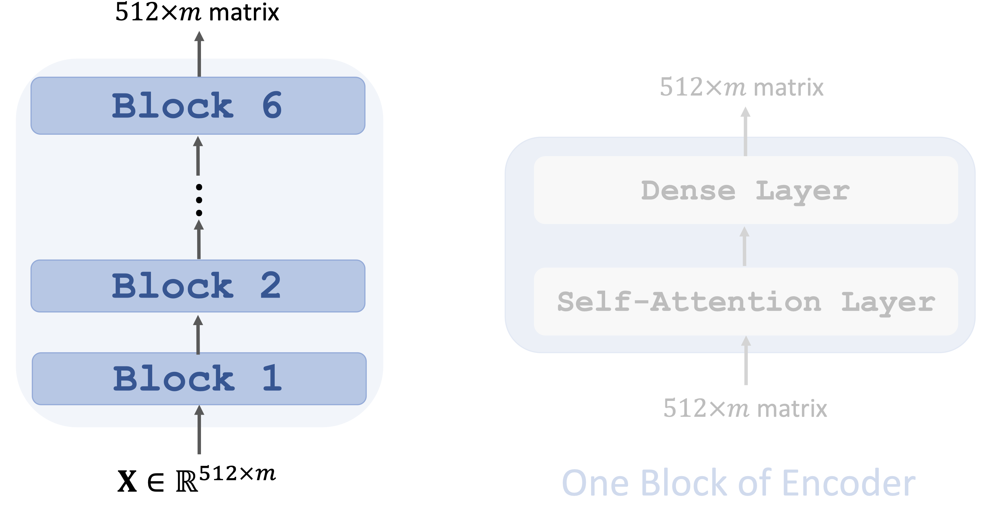
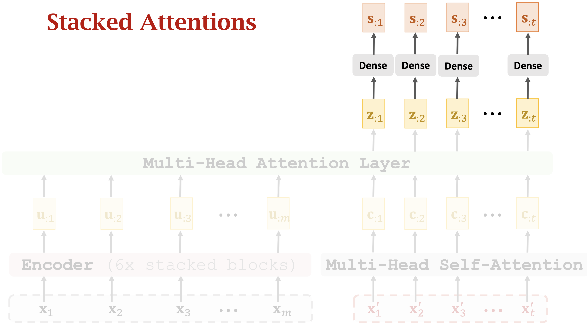
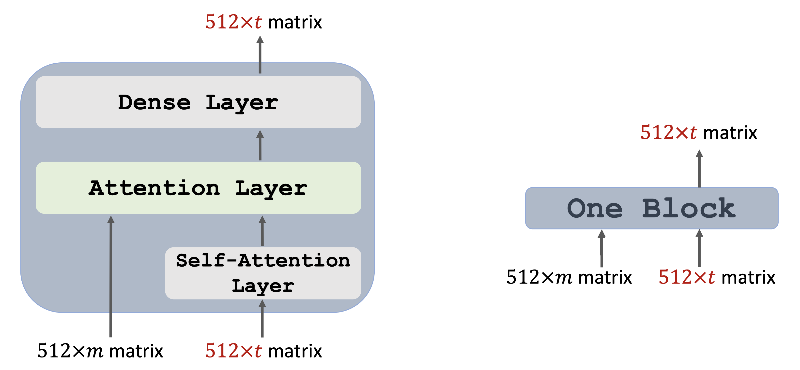
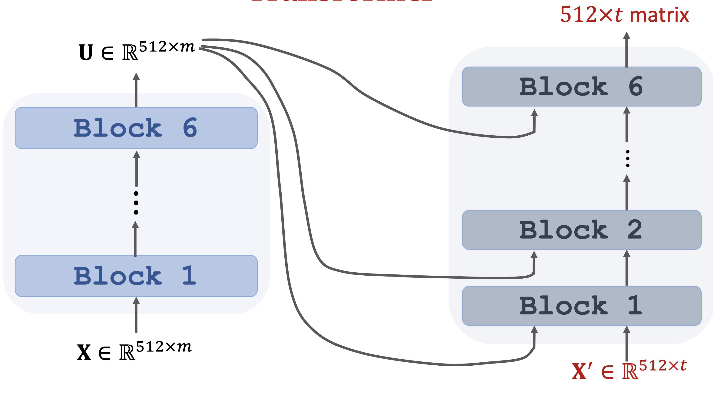

# Transformer

* Transformer is a Seq2Seq model.
* Transformer is not RNN.
* Purely based attention and dense layers.
* Higher accuracy than RNNs on large datasets.

## From Single-Head to Multi-Head

* Single-head self-attention can be combined to form a multi-head self-attention.
* Single-head attention can be combined to form a multi-head attention.
* Using $$l$$ single-head self-attentions \(which do not share parameters.\)
  * A single-head self-attention has 3 parameter matrices: $$W_Q, W_K, W_V$$
  * Totally $$3l$$ parameters matrices.
* Concatenating outputs of single-head self-attentions.
  * Suppose single-head self-attentions' outputs are $$d \times m$$ matrices.

    • Multi-head’s output shape: $$(ld) \times m$$

## Self-Attention Layer + Dense Layer

## Stacked Self-Attention Layers

## Transformer's Encoder

* Transformer is a Seq2Seq model \(encoder + decoder\).
* Encoder’s inputs are vectors $$x_1,x_2,...,x_m$$.
* Decoder’s inputs are vectors $$x'_1,x'_2,...,x'_t$$.
* Transformer’s encoder contains 6 stacked blocks.
* 1 block ≈ 1 multi-head self-attention layer + 1 dense layer.
  * Input shape: $$512 \times m$$
  * Output shape: $$512 \times m$$
* Encoder network is a stack of 6 such blocks

## Transformer’s Decoder : One Block

* 1 decoder block $$\approx$$multi-head self-attention + multi-head attention + dense
  * Input shape: $$(512 \times m, 512 \times t)$$
  * Output shape: $$512 \times t$$
* Decoder network is a stack of 6 such blocks

## Put things together: Transformer

* Transformer is Seq2Seq model; it has an encoder and a decoder.
* Transformer model is not RNN.
* Transformer is based on attention and self-attention.
* Transformer outperforms all the state-of-the-art RNN models.

## Reference

[youtube](https://www.youtube.com/watch?v=aJRsr39F4dI&t=2s) 

