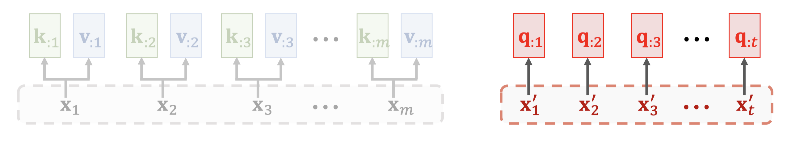
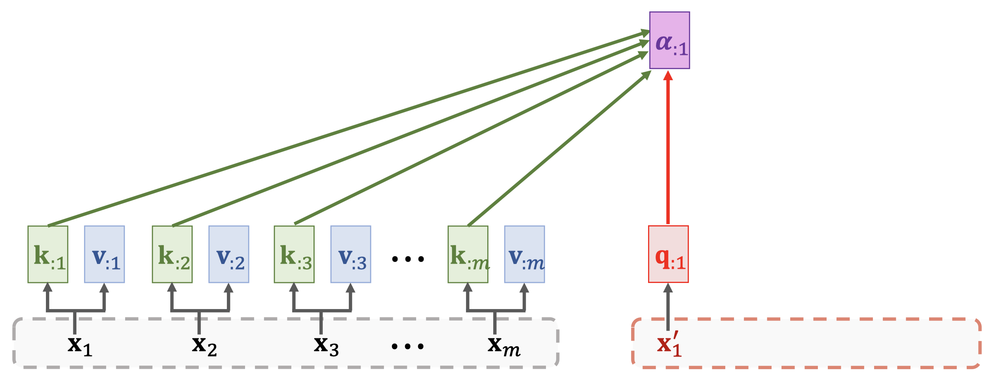
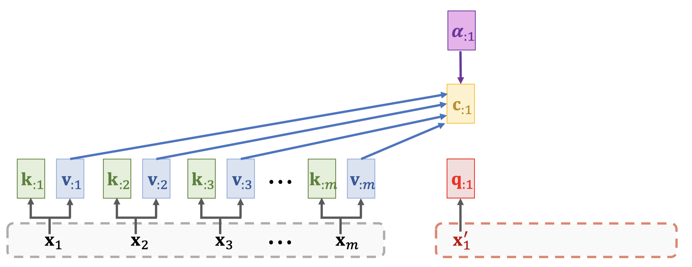
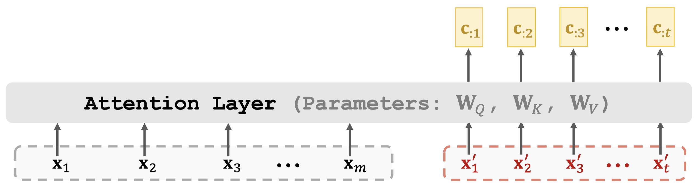
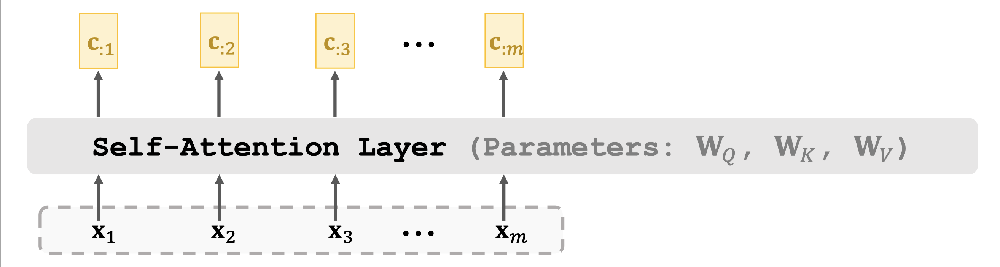

# Attention without RNN

## Attention Layer: Attention without RNN

Compared with Simple RNN + Attention, it's not using hidden states from RNN to compute Key, Value, Query parameters.

* We study Seq2Seq model \(encoder + decoder\).
* Encoder’s inputs are vectors $$x_1,x_2,...,x_m$$.
* Decoder’s inputs are vectors $$x'_1,x'_2,...,x'_t$$.
* Keys and values are based on encoder’s inputs $$x_1,x_2,...,x_m$$.
  * Key: $$k_{:i}=W_K x_i$$
  * Value: $$v_{:i}=W_V x_i$$
* Queries are based on decoder’s inputs $$x'_1,x'_2,...,x'_t$$
* Query: $$q_{:j}=W_Q x'_j$$

* Compute weights: $$\alpha_{:j}=Softmax(K^T q_{:j}) \in R^m$$

* Context vector: $$c_j=\alpha_{ij} v_{:1} + ... +\alpha_{mj} v_{:m}=V \alpha_{:j}$$
  * Thus, $$c_{:j}$$is a function of $$x'_j$$and $$[x_1,...x_m]$$

* Output of attention layer: $$C=[c_{:1}, c_{:2},c_{:3},...,c_{:t}]$$

### Attention layer summary

* Attention layer: $$C=Attn(X,X')$$
  * Encoder's inputs: $$X=[x_1, x_2,...,x_m]$$
  * Decoder's inputs: $$X'=[x'_1,x'_2,...,x'_t]$$
  * Parameters: $$W_Q,W_K, W_V$$

### Self-Attention layer summary

* Self-Attention layer: $$C=Attn(X,X)$$
  * Inputs: $$X=[x_1, x_2,...,x_m]$$
  * Parameters: $$W_Q,W_K, W_V$$

## Summary

* Attention was originally developed for Seq2Seq RNN models \[1\].
* Self-attention: attention for all the RNN models \(not necessarily Seq2Seq models \[2\].
* Attention can be used without RNN \[3\].
* We learned how to build attention layer and self-attention layer.

## Reference

* Original paper: Vaswani et al. Attention Is All You Need. In NIPS, 2017.
* [youtube](https://www.youtube.com/watch?v=aButdUV0dxI&t=1s)

