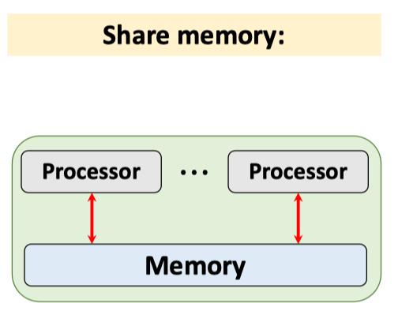
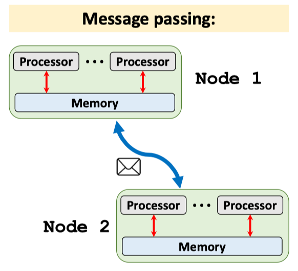
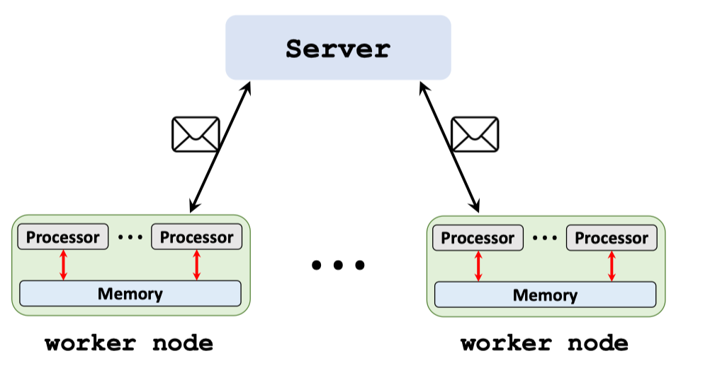
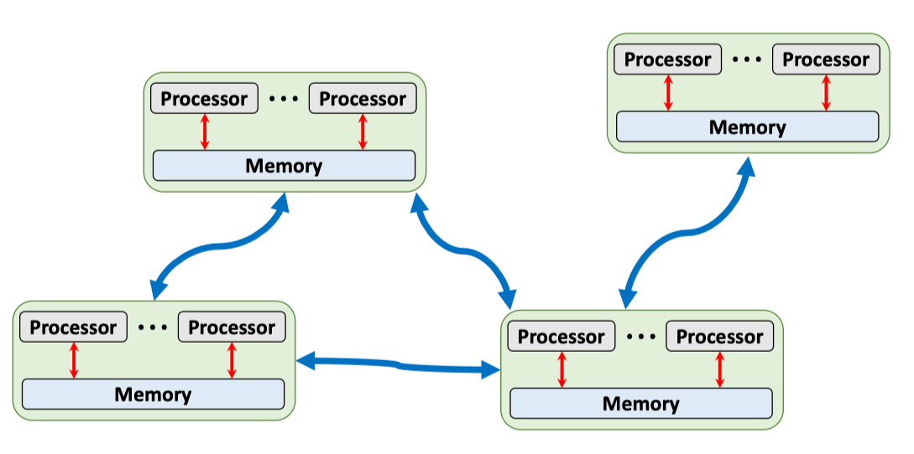

[Slides](https://github.com/wangshusen/DeepLearning/blob/master/Slides/14_Parallel_1.pdf) [Youtube](https://www.youtube.com/watch?v=gVcnOe6_c6Q&list=PLvOO0btloRns6egXueiRju4DXQjNRJQd5)

## Two ways of communication

## Client-Server Architecture

## Peer-to-peer architecture

