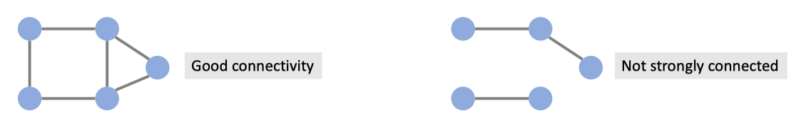
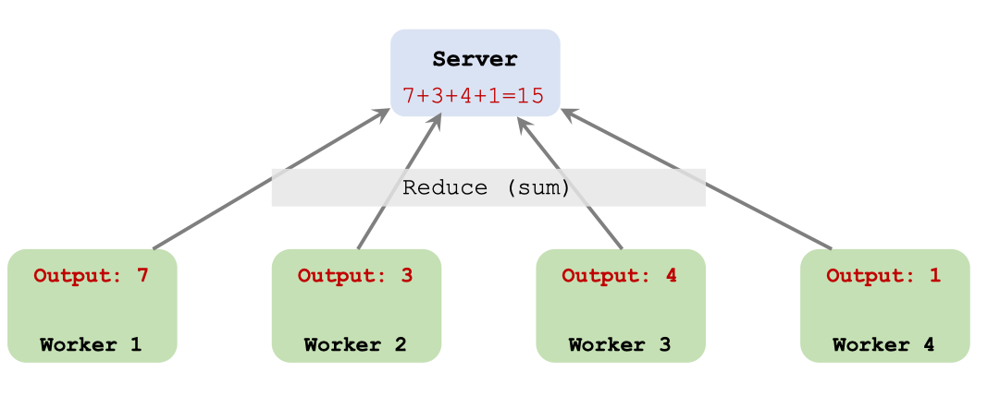
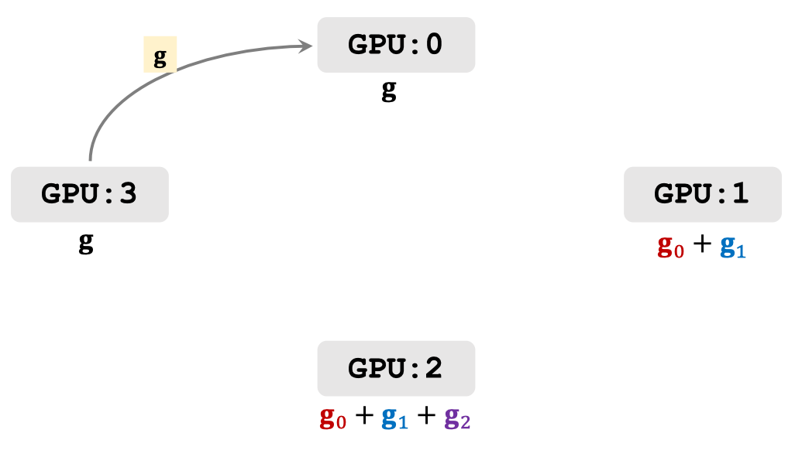
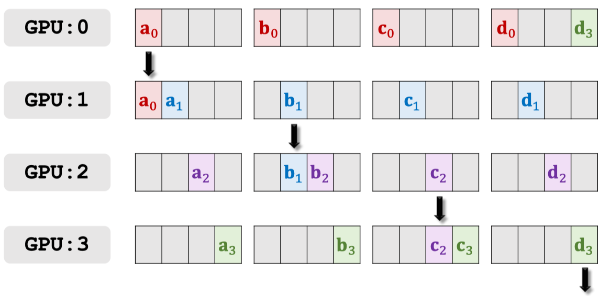

# Decentralized And Ring All Reduce

## Parallel Gradient Descent in Decentralized Network

[slides](https://github.com/wangshusen/DeepLearning/blob/master/Slides/14_Parallel_3.pdf)

[youtube](https://www.youtube.com/watch?v=rj-hjS5L8Bw)

### Decentralized Network

Characters: peer-to-peer architecture \(no central server\), messagepassing communication, a node communicate with its neighbors.

### Decentralized Gradient Descent

### Theories of Decentralized Algorithms

- Decentralized GD and SGD are guaranteed to converge, e.g., .
- Convergence rate depends on how well the nodes are connected.
  - If the nodes are well connected, then it has fast convergence.
  - If the graph is not strongly connected, then it does not converge.

## Ring All-reduce

### Reduce VS All-Reduce

### Reduce

The server gets the result of reduce \(e.g., sum, mean, count.\)

### All-Reduce

- Every node gets a copies of the result of reduce.
  - E.g., all-reduce via reduce+broadcast. See figure 1
  - E.g., all-reduce via all-to-all communication. See figure 2
  - E.g., ring all-reduce.

Figure 1

Figure 2

### Ring All-Reduce

#### Native Approach

> Note: $$g_0+g_1$$ is considered as a single gradient and will only be transfered once. It will not transfer $$g_0$$ and $$g_1$$ separately.

Then Continue update all gpus with gradient $$g$$.

#### What is wrong with the naïve approach?

- Most computer networks are idle.
- Communication time: $$\frac{md}{b}$$. \(Ignore latency.\)
  - m: number of GPUs.
  - d: number of parameters.
  - b: network bandwidth.

#### Effective Approach

Then continue update all gpus' gradients with these red blocks.

#### Comparsion

### Horovod

- In addition to being network-optimal, the allreduce approach is much easier to understand and adopt. Users utilize a [Message Passing Interface](http://mpi-forum.org/) \(MPI\) implementation such as [Open MPI](https://www.open-mpi.org/) to launch all copies of the TensorFlow program. MPI then transparently sets up the distributed infrastructure necessary for workers to communicate with each other. All the user needs to do is modify their program to average gradients using an allreduce\(\) operation.
- We replaced the Baidu ring-allreduce implementation with [NCCL](https://developer.nvidia.com/nccl). NCCL is NVIDIA’s library for collective communication that provides a highly optimized version of ring-allreduce. NCCL 2 introduced the ability to run ring-allreduce across multiple machines, enabling us to take advantage of its many performance boosting optimizations.
- We added support for models that fit inside a single server, potentially on multiple GPUs, whereas the original version only supported models that fit on a single GPU.
- Finally, we made several API improvements inspired by feedback we received from a number of initial users. In particular, we implemented a broadcast operation that enforces consistent initialization of the model on all workers. The new API allowed us to cut down the number of operations a user had to introduce to their single GPU program to four.

#### Benchmark

A comparison of the images processed per second of the Horovod over plain 25GbE TCP and the Horovod with 25GbE RDMA-capable networking when running a distributed training job over different numbers of NVIDIA Pascal GPUs for Inception V3, ResNet-101 and VGG-16.

Since both MPI and NCCL support [remote direct memory access](https://en.wikipedia.org/wiki/Remote_direct_memory_access) \(RDMA\) capable networking \(e.g., via [InfiniBand](https://en.wikipedia.org/wiki/InfiniBand) or [RDMA over Converged Ethernet](https://en.wikipedia.org/wiki/RDMA_over_Converged_Ethernet)\), we ran additional sets of benchmarking tests using RDMA network cards to determine if they helped us enhance efficiency compared to TCP networking.

### Footnote
