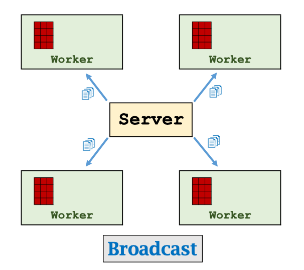
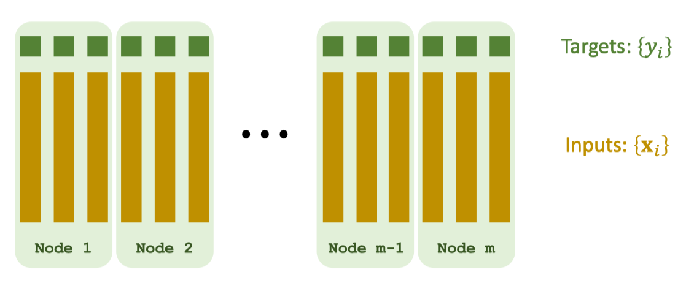
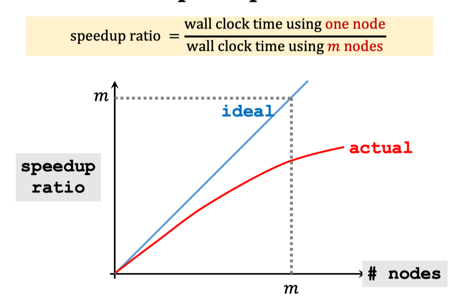

# MapReduce

[Slides](https://github.com/wangshusen/DeepLearning/blob/master/Slides/14_Parallel_1.pdf) [Youtube](https://www.youtube.com/watch?v=gVcnOe6_c6Q&list=PLvOO0btloRns6egXueiRju4DXQjNRJQd5)

## MapReduce

* MapReduce is a programming model and software system developed by Google .
* Characters: client-server architecture, message-passing communication, and bulk synchronous parallel.
* Apache Hadoop  is an open-source implementation of MapReduce.
* Apache Spark  is an improved open-source MapReduce.

### Broadcase

### Map

### Reduce

## Data Parallelism

Partition the data among worker nodes. \(A node has a subset of data.\)

## Parallel Gradient Descent Using MapReduce

* Broadcast: Server broadcast the up-to-date parameters $$w_t$$ o workers.
* Map: Workers do computation locally.
  * Map $$(x_i,y_i,w_t)$$ to $$g_i=(x_i^T w_t-yi)xi$$.
  * Obtain $$n$$ vectors: $$g_1, g_2,g_3,...,g_n$$
* Reduce: Compute the sum: $$g=\sum_{i=1}^{n}g_i$$
* Every worker sums all the $${g_i}$$ stored in its local memory to get a vector.
* Then, the server sums the resulting m vectors. \(There are m workers.\)
* Server updates the parameters: $$w_{t+1}=t_t-\alpha \cdot g$$

## Speedup Ratio

## Communication Cost

* Communication complexity: How many words are transmitted between server and workers.
  * Proportional to number of parameters.
  * Grow with number of worker nodes.
* Latency: How much time it takes for a packet of data to get from one point to another. \(Determined by the compute network.\)
* Communication time: $$\frac{comlexity}{bancwith}+latency$$

## Bulk Synchronous

## Synchronization Cost

Question: What if a node fails and then restart?

* This node will be much slower than all the others.
* It is called straggler.
* Straggler effect:
  * The wall-clock time is determined by the slowest node.
  * It is a consequence of synchronization.

## Footnote

