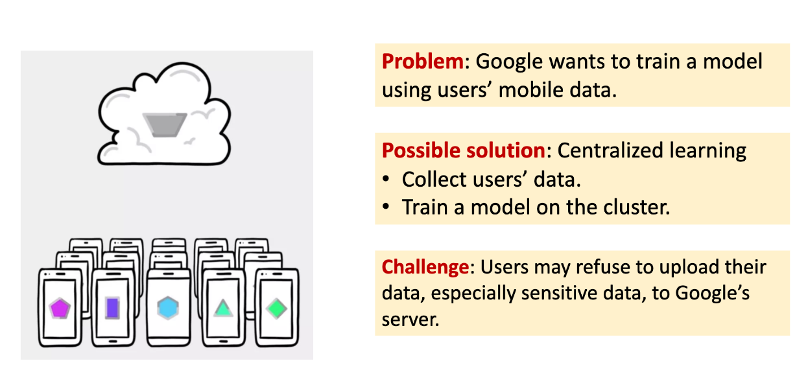
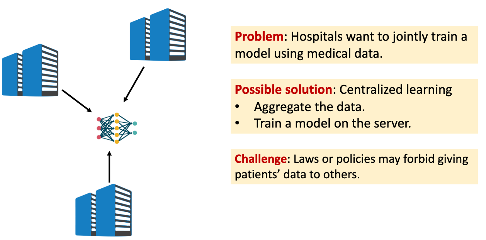
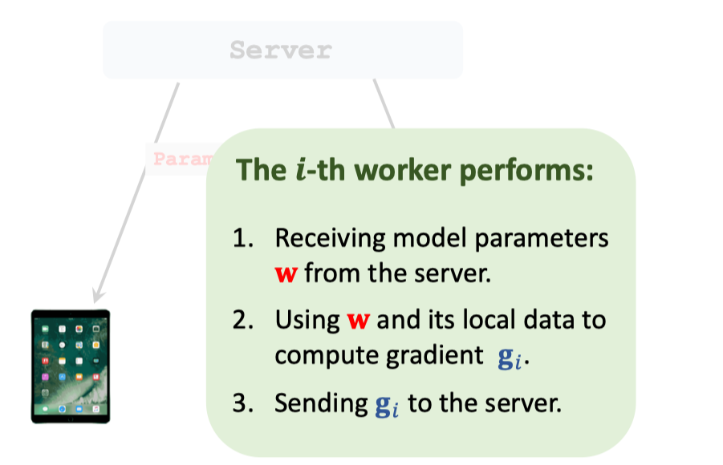
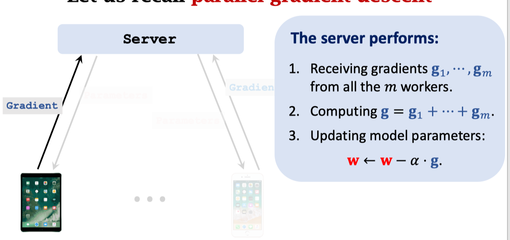
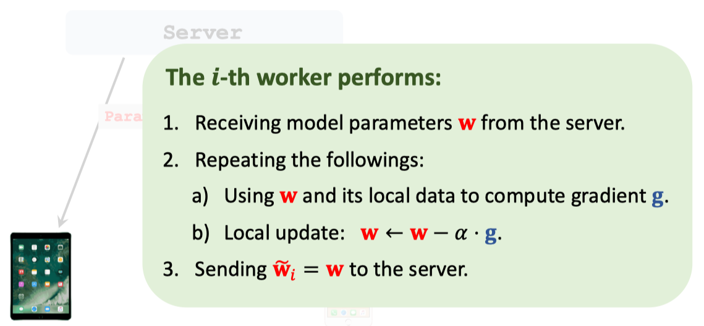
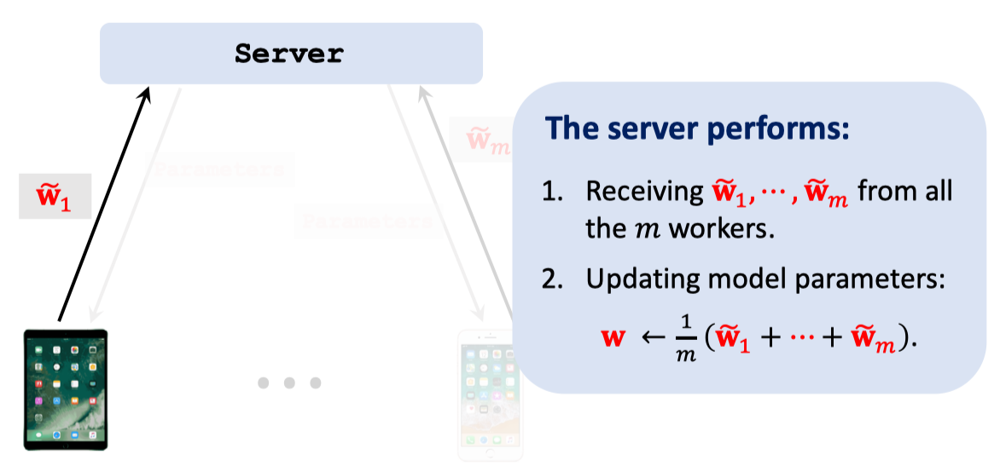
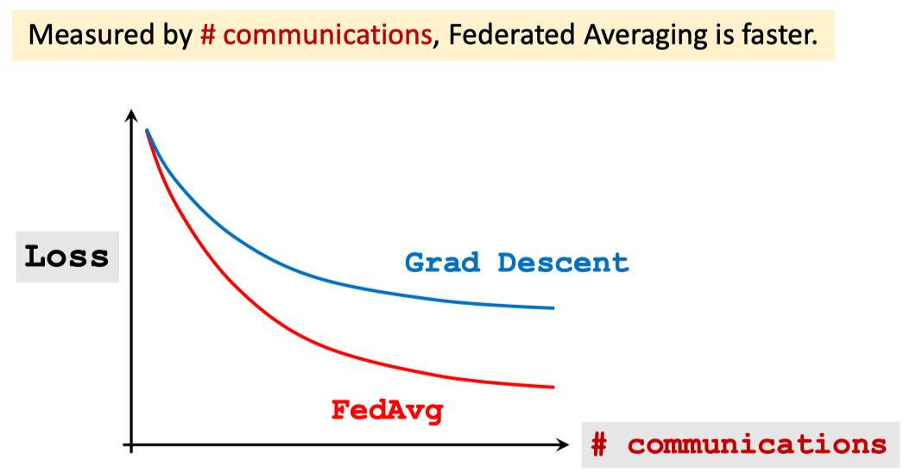
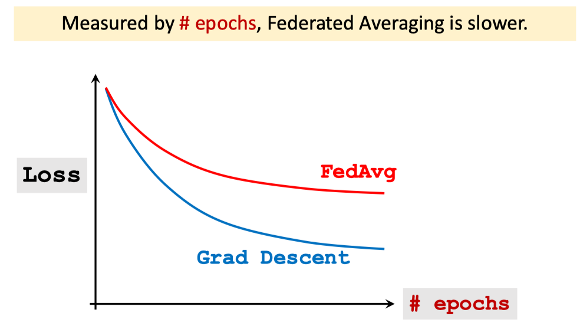

# Federated Learning

[Slides](https://github.com/wangshusen/DeepLearning/blob/master/Slides/14_Parallel_4.pdf)

[Youtube](https://www.youtube.com/watch?v=STxtRucv_zo)

## Motivating Examples

## What is federated learning

Federated learning , \[1\] is \[2\] a kind of distributed learning.

How does federated learning differ from traditional distributed learning?

1. Users have control over their device and data.
2. Worker nodes are unstable.
3. Communication cost is higher than computation cost.
4. Data stored on worker nodes are not IID.
5. The amount of data is severely imbalanced.

## Let us recall parallel gradient descent

## Federated Averaging Algorithm

## Computation vs. Communication

## References

* \[1\] McMahan and others: Communication-efficient learning of deep networks from decentralized data. In AISTATS, 2017. . 
* \[2\] Konevcny, McMahan, and Ramage: Federated optimization: distributed optimization beyond the datacenter. arXiv:1511.03575, 2015

