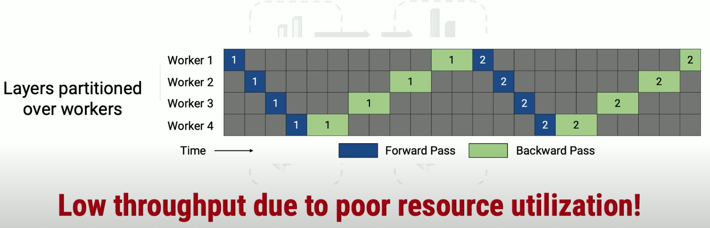

# Model Parallelism: GPipe

### Introduction

Data parallelism can be effective despite the bubble problem but suffers from an additional problem — communication overhead. As models grow and hardware becomes faster, the requirement to sync the entire model between devices becomes a bottleneck in the training process, considerably slowing it down. The accompanying image exemplifies how in large neural networks, communication overhead constitutes a large majority of the training time. The phenomenon of communication overhead encourages to create very large mini-batches but these are often the wrong choice for training a network and can present inferior results in production.

A **dumb idea** in model parallelism is to partition the model into K partitions and running in K GPUs. As it's shown below, due to the dependencies of partitions' backward and forward, there is only one worker active at one time.

## How GPipe works 

GPipe uses both model and data parallelism, a combination commonly known as ‘pipelining’. It provides two key contributions to previous pipelining techniques — automatic parallelism and device memory optimization.

### Algorithm 

**GPipe partitions the network into K cells and places the k-th cell on the k-th accelerator.** Communication primitives are automatically inserted at partition boundaries to allow data transfer between neighboring partitions. The partitioning algorithm minimizes the variance in the estimated costs of all cells in order to maximize the efficiency of the pipeline by syncing the computation time across all partitions.

During the forward pass, **GPipe first divides every mini-batch of size N into M equal micro-batches**, which are pipelined through the K accelerators. During the backward pass, gradients for each micro-batch are computed based on the same model parameters used for the forward pass. At the end of each mini-batch, gradients from all M micro-batches are accumulated and applied to update the model parameters across all accelerators. This sequence of operations is illustrated in Figure

While micro-batches allow parallelism, when using model parallelism each stage naturally still has to wait for the results of previous stages, resulting in a “Bubble” of idleness, as shown in the accompanied image. In the image, $$F0,i-F3,i$$ are members of a single micro-batch across four stages and $$Fi,0-Fi,3$$ are the four micro-batch computations performed in a single stage.

### Device Memory Optimization 

When computing a backward pass in a neural network, the forward pass activations of the network are required to perform the calculations. Normally this means that with a micro-batch of size N and L layers in the neural network, **O(N x L) activations are kept in device memory** after the forward pass, in preparation for the backward pass.

**Re-materialization**: GPipe uses a different approach, **applying an interesting compute-memory tradeoff — instead of keeping NxL activations in memory, it only keeps the N activations in the final layer** (partition boundary) of the stage (stage = group of layers). In this case, every time a backward pass begins (from the last layer), **the forward pass activations are recomputed and kept in memory**. When a backward pass of a single sample is concluded, the activations in memory are discarded and are recomputed for the backward pass of the next sample. Using this approach, the device memory only keeps one set of activations at a time, gaining valuable memory at the price of making O(N) more forward passes. Since the general hardware trend is device speed growing faster than device memory, this tradeoff is often a useful one.

During forward computation, each accelerator only stores output activations at the partition boundaries. During the backward pass, the k-th accelerator recomputes the composite forward function $$F_k$$. As a consequence, **peak activation memory requirement is reduced to** $$O(N + \frac{L}{K} × \frac{N}{M} )$$, where N M is the micro-batch size and $$\frac{L}{K}$$ is the number of layers per partition. **In comparison, memory requirement without re-materialization and partitioning would be** $$O(N × L)$$, since computing the gradients bi requires both the upper layer gradients $$b_i+1$$ and the cached activations $$fi(x)$$.&#x20;

As illustrated in Figure above, partitioning introduces some idle time per accelerator, which we refer to as the bubble overhead. **This bubble time is** $$O( \frac{K−1}{ M+K−1} )$$ amortized over the number of micro-steps M. In our experiments, **we found the bubble overhead to be negligible when** $$M ≥ 4 × K$$. This is also partly because re-computation during the backward pass can be scheduled earlier, without waiting for the gradients from earlier layers.

### Reference

* [https://towardsdatascience.com/explained-gpipe-training-giant-neural-nets-using-pipeline-parallelism-341b63bfc74b](https://towardsdatascience.com/explained-gpipe-training-giant-neural-nets-using-pipeline-parallelism-341b63bfc74b)

