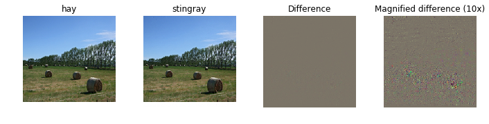

# Fooling images

References:

1. [https://github.com/MahanFathi/CS231/blob/master/assignment3/NetworkVisualization-TensorFlow.ipynb](https://github.com/MahanFathi/CS231/blob/master/assignment3/NetworkVisualization-TensorFlow.ipynb)
2. [http://www.evolvingai.org/fooling](http://www.evolvingai.org/fooling)

## Fooling Images

We can also use image gradients to generate "fooling images" as discussed in \[[3](https://arxiv.org/abs/1312.6199)\]. Given an image and a target class, we can perform gradient ascent over the image to maximize the target class, stopping when the network classifies the image as the target class. Implement the following function to generate fooling images.

### Implementation

```python
def make_fooling_image(X, target_y, model):
    """
    Generate a fooling image that is close to X, but that the model classifies
    as target_y.

    Inputs:
    - X: Input image, of shape (1, 224, 224, 3)
    - target_y: An integer in the range [0, 1000)
    - model: Pretrained SqueezeNet model

    Returns:
    - X_fooling: An image that is close to X, but that is classifed as target_y
    by the model.
    """
    X_fooling = X.copy()
    learning_rate = 1
    ##############################################################################
    # TODO: Generate a fooling image X_fooling that the model will classify as   #
    # the class target_y. Use gradient ascent on the target class score, using   #
    # the model.classifier Tensor to get the class scores for the model.image.   #
    # When computing an update step, first normalize the gradient:               #
    #   dX = learning_rate * g / ||g||_2                                         #
    #                                                                            #
    # You should write a training loop                                           #
    #                                                                            #
    # HINT: For most examples, you should be able to generate a fooling image    #
    # in fewer than 100 iterations of gradient ascent.                           #
    # You can print your progress over iterations to check your algorithm.       #
    ##############################################################################

    i = 0
    scores = sess.run(model.classifier, feed_dict={model.image: X_fooling})
    y = np.argmax(scores)

    target_score = model.classifier[0, target_y]
    g = tf.gradients(target_score, model.image)
    g = learning_rate * g / tf.norm(g)
    while y != target_y:
        dx = sess.run(g, feed_dict={model.image: X_fooling})
        X_fooling += dx[0,:,:,:,:]
        scores = sess.run(model.classifier, feed_dict={model.image: X_fooling})
        y = np.argmax(scores)
        if (i % 1 == 0):
            print ('Iteration: ', i, ' Target Class Score: ', scores[0, target_y])
        i += 1

    ##############################################################################
    #                             END OF YOUR CODE                               #
    ##############################################################################
    return X_fooling
```

### Example

Run the following to generate a fooling image. Feel free to change the idx variable to explore other images.

```python
idx = 0
Xi = X[idx][None]
target_y = 6
X_fooling = make_fooling_image(Xi, target_y, model)

# Make sure that X_fooling is classified as y_target
scores = sess.run(model.classifier, {model.image: X_fooling})
assert scores[0].argmax() == target_y, 'The network is not fooled!'

# Show original image, fooling image, and difference
orig_img = deprocess_image(Xi[0])
fool_img = deprocess_image(X_fooling[0])
# Rescale
plt.subplot(1, 4, 1)
plt.imshow(orig_img)
plt.axis('off')
plt.title(class_names[y[idx]])
plt.subplot(1, 4, 2)
plt.imshow(fool_img)
plt.title(class_names[target_y])
plt.axis('off')
plt.subplot(1, 4, 3)
plt.title('Difference')
plt.imshow(deprocess_image((Xi-X_fooling)[0]))
plt.axis('off')
plt.subplot(1, 4, 4)
plt.title('Magnified difference (10x)')
plt.imshow(deprocess_image(10 * (Xi-X_fooling)[0]))
plt.axis('off')
plt.gcf().tight_layout()
```

Output:

```text
Iteration:  0  Target Class Score:  7.48085
Iteration:  1  Target Class Score:  10.2266
Iteration:  2  Target Class Score:  13.1471
Iteration:  3  Target Class Score:  16.4118
Iteration:  4  Target Class Score:  19.4206
Iteration:  5  Target Class Score:  22.5584
Iteration:  6  Target Class Score:  25.3327
Iteration:  7  Target Class Score:  27.9393
Iteration:  8  Target Class Score:  30.5871
```



